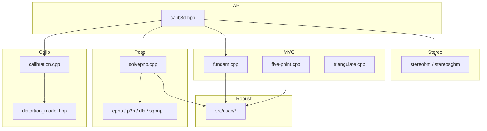

# OpenCV 4.13.0 — `modules/calib3d` 代码结构分析

本文档说明 `opencv-4.13.0/modules/calib3d` 目录的组织方式、主要源码职责及阅读顺序，便于从公开 API 追溯到具体算法实现。

---

## 1. 模块定位与构建

- **职责**：相机标定与三维重建（针孔模型、镜头畸变、立体匹配、多视图几何等）。
- **构建描述**（`CMakeLists.txt`）：`Camera Calibration and 3D Reconstruction`。
- **依赖模块**：`opencv_imgproc`、`opencv_features2d`、`opencv_flann`；调试构建可选 `opencv_highgui`。
- **外部库**：链接 **LAPACK**（SVD、最小二乘、束调整类等数值计算）。
- **优化分发**：`ocv_add_dispatched_file(undistort SSE2 AVX2)`，`undistort` 按 SIMD 目标分发优化实现。
- **语言绑定**：支持 Java、Objective-C、Python、JavaScript 封装（`WRAP`）。

---

## 2. 目录结构概览

| 路径 | 作用 |
|------|------|
| `include/opencv2/calib3d.hpp` | 对外主头文件：公开 API、大量 Doxygen 数学说明（针孔模型、畸变公式等）。 |
| `include/opencv2/calib3d/calib3d.hpp` | 兼容包装，内部构建时若误包含会触发 `#error`。 |
| `include/opencv2/calib3d/calib3d_c.h` | C 语言接口（历史/兼容）。 |
| `src/*.cpp`、`src/*.hpp` | 算法实现主体。 |
| `src/usac/` | **USAC**：通用采样一致性框架，与现代 RANSAC 路径（单应、F/E、PnP 等）强相关。 |
| `test/` | 单元测试（含棋盘格、PnP、USAC、立体等）。 |
| `perf/` | 性能基准（含 OpenCL 子目录）。 |

---

## 3. 内部公共基础设施：`precomp.hpp`

模块级预编译头，主要作用：

1. **统一依赖**：`opencv2/core/private.hpp`、`opencv2/calib3d.hpp`、`imgproc`、`features2d`、`ocl` 等。
2. **内部工具声明**：
   - `RANSACUpdateNumIters`：由置信度、外点比例、模型点数推算 RANSAC 迭代次数。
   - `PointSetRegistrator` 及 `createRANSACPointSetRegistrator` / `createLMeDSPointSetRegistrator`：点集鲁棒配准抽象。
   - `compressElems`、`haveCollinearPoints` 等辅助函数。
   - 旧式/内部接口：`findExtrinsicCameraParams2`、带完整雅可比的 `projectPoints` 重载、`getUndistortRectangles` 等。
3. **棋盘快速检测**：声明 `checkChessboardBinary`（与 C API / 检测流水线衔接）。

各实现文件通过 `#include "precomp.hpp"` 共享上述声明与依赖。

---

## 4. 按功能划分的源码地图

### 4.1 相机标定与畸变（Zhang 系）

| 文件 | 说明 |
|------|------|
| `calibration.cpp` | 核心标定引擎。注释标明源自 **Jean-Yves Bouguet** 的 Matlab 标定工具 v3，理论基于 **Zhang, 2000**。含多视图联合估计内参、畸变、外参及非线性优化。 |
| `calibration_base.cpp` | 标定公共基础（初始化块、误差与约束的共用逻辑）。 |
| `calibinit.cpp` | 标定初始化（与图像尺寸、角点数量等配合）。 |
| `distortion_model.hpp` | 畸变模型与投影关系抽象（径向、切向、有理模型等）。 |
| `hal_replacement.hpp` | 与 HAL/替换实现相关的加速或平台适配。 |

**阅读建议**：在 `calib3d.hpp` 中定位 `calibrateCamera` 等 API，再回到 `calibration.cpp` 中 `initIntrinsicParams2D` 与主优化循环。

---

### 4.2 PnP / 位姿估计

**总入口**：`solvepnp.cpp` — 根据 `flags` 在 **EPnP、P3P、AP3P、DLS、IPPE、SQPnP** 等之间调度，并与 **USAC** 集成实现 `solvePnPRansac` 等鲁棒估计。

| 文件 | 说明 |
|------|------|
| `epnp.h` / `epnp.cpp` | 经典 EPnP（Efficient PnP）。 |
| `p3p.h` / `p3p.cpp` | 三点透视闭式解。 |
| `ap3p.h` / `ap3p.cpp` | 改进的 P3P 变体。 |
| `dls.h` / `dls.cpp` | Direct Least Squares 类 PnP。 |
| `ippe.hpp` / `ippe.cpp` | 平面位姿（共面目标）常用。 |
| `sqpnp.hpp` / `sqpnp.cpp` | 基于平方规划的 PnP。 |
| `upnp.h` / `upnp.cpp` | Undetermined PnP 相关实现（按代码路径选用）。 |
| `rho.h` / `rho.cpp` | 归一化/尺度等工具，亦与基础矩阵等模块共用思路。 |

源码中包含**平面物体点退化配置**检测（如对物体点做 PCA/SVD），用于在调试或静态分析下减少未定义行为。

---

### 4.3 多视图几何

| 文件 | 说明 |
|------|------|
| `fundam.cpp` | 单应 DLT、基础矩阵（7 点 / 8 点）、与 RHO 等；大量与现代 **USAC** 集成。 |
| `five-point.cpp` | **Nister 2004** 五点算法（本质矩阵/相对位姿），接入 USAC。 |
| `homography_decomp.cpp` | 单应分解；从多解中筛选物理合理的运动与平面法向。 |
| `triangulate.cpp` | 多视图三角化；注释引用 Hartley & Zisserman（多视图几何）；含 `cvCorrectMatches` 等配套。 |

---

### 4.4 立体视觉

| 文件 | 说明 |
|------|------|
| `stereobm.cpp` | **Block Matching**：SAD 块匹配；含 OpenCL、SIMD、缓冲管理；注释标明 Kurt Konolige 贡献。 |
| `stereosgbm.cpp` | **Semi-Global Block Matching**：半全局代价聚合与优化。 |
| `stereo_geom.cpp` | 立体几何工具（与双目标定得到的 `R`、`T`、Q 及重投影配合）。 |

典型流程：**双目标定 → 立体校正映射 → 视差图 → `reprojectImageTo3D` 得到稠密三维点**。

---

### 4.5 去畸变与映射初始化

| 文件 | 说明 |
|------|------|
| `undistort.dispatch.cpp` | 按 CPU 特性分发的去畸变与初始化新相机矩阵等路径。 |
| `undistort.simd.hpp` | SIMD 内核实现细节。 |

与对外函数 `initUndistortRectifyMap`、`getOptimalNewCameraMatrix` 等对应。

---

### 4.6 鱼眼模型

| 文件 | 说明 |
|------|------|
| `fisheye.cpp` / `fisheye.hpp` | 鱼眼投影模型（如 Kannala–Brandt）、标定与去畸变；与针孔 `calibration.cpp` 平行的一套 API。 |

---

### 4.7 标定靶标检测

| 文件 | 说明 |
|------|------|
| `chessboard.cpp` / `chessboard.hpp` | 棋盘格检测；内部含 `details::FastX`（基于局部 Radon 的叉点快速检测）等。 |
| `circlesgrid.cpp` / `circlesgrid.hpp` | 圆网格（对称圆图案）检测与排序。 |
| `checkchessboard.cpp` | 快速判断区域是否可能为棋盘。 |
| `quadsubpix.cpp` | 与四边形/四角点亚像素细化相关。 |

支撑 `findChessboardCorners`、`findCirclesGrid` 等高层接口。

---

### 4.8 USAC 子系统（`src/usac/`）

独立于单文件的一条**现代鲁棒估计**管线，命名空间 `cv::usac`（见 `src/usac.hpp`）。

**概念分层概要**：

- **误差度量**：Sampson、对称几何距离、对称/单向重投影等（`Error` 层次）。  
- **最小解算器 `MinimalSolver`**：如 4 点单应、7/8 点 F、5 点 E、PnP 等。  
- **采样、评分、退化检测、局部优化（LO）、终止条件、Bundle 辅助** 等分散在对应 `.cpp` 中。  

**核心调度**：`ransac_solvers.cpp` — 组合 `UsacParams`（置信度、最大迭代、LO 方法、最终抛光器等）与具体估计器。

**阅读建议**：修改或理解 `findHomography` / `findFundamentalMat` / `findEssentialMat` 在不同 flag 下的行为时，需对照 **`fundam.cpp`（或 `five-point.cpp`）中的 USAC 调用** 与 **`usac/ransac_solvers.cpp` 的参数映射**。

---

### 4.9 其它重要文件

| 文件 | 说明 |
|------|------|
| `ptsetreg.cpp`、`compat_ptsetreg.cpp` | 点集配准 RANSAC/LMeDS 与兼容层。 |
| `levmarq.cpp` | Levenberg–Marquardt，用于非线性精化。 |
| `calibration_handeye.cpp` | 手眼标定（安装方式与算法变体）。 |
| `polynom_solver.cpp` | 多项式求根（五点法等内部数值步骤）。 |
| `main.cpp` | 库初始化相关（如 IPP），非业务算法。 |

---

## 5. 依赖与数据流（简图）

---

## 6. 推荐阅读顺序

1. **API 与数学记号**：阅读 `include/opencv2/calib3d.hpp` 前半部文档注释。  
2. **Zhang 平面标定**：`calibration.cpp`（作者与论文注释 + `initIntrinsicParams2D` + 优化主循环）。  
3. **PnP 与 RANSAC**：`solvepnp.cpp` 中分支与 `solvePnPRansac`，配合 `usac/pnp_solver.cpp`。  
4. **F/H/E 与 USAC**：`fundam.cpp`、`five-point.cpp`，配合 `usac/ransac_solvers.cpp`。  
5. **立体**：`stereobm.cpp` 中 `StereoBMParams` 与匹配主循环、`stereosgbm.cpp` 半全局路径。  

---

## 7. 版本与路径说明

- 分析对象路径：`opencv-4.13.0/modules/calib3d`。  
- OpenCV 小版本升级时，文件名大体稳定，但 USAC 参数与默认迭代/阈值可能变化，以对应版本源码为准。

---

*文档生成用于本地源码研读；与官方 Doxygen 手册互补。*
