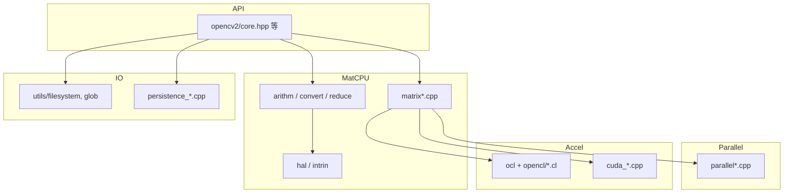

# OpenCV 4.13.0 — `modules/core` 代码结构分析

本文档梳理 `opencv-4.13.0/modules/core` 的构建方式、目录组织、主要源码职责及阅读线索。**core** 是 OpenCV 的根基：多维数组 `Mat`/`UMat`、基础算术与线性代数、并行与异步、序列化、平台与加速器抽象（CPU SIMD、OpenCL、CUDA、OpenGL 等）均集中于此。

---

## 1. 模块定位与构建要点

- **职责**（`CMakeLists.txt`）：`The Core Functionality`。
- **可选依赖**：`opencv_cudev`（启用 CUDA 且需 **opencv_contrib** 中的 cudev 模块，否则 CMake 会报错）。
- **语言绑定**：Java、Objective-C、Python、JavaScript（`WRAP`）。

### 1.1 SIMD / 指令集分发（`ocv_add_dispatched_file`）

下列基名对应 `*.dispatch.cpp` + `*.simd.hpp`（或同类）模式，在**运行时按 CPU 特性**选择最优实现：

| 基名 | 典型指令集标签（含部分平台扩展） |
|------|-----------------------------------|
| `mathfuncs_core` | SSE2, AVX, AVX2, LASX |
| `stat` | SSE4_2, AVX2, LASX |
| `arithm` | SSE2, SSE4_1, AVX2, VSX3, LASX |
| `convert` / `convert_scale` | SSE2, AVX2, VSX3, LASX |
| `count_non_zero` / `has_non_zero` | SSE2, AVX2, LASX |
| `matmul` | SSE2, SSE4_1, AVX2, AVX512_SKX, NEON_DOTPROD, LASX |
| `mean` / `merge` / `split` / `sum` / `norm` | 多种 SIMD（含 NEON_DOTPROD、VSX 等） |

另有 **`test_intrin128` / `test_intrin256` / `test_intrin512`**：`ocv_add_dispatched_file_force_all`，用于**内建向量指令正确性/精度测试**，而非仅生产路径默认启用一种实现。

### 1.2 并行后端

- `PARALLEL_ENABLE_PLUGINS`：是否允许并行插件架构（Emscripten、iOS、XROS、WINRT 等默认关闭）。
- 实现分散在 `src/parallel/`（如 `parallel_tbb.cpp`、`parallel_openmp.cpp`）及 `parallel.cpp` / `parallel_impl.cpp`。

### 1.3 Intel IPP 可选加速

在 `HAVE_IPP` 时可通过 `OPENCV_IPP_*` 为 **mean / minmax / sum** 等增加 IPP 路径（增大二进制体积），并通过编译宏打到对应 `.cpp`。

### 1.4 链接与依赖库（节选）

模块私有链接：**ZLIB**、**OpenCL**、**VA（LibVA）**、**OpenGL/GLX**、**LAPACK**、**CPUFEATURES**（Android）、**ITT**（追踪）、**OpenCV HAL** 等。具体如下游模块与 CMake 开关而定。

### 1.5 其它 CMake 行为（与源码阅读相关）

- **分配器统计**：`OPENCV_ENABLE_ALLOCATOR_STATS`、`OPENCV_ALLOCATOR_STATS_COUNTER_TYPE` 等影响 `alloc.cpp` 行为。
- **剔除 C API**：`OPENCV_CORE_EXCLUDE_C_API`。
- **无线程 / 无环境变量**：`OPENCV_DISABLE_THREAD_SUPPORT`、`OPENCV_DISABLE_ENV_SUPPORT`（如 `system.cpp` 内 `NO_GETENV`）。
- **`opencv_data_config.hpp`**：在构建目录生成，定义安装前缀、数据搜索路径等，供样本与资源定位使用。

---

## 2. 目录结构概览

| 区域 | 作用 |
|------|------|
| `include/opencv2/core.hpp` | 用户可见主入口之一（与仓库根 `opencv2.hpp` 组合使用）。 |
| `include/opencv2/core/*.hpp` | 核心公开类型与 API：`mat.hpp`、`types.hpp`、`utility.hpp`、`persistence.hpp`、`optim.hpp`、`ocl.hpp`、`cuda.hpp` 等。 |
| `include/opencv2/core/hal/` | **硬件抽象层**：标量/向量接口与多架构 **intrin**（SSE、AVX、AVX512、NEON、VSX、LASX、RVV、WASM 等）。 |
| `include/opencv2/core/utils/` | 日志、跟踪、文件系统、TLS、缓冲区等工具头。 |
| `include/opencv2/core/opencl/`、`cuda/`、`detail/` 等 | 加速器与实现细节声明。 |
| `src/` | 实现文件：`matrix*.cpp`、`arithm*.cpp`、`*dispatch.cpp`、并行、持久化、OCL 运行时、平台封装等。 |
| `src/opencl/` | OpenCL **.cl** 内核与 **runtime** 下 **自动生成** 的 OpenCL 封装（含 `generator/` 脚本）。 |
| `test/`、`perf/` | 单测与性能测试（含 OpenCL、CUDA、intrinsic 专项）。 |
| `3rdparty/SoftFloat/` | 软件浮点（许可证单独安装说明于 CMake `ocv_install_3rdparty_licenses`）。 |

源码文件数量多（数百级），下列按**主题**归类便于检索，而非穷举每一文件名。

---

## 3. 内部公共头：`src/precomp.hpp`

模块实现默认包含：

- `opencv_modules.hpp`、`cvconfig.h`（构建配置）。
- `opencv2/core/private.hpp`、`private.cuda.hpp`；条件包含 `ocl.hpp`。
- 标准 C/C++ 数学与工具头。

并定义与 CPU 能力检测相关的宏，例如：

- `USE_SSE2` / `USE_SSE4_2` / `USE_AVX` / `USE_AVX2` — 通过 `cv::checkHardwareSupport(...)` 判断。

包含 **HAL**：`opencv2/core/hal/hal.hpp`、`intrin.hpp` 及平台相关的 `sse_utils.hpp`、`neon_utils.hpp`、`vsx_utils.hpp` 与 **`hal_replacement.hpp`**（可被自定义 HAL 替换）。

另声明全局查找表等（如 `g_8x32fTab`）供颜色与定点运算加速使用。

---

## 4. 按功能划分的源码地图

### 4.1 `Mat` / `UMat` 与矩阵子系统

| 文件（节选） | 说明 |
|--------------|------|
| `matrix.cpp`、`matrix_operations.cpp`、`matrix_expressions.cpp` | `Mat` 内存布局、运算符表达式、逐元素操作路由等。 |
| `matrix_wrap.cpp`、`matrix_iterator.cpp`、`matrix_transform.cpp`、`matrix_decomp.cpp` | 包装、迭代器、几何/变换相关矩阵操作、分解入口等。 |
| `matrix_sparse.cpp` | 稀疏矩阵相关。 |
| `umatrix.cpp`、`umatrix.hpp` | `UMat` 与 OpenCL 交互等路径。 |
| `array.cpp` | 与 `cv::Mat` 同家族的更底层数组/头对象逻辑。 |
| `matrix_c.cpp` | C API 兼容层（可被 `OPENCV_EXCLUDE_C_API` 关闭编译）。 |

### 4.2 逐元素算术与类型转换

| 文件 | 说明 |
|------|------|
| `arithm.cpp` + `arithm.dispatch.cpp` | 加减乘除、按位运算、比较、`addWeighted` 等；热点在 dispatch/simd。 |
| `convert.dispatch.cpp`、`convert_scale.dispatch.cpp`、`convert_c.cpp` | 类型转换与线性缩放 `alpha/beta`。 |
| `channels.cpp`、`split.dispatch.cpp`、`merge.dispatch.cpp` | 通道拆分与合并。 |
| `copy.cpp`、`lut.cpp` | 拷贝、查找表映射。 |

### 4.3 规约、统计与范数

| 文件 | 说明 |
|------|------|
| `sum.dispatch.cpp`、`mean.dispatch.cpp`、`norm.dispatch.cpp` | 和、均值、多种范数。 |
| `stat.dispatch.cpp`、`minmax.cpp` | 最小/最大/掩码统计等。 |
| `count_non_zero.dispatch.cpp`、`has_non_zero.dispatch.cpp` | 非零计数与快速判空。 |

### 4.4 数学与线性代数

| 文件 | 说明 |
|------|------|
| `mathfuncs.cpp`、`mathfuncs_core.dispatch.cpp` | 数学函数（三角函数、幂、向量运算等）与核心 SIMD 实现。 |
| `matmul.dispatch.cpp` | 通用矩阵乘法与块调度；常与 LAPACK/内部块大小策略配合。 |
| `lapack.cpp` | 对接 LAPACK 的高层封装（特征值、SVD 等，具体以符号为准）。 |
| `pca.cpp`、`lda.cpp` | 主成分分析、线性判别分析。 |
| `kmeans.cpp` | K 均值聚类。 |
| `dxt.cpp` | DFT/DCT 等（与 IPP/复数路径协同，历史上与 “dxt” 命名相关）。 |
| `conjugate_gradient.cpp`、`downhill_simplex.cpp`、`lpsolver.cpp` | 与 `optim.hpp` 对应的优化与线性规划求解器实现侧。 |

### 4.5 内存、缓冲与对齐

| 文件 | 说明 |
|------|------|
| `alloc.cpp` | 对齐分配、与 `posix_memalign` / `memalign` / Windows 对齐 API 等的条件编译。 |
| `buffer_area.cpp` | 大块/多块缓冲的 RAII 风格管理（与 `utils/buffer_area` 头配合）。 |

### 4.6 系统信息与 CPU 特性

| 文件 | 说明 |
|------|------|
| `system.cpp` | 硬件特性位、缓存行、`getCPUFeatures`、平台相关检测（如 Android `cpufeatures`、Linux `getauxval`）。 |
| `tables.cpp` | 预计算常量表。 |

### 4.7 随机、软浮点与数值兜底

| 文件 | 说明 |
|------|------|
| `rand.cpp` | 伪随机数与分布。 |
| `softfloat.cpp`、`include/.../softfloat.hpp` | 可移植软浮点，减少对宿主 FP 硬件的依赖场景。 |

### 4.8 序列化（Persistence）

| 文件 | 说明 |
|------|------|
| `persistence.cpp`、`persistence_impl.hpp`、`persistence_types.cpp` | 统一读写框架与类型注册。 |
| `persistence_xml.cpp`、`persistence_yml.cpp`、`persistence_json.cpp` | XML / YAML / JSON 后端。 |
| `persistence_base64_encoding.cpp` | 二进制块 Base64 编码。 |

### 4.9 并行与异步

| 路径/文件 | 说明 |
|-----------|------|
| `parallel.cpp`、`parallel_impl.cpp`、`parallel_impl.hpp` | `parallel_for_` 全局入口与后端注册。 |
| `parallel/parallel.cpp`、`parallel_tbb.cpp`、`parallel_openmp.cpp` | TBB / OpenMP 等后端。 |
| `include/opencv2/core/parallel/*.hpp` | 后端抽象与插件 API。 |
| `async.cpp` | 异步任务与 `cv::AsyncArray` 等。 |

### 4.10 OpenCL

| 路径 | 说明 |
|------|------|
| `ocl.cpp` | OpenCV OCL 后端调度、与 `UMat` 协作。 |
| `src/opencl/*.cl` | 各算子内核（arithm、gemm、reduce、fft 等）。 |
| `src/opencl/runtime/` | 动态/静态加载 OpenCL、clBLAS、clFFT 等；**autogenerated/** 由 **generator** 脚本从函数列表生成封装。 |

### 4.11 CUDA（需 contrib cudev）

| 文件（节选） | 说明 |
|--------------|------|
| `cuda_stream.cpp`、`cuda_info.cpp`、`cuda_gpu_mat.cpp`、`cuda_gpu_mat_nd.cpp`、`cuda_host_mem.cpp` | 流、设备信息、`GpuMat` 与主机端内存对象。 |

头文件在 `include/opencv2/core/cuda*.hpp` 与 `private.cuda.hpp` 中分层暴露。

### 4.12 OpenGL / DirectX / VA / OpenVX

| 文件 | 说明 |
|------|------|
| `opengl.cpp`、`gl_core_3_1.cpp` | OpenGL 互操作与核心入口。 |
| `directx.cpp` | Direct3D 互操作。 |
| `va_intel.cpp` | Intel VA-API/Media 相关路径。 |
| `ovx.cpp` | OpenVX 集成（与 `ovx.hpp`、openvx 子目录声明对应）。 |

### 4.13 工具与其它

| 路径/文件 | 说明 |
|-----------|------|
| `utils/filesystem.cpp`、`utils/samples.cpp`、`utils/datafile.cpp`、`glob.cpp` | 文件系统、样本路径、通配遍历。 |
| `utils/logtagmanager.cpp` 等 + `logger.cpp`、`trace.cpp` | 日志标签、日志与 ITT 追踪。 |
| `command_line_parser.cpp` | 命令行解析。 |
| `algorithm.cpp` | `cv::Algorithm` 基类基础设施。 |
| `check.cpp` | `CV_Check*` 等诊断宏的实现侧支撑。 |
| `types.cpp`、`datastructs.cpp`、`stl.cpp` | 基础类型与辅助容器桥接。 |
| `batch_distance.cpp` | 批量距离计算（与特征流水线可衔接）。 |
| `bindings_utils.cpp` | Python 等绑定辅助。 |
| `hal_internal.cpp` | HAL 内部 glue。 |

---

## 5. HAL 与向量抽象（`include/opencv2/core/hal/`）

- **`hal.hpp`**：标量层原语与不因平台而异的约定。
- **`intrin.hpp`** 与 **`intrin_*.hpp`**：  
  - 统一包装 **SSE/AVX/AVX512/NEON/VSX/LASX/LSX/MSA/RVV/WASM** 等。  
  - **`intrin_cpp.hpp`**：纯标量回退实现。  
  - **`intrin_forward.hpp` / `simd_intrinsics.hpp`**：与前向声明、SIMD 工具配合。

阅读 SIMD 内核时可从具体 **`*.simd.hpp`** 对应到 **`intrin_*`** 中的类型与 intrinsic 名称。

---

## 6. 依赖关系简图

---

## 7. 推荐阅读顺序

1. **整体 API 与类型**：`include/opencv2/core/core.hpp`（若存在聚合）、`mat.hpp`、`types.hpp`、`utility.hpp`。  
2. **Mat 生命周期与表达式**：`matrix.cpp`、`matrix_expressions.cpp`。  
3. **热点算子实现链**：任选 `arithm.dispatch.cpp` 或 `matmul.dispatch.cpp`，跟进到同名 **`*.simd.hpp`** 与 **`hal/intrin*.hpp`**。  
4. **并行**：`parallel.cpp` → `parallel/parallel_tbb.cpp` 或 `parallel_openmp.cpp`。  
5. **跨设备**：`ocl.cpp` + 某一 `opencl/*.cl`；有 CUDA 时再读 `cuda_gpu_mat.cpp`。  
6. **序列化**：`persistence.cpp` + 某一种 `persistence_*.cpp`。  

---

## 8. 版本与路径说明

- 分析对象路径：`opencv-4.13.0/modules/core`。  
- 文件列表与 CMake 选项会随小版本变化；以当前树中 **`CMakeLists.txt`** 与 **`precomp.hpp`** 为准。

---

*文档用于本地源码导航，与官方用户手册及 Doxygen 互补。*
