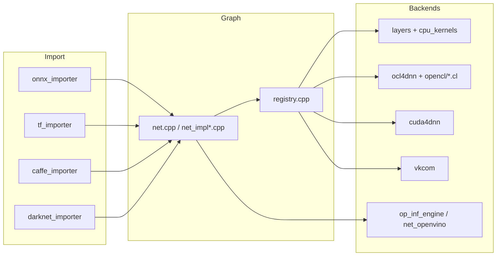

# OpenCV 4.13.0 — `modules/dnn` 代码结构分析

本文档梳理 `opencv-4.13.0/modules/dnn` 的构建选项、目录组织、计算后端与模型导入路径，便于从 **`cv::dnn::Net` 公开 API** 追到 **层实现、CPU/GPU 内核与 ONNX/Caffe 等导入器**。

---

## 1. 模块定位

- **职责**（`CMakeLists.txt`）：深度学习推理模块；从多种框架加载序列化模型并执行 **前向传播**（**不支持完整训练流程**，与设计目标一致）。
- **依赖**：`opencv_core`、`opencv_imgproc`。
- **语言绑定**：Python、Java、Objective-C、JavaScript。
- **平台**：`WINRT` 下禁用整个 `dnn` 模块。

---

## 2. 构建与 simd 分发

### 2.1 强制全路径分发的内核（测试/多实现覆盖）

CMake 使用 `ocv_add_dispatched_file_force_all`，典型覆盖 **AVX / AVX2 / AVX512_SKX / RVV / LASX / NEON / SVE** 等：

| 基路径（相对 `src/`） | 含义 |
|------------------------|------|
| `layers/layers_common` | 多数算子在 CPU 上的公共实现与向量化分支。 |
| `int8layers/layers_common` | **INT8** 量化路径的层公共代码。 |
| `layers/cpu_kernels/conv_block` | 卷积块内核。 |
| `layers/cpu_kernels/conv_depthwise` | 深度可分离卷积。 |
| `layers/cpu_kernels/fast_gemm_kernels` | 快速 GEMM（卷积/FullyConnected 等会用到）。 |

### 2.2 常规 dispatch

- **`layers/cpu_kernels/conv_winograd_f63`**：`ocv_add_dispatched_file`（Winograd F(6,3) 类卷积加速，按平台分发）。
- 未使用 `force_all` 时，运行期只启用与当前 CPU 匹配的优化版本。

### 2.3 OpenCL / CUDA / 其它加速器宏

| 选项/条件 | 编译宏或行为 |
|-----------|----------------|
| `OPENCV_DNN_OPENCL` 且 `HAVE_OPENCL`（默认苹果除外） | `CV_OCL4DNN=1`，`ocl4dnn` + `src/opencl/*.cl`。 |
| `OPENCV_DNN_CUDA` 且 CUDA+cuBLAS+cuDNN | `CV_CUDA4DNN=1`；计算能力需 ≥ 3.0。 |
| `HAVE_WEBNN` | `HAVE_WEBNN=1`。 |
| `HAVE_TIMVX` | `HAVE_TIMVX=1`。 |
| `HAVE_CANN` | `HAVE_CANN=1`（华为 CANN）。 |

### 2.4 Protobuf / FlatBuffers / 模型生成代码

- **`HAVE_PROTOBUF`**：解析 Caffe / TensorFlow / ONNX 等；`.proto` 默认使用 **`misc/`** 下预生成的 `*.pb.cc` / `*.pb.h`（`PROTOBUF_UPDATE_FILES` 打开时改由 `protoc` 生成）。
- **`OPENCV_DNN_TFLITE`**：**FlatBuffers** + `misc/tflite/schema_generated.h`；schema 源为 `src/tflite/schema.fbs`。

### 2.5 链接库（节选）

- **LAPACK**、**Protobuf**（内置或外部）、可选 **OpenCL**、**CUDA/cuDNN/cuBLAS**、**TIM-VX**、**CANN**、**WebNN**；OpenVINO 作为 **`ocv.3rdparty.openvino`** 或 **插件子目录**（见 `cmake/plugin.cmake`）。

### 2.6 DNN 插件（可选）

- **`DNN_ENABLE_PLUGINS`**、`DNN_PLUGIN_LIST`：可将部分后端做成动态插件；`plugin_wrapper.impl.hpp`、`plugin_api.hpp` 与 **`registry.cpp`** / **`backend.cpp`** 协同。
- 插件源集在 `CMakeLists.txt` 中通过 `ocv_list_filterout_ex` 从完整 `src/*.cpp` 中**排除**核心小块与导入器/执行器目录，供独立插件目标使用。

### 2.7 默认后端

- **`OPENCV_DNN_BACKEND_DEFAULT`**：可通过 CMake 写入 `dnn_params.cpp`，与 `DNN_BACKEND_DEFAULT` 语义一致（空则等价于 OpenCV 内置实现）。

---

## 3. 公开 API 入口

| 头文件 | 作用 |
|--------|------|
| `include/opencv2/dnn.hpp` | 兼容用总头，建议应用只包含此文件。 |
| `include/opencv2/dnn/dnn.hpp` | **核心 API**：`Net`、`Backend`/`Target`、`Layer`、读写与工具函数声明。 |
| `include/opencv2/dnn/layer.hpp` | 自定义层基类与注册相关。 |
| `include/opencv2/dnn/all_layers.hpp` | 内置层类型前向声明/聚合。 |
| `include/opencv2/dnn/dict.hpp` | 层参数字典。 |
| `include/opencv2/dnn/shape_utils.hpp` | Blob 形状辅助。 |

**后端枚举**（`dnn.hpp`）：`DNN_BACKEND_HALIDE`、`DNN_BACKEND_INFERENCE_ENGINE`（Intel OpenVINO）、`DNN_BACKEND_OPENCV`、`DNN_BACKEND_VKCOM`（Vulkan）、`DNN_BACKEND_CUDA`、`DNN_BACKEND_WEBNN`、`DNN_BACKEND_TIMVX`、`DNN_BACKEND_CANN`，以及构建内部可见的旧版 IE 枚举。

**目标设备枚举**：`DNN_TARGET_CPU`、`OPENCL`、`OPENCL_FP16`、`CUDA`/`CUDA_FP16`、`VULKAN`、`MYRIAD`、`HDDL`、`NPU`、`CPU_FP16`（ARM）等。

---

## 4. 内部公共头：`src/precomp.hpp`

- 包含 `cvconfig.h`、`opencv2/core`、**`opencv2/dnn.hpp`**、**`all_layers.hpp`**、**`shape_utils.hpp`**。
- 根据 **`CV_OCL4DNN`** / **`CV_CUDA4DNN`** 强制与 `HAVE_OPENCL` / `HAVE_CUDA` 一致，否则 `#error` 防配置漂移。
- 当 `BUILD_PLUGIN` 时走精简包含路径（仅公开 API）。

工程内另有 **`dnn_common.hpp`**（由 `precomp.hpp` 引用），集中 DNN 内部类型与工具。

---

## 5. 运行图与网络对象（`src/` 根层）

| 文件（节选） | 说明 |
|--------------|------|
| `dnn.cpp` | 模块级注册、与公开 `dnn` API 绑定的实现入口。 |
| `dnn_read.cpp`、`dnn_utils.cpp`、`dnn_params.cpp` | 模型读取辅助、工具函数、默认后端/参数。 |
| `net.cpp` | **`Net`** 对象与用户 API 骨架。 |
| `net_impl.cpp`、`net_impl_backend.cpp`、`net_impl_fuse.cpp` | 计算图执行、后端切换、**层融合**（fuse）优化。 |
| `net_openvino.cpp`、`net_cann.cpp` | Intel OpenVINO / CANN 专用网络路径。 |
| `legacy_backend.cpp`、`backend.cpp` | 后端抽象与旧接口兼容。 |
| `model.cpp` | 高层 `readNet*` 等与 **`Net`** 的桥接。 |
| `registry.cpp` | **层类型 → 工厂** 注册表。 |
| `net_quantization.cpp` | 量化相关（与 INT8 路径、标定配合）。 |
| `nms.cpp` | 检测后处理 NMS 等。 |

---

## 6. 计算后端实现目录

| 目录 | 说明 |
|------|------|
| `layers/` | **内置层**实现：卷积、池化、BN、全连接、激活、RNN/注意力、`einsum`、`layer_norm` 等；`convolution_layer.cpp`、`elementwise_layers.cpp` 等按层类分文件。 |
| `layers/cpu_kernels/` | CPU 卷积、深度卷积、Winograd、快速 GEMM、softmax、norm 等**内核**；大量 `*.dispatch.cpp` + SIMD。 |
| `int8layers/` | **INT8** 推理：卷积/FC/池化/BN/元素级等及 `quantization_utils.cpp`。 |
| `ocl4dnn/` | **OpenCL 4 DNN**：卷积、LRN、池化、Softmax、GEMM 等与 `src/opencl/*.cl` 配合。 |
| `opencl/` | OpenCL 内核源码（eltwise、im2col、gemm、pooling、activation 等）。 |
| `cuda/`、`cuda4dnn/` | **CUDA/cuDNN** 路径：`cuda4dnn` 含 **primitives**、**kernels**、**csl**（CUDA 支持库）等分层实现。 |
| `vkcom/` | **Vulkan** 后端：SPIR-V / `*.comp` 着色器生成脚本、`tensor`、`op_conv`、`op_matmul` 等。 |
| `op_cuda.cpp`、`op_inf_engine.cpp`、`op_halide.cpp`、`op_vkcom.cpp`、`op_webnn.cpp`、`op_timvx.cpp`、`op_cann.cpp` | 各后端 **`BackendWrapper`/`BackendNode`** 胶水层**，被 `net_impl_backend.cpp` 等调用。 |

---

## 7. 模型导入器（按框架分目录）

| 目录 | 格式 / 说明 |
|------|-------------|
| `onnx/` | **ONNX**：`onnx_importer.cpp`、`onnx_graph_simplifier.*`；proto 在 `src/onnx/opencv-onnx.proto`，生成代码在 `misc/onnx/`。 |
| `caffe/` | **Caffe**：`caffe_importer.cpp`、`caffe_io.cpp`、`caffe_shrinker.cpp`。 |
| `tensorflow/` | **TensorFlow frozen / checkpoint**：`tf_importer.cpp`、`tf_io.cpp`、`tf_graph_simplifier.cpp`；多份 `*.proto`。 |
| `darknet/` | **Darknet**：`darknet_importer.cpp`、`darknet_io.cpp`（YOLO 类等）。 |
| `torch/` | 旧 **Torch7** 二进制：`torch_importer.cpp`、`THFile` 等系列（非 PyTorch JIT）。 |
| `tflite/` | **TensorFlow Lite**：`tflite_importer.cpp`、`builtin_op_data.h`、`schema.fbs`。 |

对外常用入口如 **`readNetFromONNX`**、**`readNetFromTensorflow`**、**`readNetFromDarknet`**、**`readNetFromCaffe`**、**`readNetFromTFLite`** 等在 `dnn.hpp` / `model` 侧声明，实现分布在上述文件中。

---

## 8. 其它

- **`misc/`**：预生成 protobuf 代码、OpenVINO 插件 CMake、TFLite schema 头文件等。
- **`cmake/`**：`plugin.cmake`、钩子 **`INIT_MODULE_SOURCES_opencv_dnn.cmake`**。
- **`test/`**：各导入器测试、`test_onnx_conformance.cpp` 与多份 **denylist**（按后端/精度筛选 ONNX 算子合规性）；`test_layers.cpp`、`test_backends.cpp` 等。
- **`perf/`**：性能测试可与 `test_common` 共享头文件。
- **`src/webnn/README.md`**：WebNN 后端说明（若打开 `HAVE_WEBNN`）。

---

## 9. 数据流简图

---

## 10. 推荐阅读顺序

1. **`include/opencv2/dnn/dnn.hpp`**：`Backend` / `Target`、`Net::forward`、读写 API。  
2. **`net_impl.cpp` + `net_impl_backend.cpp`**：一次前向如何调度层与后端。  
3. **任选一层**：如 `layers/convolution_layer.cpp` → `layers/cpu_kernels/convolution.cpp` 或对应 CUDA/OpenCL 路径。  
4. **`onnx/onnx_importer.cpp`**：最常用导入链路与图简化。  
5. **`registry.cpp`**：层名如何映射到 C++ `Layer` 子类。  

---

## 11. 版本与路径说明

- 分析对象：`opencv-4.13.0/modules/dnn`。  
- 各 CMake 开关与可选后端随构建矩阵变化，以本树 **`CMakeLists.txt`** 与 **`opencv2/dnn/dnn.hpp`** 为准。

---

*文档用于本地源码导航，与官方 `tutorial_dnn_*` 及 Doxygen 模块说明互补。*
