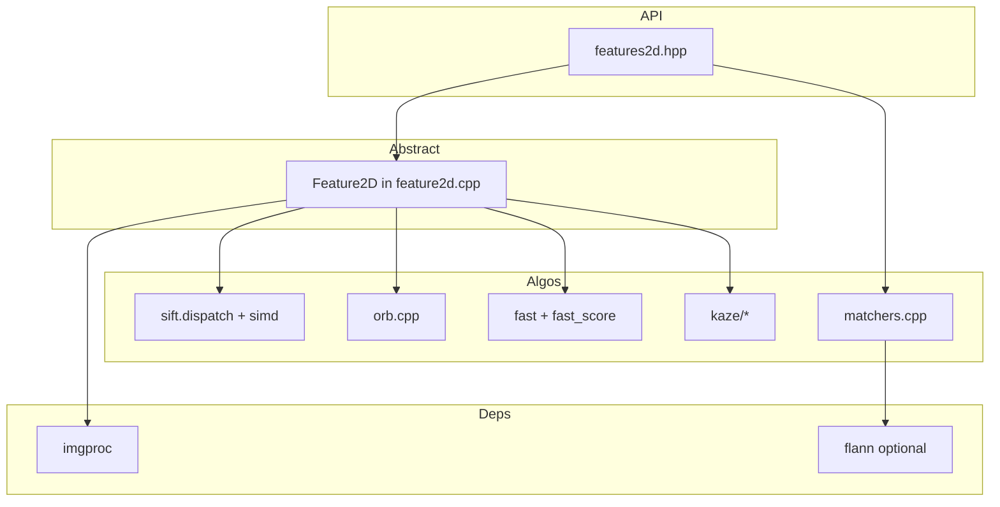

# OpenCV 4.13.0 — `modules/features2d` 代码结构分析

本文档说明 `opencv-4.13.0/modules/features2d` 的职责、构建选项、目录与主要源码对应关系，便于从 **`cv::Feature2D` / 描述子匹配 API** 定位到具体算法实现。

---

## 1. 模块定位与构建

- **职责**（`CMakeLists.txt`）：**2D Features Framework** — 二维局部特征检测与描述、描述子匹配、关键点绘制、基于词袋的粗分类等。
- **依赖**：**`opencv_imgproc`**（卷积、非极大抑制等）；可选 **`opencv_flann`**（构建模块时加 `OPTIONAL`，无 FLANN 时部分匹配/索引能力受限）。
- **调试**：`DEBUG_opencv_features2d` 时可链 `opencv_highgui`。
- **语言绑定**：Java、Objective-C、Python、JavaScript。
- **第三方资源**：`3rdparty/mscr/` 与 **MSCR/MSER** 相关的 **chi 表** 数据及许可证；安装时通过 `ocv_install_3rdparty_licenses` 声明。

### SIMD 分发

- **`ocv_add_dispatched_file(sift SSE4_1 AVX2 AVX512_SKX)`**  
  对应 `src/sift.dispatch.cpp` + `src/sift.simd.hpp`，在支持的 CPU 上启用 **SIFT** 的向量化路径。

---

## 2. 公开头文件

| 路径 | 作用 |
|------|------|
| `include/opencv2/features2d.hpp` | **主入口**：Doxygen 分组（检测与描述、匹配、绘制、分类、HAL）；声明 `Feature2D`、`KeyPointsFilter`、`DescriptorMatcher`、`drawMatches`、各具体算法类等。 |
| `include/opencv2/features2d/features2d.hpp` | 历史/拆分头（若存在则可与主头配合）。 |
| `include/opencv2/features2d/hal/interface.h` | **Feature2D HAL 接口**：如 FAST 的 HAL 类型枚举、`cvhalKeyPoint` 与 `KeyPoint` 对应的 C 布局等。 |

---

## 3. 内部预编译头：`src/precomp.hpp`

包含 **`opencv2/features2d.hpp`**、**`imgproc`**、**`core/private`**、**`ocl`**、**`hal/hal.hpp`**。模块内实现统一通过该头引入依赖，便于 OpenCL 加速路径与 HAL 替换。

---

## 4. 核心抽象与入口：`feature2d.cpp` / `keypoint.cpp`

- **`Feature2D`**：`detect` / `compute` / `detectAndCompute` 的默认实现将 **检测与计算** 聚合到子类实现的 `detectAndCompute`；支持多图、`UMat` 路径；带 **`CV_INSTRUMENT_REGION()`** 便于性能跟踪。
- **`keypoint.cpp`**：`KeyPoint` 相关的读写、运算或辅助（与头文件声明对应）。

阅读自定义特征或新算法时，**优先看某子类如何重写 `detectAndCompute`**。

---

## 5. 按算法/功能划分的源码

### 5.1 角点 / 极快检测类

| 文件 | 说明 |
|------|------|
| `fast.cpp`、`fast.hpp` | **FAST** 特征检测主流程。 |
| `fast_score.cpp`、`fast_score.hpp` | 圆周像素比较得分与加速结构。 |
| `fast.avx2.cpp` | FAST 的 **AVX2** 特化路径。 |
| `agast.cpp` | **AGAST**（与 FAST 类同家族的快速检测）。 |
| `agast_score.cpp`、`agast_score.hpp` | AGAST 得分与表驱动逻辑。 |
| `gftt.cpp` | **Good Features To Track**（含 Shi-Tomasi / Harris 等通过参数区分）。 |

### 5.2 斑点与区域类

| 文件 | 说明 |
|------|------|
| `mser.cpp` | **MSER**（最大稳定极值区域）；依赖 `3rdparty/mscr` 数据时与 MSCR 思路相关。 |
| `blobdetector.cpp` | **SimpleBlobDetector**：基于 SimpleBlobParams 的连通域/阈值级 blob。 |

### 5.3 尺度不变与二进制/浮点描述子

| 文件 | 说明 |
|------|------|
| `sift.dispatch.cpp`、`sift.simd.hpp` | **SIFT**：分发的 SIMD 实现；热点在 `dispatch` + `simd`。 |
| `orb.cpp` | **ORB**：定向 FAST + rBRIEF。 |
| `brisk.cpp` | **BRISK**：尺度空间 + 采样模式 + 二进制描述子。 |

### 5.4 KAZE / AKAZE 族（非线性尺度空间）

| 路径 | 说明 |
|------|------|
| `kaze.cpp`、`akaze.cpp` | 对 `cv::KAZE`、`cv::AKAZE` 的外层封装与注册。 |
| `kaze/` 子目录 | 核心算法实现：**非线性扩散**（`nldiffusion_functions`）、**FED**（`fed.cpp`/`fed.h`）、`KAZEFeatures.cpp`、`AKAZEFeatures.cpp` 及配置头 `KAZEConfig.h`、`AKAZEConfig.h`、`TEvolution.h`、`utils.h` 等。 |

### 5.5 匹配、词袋与绘制

| 文件 | 说明 |
|------|------|
| `matchers.cpp` | **`DescriptorMatcher`** 体系：**BruteForce**、**FlannBasedMatcher**（在编译了 FLANN 时）等；距离类型、交叉检查、KNN、`match`/`knnMatch`/`radiusMatch`。 |
| `bagofwords.cpp` | **`BOWImgDescriptorExtractor`**、**`BOWKMeansTrainer`** 等与词袋/视觉词表相关的工具。 |
| `draw.cpp` | **`drawKeypoints`**、**`drawMatches`** 等可视化。 |

### 5.6 辅助与其它

| 文件 | 说明 |
|------|------|
| `affine_feature.cpp` | **`AffineFeature`**：对任意 `Feature2D` 做仿射协变采样（多仿射形状检测）。 |
| `evaluation.cpp` | 描述子/检测器**评测**相关工具（与回归测试、重复率等指标配合）。 |
| `hal_replacement.hpp` | 与 **opencv_hal** 自定义实现对接的替换点（与 `core` HAL 机制一致）。 |
| `dynamic.cpp` | 当前仅为包含 `precomp.hpp` 的空实现文件，无额外符号（或为保留单元参与链接）。 |
| `main.cpp` | `IPP_INITIALIZER_AUTO` 等库初始化（与其它 OpenCV 模块 `main.cpp` 同类）。 |

---

## 6. OpenCL

- **`precomp.hpp`** 引入 **`opencv2/core/ocl.hpp`**，匹配器与部分 2D 特征在 **`test/ocl/`、`perf/opencl/`** 中有专项测试，说明存在 **OCL 加速分支**（具体算子以实现文件中的 `ocl::` 路径为准）。

---

## 7. 绑定与语言层

| 路径 | 说明 |
|------|------|
| `misc/python/pyopencv_features2d.hpp` | Python 绑定辅助。 |
| `misc/java/src/cpp/features2d_converters.*` | Java 侧 `KeyPoint`、`DMatch` 等与 Mat 的转换。 |

---

## 8. 测试与性能

- **`test/`**：各算法回归/不变性测试（`test_sift.cpp`、`test_orb.cpp`、`test_fast.cpp`、`test_agast.cpp`、`test_akaze.cpp`、`test_brisk.cpp`、`test_mser.cpp` 等）、描述子/检测器**回归与不变性**的 `*.impl.hpp`、**匹配器**算法测试、**OpenCL** 子目录。
- **`perf/`**：特征检测与暴力匹配等基准；`perf_feature2d.hpp` 统一计时辅助。

---

## 9. 依赖关系简图

---

## 10. 推荐阅读顺序

1. **`include/opencv2/features2d.hpp`**：类继承关系、`createXxx` 工厂、`DescriptorMatcher` 接口。  
2. **`src/feature2d.cpp`**：`detect` / `compute` 如何委托 `detectAndCompute`。  
3. **任选一种算法**：如 `orb.cpp` 或 `sift.dispatch.cpp`，对照公开参数。  
4. **`matchers.cpp`**：BF/FLANN 分支与 OpenCL。  
5. **KAZE 深度**：从 `kaze.cpp` 进入 `kaze/KAZEFeatures.cpp` 与非线性扩散模块。  

---

## 11. 版本与路径说明

- 分析对象：`opencv-4.13.0/modules/features2d`。  
- 算法列表与默认参数可能随小版本微调，以当前树中 **`features2d.hpp`** 与对应 **`*.cpp`** 为准。

---

*文档用于本地源码导航，与官方 Features2D 教程/C++ 参考互补。*
