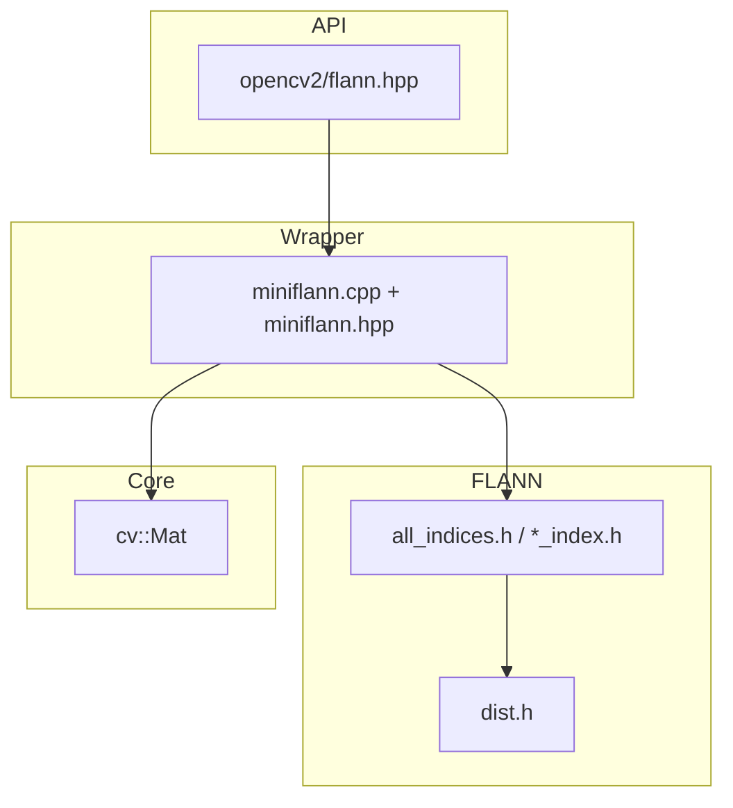

# OpenCV 4.13.0 — `modules/flann` 代码结构分析

本文档说明 `opencv-4.13.0/modules/flann` 的职责、源码与头文件布局，以及 **FLANN（Fast Library for Approximate Nearest Neighbors）** 在 OpenCV 中的集成方式。该模块以**头文件实现为主**，`src/` 中仅少量 **C++ 封装与兼容代码**。

---

## 1. 模块定位与构建

- **职责**（`CMakeLists.txt`）：**Clustering and Search in Multi-Dimensional Spaces** — 高维空间中快速近似最近邻与相关索引结构（FLANN，参见 Muja & Lowe @cite Muja2009）。
- **依赖**：仅 **`opencv_core`**。
- **语言绑定**：Python（`WRAP python`）。
- **特点**：无独立 SIMD `dispatch`、无 OpenCL 子目录；算法主体在 **`include/opencv2/flann/*.h`** 的模板实现中完成。

---

## 2. 公开入口头文件

| 路径 | 作用 |
|------|------|
| `include/opencv2/flann.hpp` | **应用推荐总入口**：聚合 `miniflann.hpp`、`flann_base.hpp`，并在文档组中说明 FLANN 用途；暴露 `cv::flann` 与 `cvflann` 中距离类型、`CvType` 特化、弃用全局 API 的前向声明等。 |
| `include/opencv2/flann/miniflann.hpp` | **`cv::flann::Index` / `IndexParams`** 等轻量封装声明（与 `cv::Mat` 友好），参数类型 `FlannIndexType`。 |
| `include/opencv2/flann/flann_base.hpp` | **`cv::flann::GenericIndex`** 及对 **`cvflann::Index`** 模板封装，连接索引构建与查询。 |

其余 **`include/opencv2/flann/`** 下大量 **`.h`** 为 **FLANN 原版头内实现**（BSD 许可，版权见各文件头部），在命名空间 **`cvflann`** 中提供数据结构、索引与距离。

---

## 3. 命名空间与层次关系

- **`cvflann`**：FLANN 核心（矩阵 `Matrix`、`IndexParams` 字典、`NNIndex`、各类 **`*_index.h`**）。
- **`cv::flann`**：OpenCV 侧薄封装：用 `Mat` 持有/传入数据，内部转换为 `cvflann::Matrix`，并管理 **`IndexParams` 内部堆对象**（见下文 `miniflann.cpp`）。

用户使用 **`cv::flann::Index`** 或 **`cv::flann::GenericIndex<Distance>`** 即可，不必直接操作 `cvflann`，除非使用高级距离类型或模板接口。

---

## 4. `src/` 源码文件

| 文件 | 说明 |
|------|------|
| **`miniflann.cpp`** | **主要编译单元**：实现 `cv::flann::IndexParams` 对底层 **`::cvflann::IndexParams*`** 的包装（构造/`delete`）、`getInt`/`setString`/遍历 `getAll()` 等；以及 **`cv::flann::Index`** 的构建、`knnSearch` / `radiusSearch` 等与 `Mat` 之间的数据拷贝与类型分发。内部 **`#define MINIFLANN_SUPPORT_EXOTIC_DISTANCE_TYPES 0`** 控制是否启用部分“非常见”距离（与编译体积/兼容性权衡有关）。 |
| **`flann.cpp`** | **体量很小**：维护已弃用的全局 **`flann_distance_type_`** 与 **`set_distance_type`**（仅 L1/L2 旧路径兼容）；新代码应使用 **`cv::flann::GenericIndex<Distance>`** 指定距离类型。 |
| **`precomp.hpp`** | 预编译头：包含 `core`、`miniflann.hpp`、`dist.h`、`index_testing.h`、`params.h`、`saving.h`、`all_indices.h`、`flann_base.hpp`、`private.hpp`，保证 `miniflann.cpp` 能实例化完整索引创建逻辑。 |

除上述外，**无**大规模 `.cpp` —— **K-d 树、KMeans 树、LSH 等均在头文件中模板实例化**。

---

## 5. 索引类型（算法枚举）

定义见 **`include/opencv2/flann/defines.h`** 中 **`flann_algorithm_t`**（节选）：

| 枚举值 | 含义 |
|--------|------|
| `FLANN_INDEX_LINEAR` | 线性扫描（精确、小数据或基准）。 |
| `FLANN_INDEX_KDTREE` | 多棵 KD 树（随机 KD）。 |
| `FLANN_INDEX_KMEANS` | 层次 KMeans 树。 |
| `FLANN_INDEX_COMPOSITE` | 组合索引（如 KMeans + KD 等复合策略，见 `composite_index.h`）。 |
| `FLANN_INDEX_KDTREE_SINGLE` | 单棵 KD 树变体。 |
| `FLANN_INDEX_HIERARCHICAL` | 层次聚类索引（`hierarchical_clustering_index.h`）。 |
| `FLANN_INDEX_LSH` | **LSH**（`lsh_index.h`、`lsh_table.h`，适合二进制/汉明类场景）。 |
| `FLANN_INDEX_SAVED` | 从磁盘加载已保存索引（`saving.h`）。 |
| `FLANN_INDEX_AUTOTUNED` | 自动调参选择索引（`autotuned_index.h`）。 |

**工厂**：**`all_indices.h`** 中 **`index_creator`** 模板根据 **`params["algorithm"]`** 的 `switch` 实例化对应 `NNIndex<Distance>`。存在两套偏特化：一类在 **`KDTreeCapability`** 为真时包含 **线性与全套 KD/KMeans/Composite/Autotuned** 等；另一类在 **无向量空间 / 不建 KD** 的情形下仅保留 **Linear、KMeans、Hierarchical、LSH** 等（具体约束见 `general.h` 与模板参数）。

---

## 6. 头文件地图（按主题）

| 主题 | 代表头文件 |
|------|------------|
| 抽象接口 | `nn_index.h`（最近邻索引接口）、`result_set.h`（K 近邻/半径结果集） |
| 树与聚类 | `kdtree_index.h`、`kdtree_single_index.h`、`kmeans_index.h`、`composite_index.h`、`hierarchical_clustering_index.h` |
| LSH | `lsh_index.h`、`lsh_table.h` |
| 线性 / 自动 | `linear_index.h`、`autotuned_index.h` |
| 距离 | `dist.h`（`L1`、`L2`、`Minkowski`、`Hamming`、`HistIntersection` 等） |
| 数据与辅助 | `matrix.h`、`heap.h`、`allocator.h`、`dynamic_bitset.h`、`random.h`、`sampling.h`、`timer.h`、`logger.h` |
| 序列化与参数 | `saving.h`、`params.h`、`general.h`、`defines.h`、`config.h` |
| 其它 | `object_factory.h`、`any.h`、`simplex_downhill.h`（内部优化子问题）、`index_testing.h`（开发与测试辅助） |

---

## 7. `misc` 与测试

- **`misc/python/pyopencv_flann.hpp`**：Python 绑定辅助。
- **`test/`**：如 **`test_lshtable_badarg.cpp`**（LSH 参数非法用例）、`test_main.cpp`、`test_precomp.hpp` 等；体量小于 dnn/core，**以参数与边界行为为主**。

---

## 8. 依赖关系简图

---

## 9. 推荐阅读顺序

1. **`include/opencv2/flann.hpp`**：文档组与 `using` 进来的距离类型列表、`CvType`。  
2. **`miniflann.hpp` + `miniflann.cpp`**：`Index` 如何包一层 `cvflann`。  
3. **`defines.h`**：`flann_algorithm_t` 与距离类型宏。  
4. **`all_indices.h`**：`index_creator` 的 `switch` 与可选模板分支。  
5. 按需深入： **`kdtree_index.h`** 或 **`lsh_index.h`** + **`dist.h`**。  

---

## 10. 版本与路径说明

- 分析对象：`opencv-4.13.0/modules/flann`。  
- FLANN 与 OpenCV 的合成方式在不同大版本间相对稳定；参数键名与枚举以当前树 **`defines.h`**、**`params.h`** 为准。

---

*文档用于本地源码导航；原理与引用请以 Muja & Lowe 及官方 FLANN 文档为准。*
