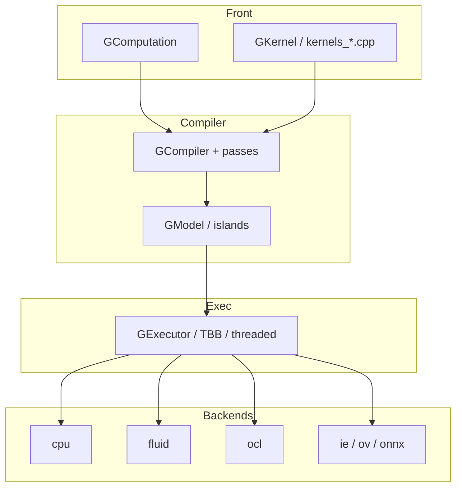

# OpenCV 4.13.0 — `modules/gapi` 代码结构分析

本文档梳理 **G-API（Graph API）** 模块 `opencv-4.13.0/modules/gapi` 的分层架构：前端图类型、编译器、执行器、多后端与流式/推理扩展，便于从 **`cv::gapi`** 公开接口追到具体实现文件。

---

## 1. 模块定位与构建前提

- **职责**（`CMakeLists.txt`）：**OpenCV G-API Core Module** — 以**计算图**描述图像/视频流水线，经**编译**映射到多种**后端**执行（CPU、Fluid、OCL、推理引擎等）。
- **硬依赖**：
  - **`opencv_imgproc`**（必选）。
  - **ADE**（图分析/变换库）：若构建树中 **`ade` 目标不存在**，整个 **`gapi` 模块会被禁用**（`ocv_module_disable(gapi)`）。
- **可选 OpenCV 模块**：**`opencv_video`**、**`opencv_calib3d`**（`OPTIONAL`），对应视频/立体等算子在条件编译下的链接与实现。
- **语言绑定**：Python。
- **私有链接**：**`ade`**（必选）、可选 **TBB**、**ITT** 追踪、**OpenVINO**（`OPENCV_GAPI_WITH_OPENVINO`）、**ONNX Runtime**、**FreeType**、**OAK(DepthAI)**、**PlaidML**、**GStreamer**、**oneVPL**、**DirectML** 相关库等（见下文可选组件）。

若在未定义 **`OPENCV_INITIAL_PASS`** 时用 **standalone** 方式配置，会走 **`cmake/standalone.cmake`** 的单独工程逻辑（与主 OpenCV 树分离构建 G-API）。

---

## 2. 总体分层（`src/`）

| 层次 | 目录/文件范围 | 职责 |
|------|----------------|------|
| **前端 API** | `src/api/` | `GMat` / `GArray` / `GOpaque` / `GFrame`、`GComputation`、`GKernel`、各类 **`kernels_*.cpp`**（core/imgproc/video/OT/streaming/stereo 等）、**`ginfer`**（推理图元）、**`media`**、**`rmat`**、**`render`** |
| **编译器** | `src/compiler/` | **`GModel`**、**`GCompiler`**、**`GCompiled`** 相关；**`passes/`**：岛（island）划分、元数据、执行计划、模式匹配替换、流式专用 Pass、**`dump_dot`** 等 |
| **执行器** | `src/executor/` | 抽象执行器、**TBB** / **线程池** 执行、**流式** `GStreamingCompiled` 对应路径、`gasync` |
| **后端** | `src/backends/` | 将图中算子落到具体运行时（见第 4 节） |
| **流式源** | `src/streaming/` | **队列**、**GStreamer**、**oneVPL** 等输入与媒体适配 |
| **其它** | `src/utils/itt.cpp` | ITT 探针；**`src/pysrc/`** Python 自定义源桥接 |

`CMakeLists.txt` 中 **`gapi_srcs`** 以显式列表列出上述 `.cpp`，便于 IDE 分组（`ocv_source_group`）。

---

## 3. 公开头文件入口

| 路径 | 作用 |
|------|------|
| **`include/opencv2/gapi.hpp`** | 主入口：聚合 **`gmat` / `garray` / `gscalar` / `gopaque` / `gframe` / `gcomputation` / `gcompiled` / `gtyped` / `gkernel` / `operators`**，以及 **streaming** 的 **`desync`**、**`format`**，避免循环依赖。 |
| **`include/opencv2/gapi/*.hpp`** | 按子域拆分：**`core.hpp`/`imgproc.hpp`/`video.hpp`/`stereo.hpp`**、**`infer*.hpp`**、**`streaming/`**、**`cpu/` `ocl/` `fluid/` `gpu/`** 各后端 kernel 声明、**`s11n.hpp`** 序列化、**`render.hpp`** 等（约百级头文件）。 |

Doxygen 分组在 **`gapi.hpp`** 注释中定义（主类、数据对象、标准后端、编译参数、序列化等）。

---

## 4. 后端目录（`src/backends/`）

| 子目录 | 说明 |
|--------|------|
| **`cpu/`** | **默认 CPU 后端**：`gcpubackend.cpp`、`gcpukernel.cpp`、`gcpuimgproc.cpp`、`gcpuvideo.cpp`、`gcpucore.cpp`、`gcpustereo.cpp`、`gcpuot.cpp`、**`gnnparsers.cpp`**（检测解析等）。 |
| **`fluid/`** | **Fluid** 行缓冲/滑动窗口后端，面向流水线内存局部性；**`gfluid*_func.dispatch.cpp`** 由 CMake 做 **SSE4_1 / AVX2** 分发（`gfluidimgproc_func`、`gfluidcore_func`）。 |
| **`ocl/`** | **OpenCL** 后端：`goclbackend.cpp`、`goclkernel.cpp`、`goclimgproc.cpp`、`goclcore.cpp`。 |
| **`ie/`** | **传统 Inference Engine** 路径：`giebackend.cpp`、`giewrapper.cpp`（与 Intel IE/OV 生态衔接， CMake 注释提示理想上仅在启用 IE 时编译）。 |
| **`ov/`** | **OpenVINO 新版** 后端：`govbackend.cpp`；与 **`OPENCV_GAPI_WITH_OPENVINO`**、`bindings_ov.cpp` 配合。 |
| **`onnx/`** | **ONNX Runtime** 后端：`gonnxbackend.cpp`；可选 **DirectML / CoreML** 执行提供：`dml_ep.cpp`、`coreml_ep.cpp`。 |
| **`render/`** | **渲染/叠加**（FreeType 等）：`grenderocv.cpp`、`ft_render.cpp`。 |
| **`plaidml/`** | **PlaidML** 实验性后端（受 `HAVE_PLAIDML` 控制）。 |
| **`oak/`** | **Luxonis OAK / DepthAI**：`goak*.cpp`（`HAVE_OAK`）。 |
| **`streaming/`** | 流式场景下与图执行协作的后端胶水：`gstreamingbackend.cpp`。 |
| **`python/`** | **Python 自定义算子**桥：`gpythonbackend.cpp`。 |
| **`common/`** | **元后端**、**复合后端**：`gmetabackend.cpp`、`gcompoundbackend.cpp`、`gcompoundkernel.cpp`；**序列化** `serialization.cpp`（与 `src/api/s11n.cpp` 等配合）。 |

复合后端允许多个岛分别落到不同实现（例如部分 OCV CPU + 部分 IE）。

---

## 5. 编译器 Pass（`src/compiler/passes/`）

代表性文件（与图优化/可执行划分强相关）：

- **`islands.cpp`**：岛划分。
- **`meta.cpp`**、**`kernels.cpp`**、**`exec.cpp`**：元数据与内核绑定、执行相关。
- **`pattern_matching.cpp`**、**`perform_substitution.cpp`**、**`transformations.cpp`**：模式匹配与图变换。
- **`streaming.cpp`**、**`intrin.cpp`**：流式与内建相关优化。
- **`dump_dot`**：导出 DOT 便于调试图结构。

---

## 6. 流式与多媒体

- **`src/streaming/gstreamer/`**：GStreamer 管道封装、缓冲与环境（`HAVE_GSTREAMER` + `OPENCV_GAPI_GSTREAMER`）。
- **`src/streaming/onevpl/`**：Intel **oneVPL** 解码/转码/预处理管线，体量较大（引擎、会话、加速器策略、DX11/VAAPI 等）。
- **`src/streaming/queue_source.cpp`**：通用队列源。
- **`src/pysrc/python_stream_source.cpp`**：从 Python 喂帧的源。

头文件位于 **`include/opencv2/gapi/streaming/`** 下各子目录。

---

## 7. 第三方与 SIMD

- **`src/3rdparty/vasot/`**：**VAS Object Tracking** 相关源码与 **`LICENSE`**（安装时单独声明许可）；供 **`gcpuot`** 等 OT 路径使用。
- **Fluid 分发**：**`ocv_add_dispatched_file`** 对 **`backends/fluid/gfluidimgproc_func`**、**`gfluidcore_func`** 使用 **SSE4_1、AVX2**。

---

## 8. 测试与示例

- **`test/`**：按 **cpu / gpu / infer / streaming / s11n / oak / render** 等分子目录；**`opencv_test_gapi` 直接链 `ade`**（因 ADE 符号可能未从 `libopencv_gapi` 再导出，CMake 中有说明）。
- **`perf/`**、**`samples/`**、**`doc/`**（模块内文档与幻灯）、**`misc/python/`** 包装与测试。

---

## 9. 架构简图

---

## 10. 推荐阅读顺序

1. **`include/opencv2/gapi.hpp`** 与 **`gcomputation.hpp`**：图如何定义与编译。  
2. **`src/compiler/gcompiler.cpp`**、**`gcompiled.cpp`**：编译产物形态。  
3. **`src/backends/cpu/gcpubackend.cpp`**：最直观的“算子如何落到实现”。  
4. **`src/compiler/passes/islands.cpp`**：多后端协作的岛模型。  
5. 推理：**`src/api/ginfer.cpp`** + **`backends/ov`** 或 **`onnx`**。  
6. 流式：**`src/executor/gstreamingexecutor.cpp`** + **`streaming/gstreamer`** 或 **`onevpl`**。  

---

## 11. 版本与路径说明

- 分析对象：`opencv-4.13.0/modules/gapi`。  
- 后端可用性、宏名与可选依赖随 CMake 与三方版本变化，以当前树 **`CMakeLists.txt`** 与 **`cvconfig.h`** 为准。

---

*文档用于源码导航，概念与教程请参考 OpenCV 官方 G-API 文档与 samples。*
