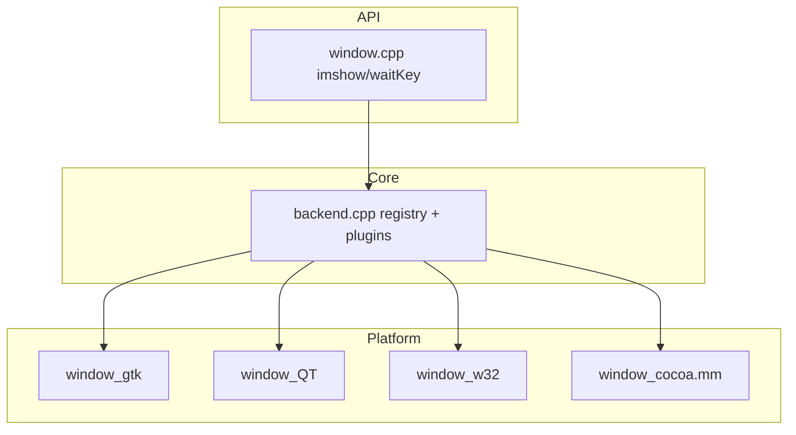

# OpenCV 4.13.0 — `modules/highgui` 代码结构分析

本文档说明 `opencv-4.13.0/modules/highgui` 的职责：**窗口显示、键盘鼠标交互、滑动条** 等高层 GUI；实现上采用 **`UIBackend` 抽象 + 平台/工具包具体后端**，并支持 **动态插件** 与运行时 **`OPENCV_UI_BACKEND`** 选择。

---

## 1. 模块定位与构建

- **职责**（`CMakeLists.txt`）：**High-level GUI**（`imshow`、`waitKey`、`namedWindow`、Trackbar、`selectROI` 等）。
- **依赖**：**`opencv_imgproc`**（必选）；可选 **`opencv_imgcodecs`**、**`opencv_videoio`**（用于部分展示/捕获协同场景）。
- **语言绑定**：Android 上仅 **Python**；其它平台 **Python + Java**。
- **生成配置**：构建时写入 **`opencv_highgui_config.hpp`**，宏 **`OPENCV_HIGHGUI_BUILTIN_BACKEND_STR`** 记录内置后端名称（如 `GTK3`、`QT5`、`WIN32UI`、`NONE` 等）；若无内置后端则定义 **`OPENCV_HIGHGUI_WITHOUT_BUILTIN_BACKEND`**。

---

## 2. 源码骨架（所有配置共有）

下列文件**始终**参与编译（与具体 GUI 后端无关）：

| 文件 | 作用 |
|------|------|
| **`src/backend.cpp`** | **后端框架**：`cv::highgui_backend` 命名空间下 `UIBackend` / `UIWindow` / `UITrackbar` 等虚接口；**注册表**遍历、按优先级/环境变量 **`OPENCV_UI_BACKEND`** 实例化后端；**插件**加载（`ENABLE_PLUGINS` 时，见 `plugin_wrapper.impl.hpp`）。 |
| **`src/window.cpp`** | **对外 C/C++ API 的主体实现**：窗口表、`imshow`、`waitKey`、`createTrackbar` 等与后端的调度；体量较大，可视为 **“门面 + 线程安全 + 后端调用”**。 |
| **`src/roiSelector.cpp`** | **交互式 ROI 选择**（如 `selectROI` / `selectROIs`）的通用逻辑，与各后端事件结合。 |

内部头文件（协作上述三文件）包括 **`backend.hpp`**、**`registry.hpp` / `registry.impl.hpp`**、**`factory.hpp`**、**`plugin_api.hpp`**、**`plugin_wrapper.impl.hpp`**。

---

## 3. 内置后端（CMake 互斥选择）

同一构建中通常只选一个 **`OPENCV_HIGHGUI_BUILTIN_BACKEND`**，优先级顺序由 **`CMakeLists.txt`** 中的 **`if/elseif`** 链决定（简化为常见分支）：

| 条件 | 内置后端宏/字符串 | 主要源文件 |
|------|-------------------|------------|
| **Wayland**（`WITH_WAYLAND`） | `Wayland` | `window_wayland.cpp`，可生成 **xdg-shell** 协议存根 |
| **Qt**（`HAVE_QT`） | `QT5` / `QT6` 等 | `window_QT.cpp`、`window_QT.h`、`window_QT.qrc`；**MOC/RCC** 由 CMake 生成 |
| **WinRT**（`WINRT`） | `WINRT` | `window_winrt.cpp`、`window_winrt_bridge.*`（8.1+） |
| **macOS Cocoa**（`HAVE_COCOA`） | `COCOA` | **`window_cocoa.mm`**（Objective-C++） |
| **Win32 UI**（`ocv.3rdparty.win32ui`） | `WIN32UI` | `window_w32.cpp` |
| **GTK2/GTK3**（`ocv.3rdparty.gtk2/gtk3`） | `GTK2` / `GTK3` | **`window_gtk.cpp`**（同文件适配 GTK2/3） |
| **Framebuffer**（`WITH_FRAMEBUFFER`） | `FB` | `window_framebuffer.cpp` / `.hpp` |

若上述均未选中且未通过插件提供 UI，则 **`OPENCV_HIGHGUI_BUILTIN_BACKEND`** 为 **`NONE`**（仍可有插件后端）。

**OpenGL**：在 **Qt / GTK / Win32** 等配置下，若检测到 OpenGL，会把相应库加入链接，用于 `imshow` 等路径中的加速/纹理展示（以各 `window_*.cpp` 实现为准）。

---

## 4. 插件机制（`cmake/plugin.cmake`）

- 选项 **`HIGHGUI_ENABLE_PLUGINS`**：打开后模块内 **`ENABLE_PLUGINS`**，测试目标同步定义。
- **`HIGHGUI_PLUGIN_LIST`** / **`all`**：可将 **GTK / GTK2 / GTK3 / win32ui** 等做成 **与主库分离的 highgui 插件**（`ocv_create_builtin_highgui_plugin`），主库可能 **不再链接对应 `window_*.cpp`**，运行时由 **`backend.cpp`** 的注册/加载逻辑选用。

阅读插件行为时，需对照根/模块 **`cmake/plugin.cmake`** 与 **`OPENCV_UI_BACKEND`**、`getBackendsInfo()` 返回的优先级。

---

## 5. 运行时后端选择

- 环境变量 **`OPENCV_UI_BACKEND`**：非空时 **`backend.cpp`** 尝试匹配注册名（大小写不敏感逻辑见 `toUpperCase` 与比较）；用于在**多后端注册**（内置+插件）下强制选用其一。
- **日志**：使用 **`cv::utils::logger`** 输出尝试顺序与失败原因（`CV_LOG_INFO` / `CV_LOG_DEBUG`）。

---

## 6. 公开头文件

| 路径 | 作用 |
|------|------|
| **`include/opencv2/highgui.hpp`** | C++ 主 API：`imshow`、`waitKey`、`setMouseCallback`、`createTrackbar` 等。 |
| **`include/opencv2/highgui/highgui.hpp`** | 细分子头（若存在与主头分工）。 |
| **`include/opencv2/highgui/highgui_c.h`** | C API 兼容。 |
| **`highgui_winrt.hpp`** | 默认从 `highgui_ext_hdrs` 中排除，仅在 **WinRT 8.1+** 等条件下加回，避免非 WinRT 构建包含 WinRT 头。 |

---

## 7. 其它

- **`src/precomp.hpp`**：统一包含 `opencv2/highgui.hpp`、`imgproc` 等与后端无关的基础头。
- **`test/test_gui.cpp`**：GUI 相关测试（在无显示环境 CI 上可能被跳过或受限）。
- **`doc/highgui_qt.cpp`**：文档用示例片段。
- **Apple**：可能额外链 **Zlib**（与图像/压缩栈有关）。

---

## 8. 依赖关系简图

---

## 9. 推荐阅读顺序

1. **`include/opencv2/highgui.hpp`**：API 面。  
2. **`src/backend.cpp`**：后端如何注册、环境变量与插件。  
3. **`src/window.cpp`**：从前端 API 到 `UIBackend` 的调用链。  
4. 按你目标平台读对应 **`window_*.cpp`**（如桌面 Linux 多为 **`window_gtk.cpp`**）。  

---

## 10. 版本与路径说明

- 分析对象：`opencv-4.13.0/modules/highgui`。  
- 实际选用的后端以构建日志 **`highgui: using builtin backend: ...`** 与生成的 **`opencv_highgui_config.hpp`** 为准。

---

*文档用于本地源码导航；无显示器/SSH 场景下行为请参考 OpenCV FAQ 与各平台后端限制。*
