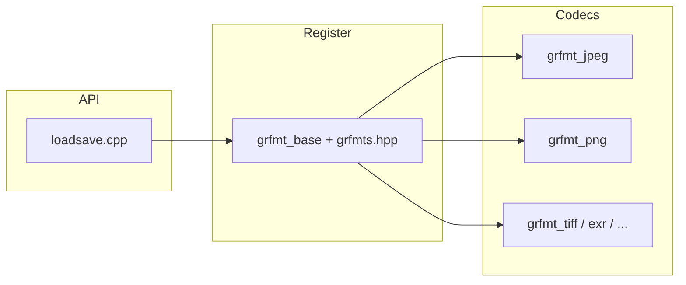

# OpenCV 4.13.0 — `modules/imgcodecs` 代码结构分析

本文档说明 `opencv-4.13.0/modules/imgcodecs` 的职责：**图像文件的读入与写出**；实现上采用 **`loadsave.cpp` 统一入口** + **`grfmt_*.cpp` 分格式编解码器** + 可选第三方库链接。

---

## 1. 模块定位与构建

- **职责**（`CMakeLists.txt`）：**Image I/O**（`imread` / `imwrite` / `imencode` / `imdecode` 等）。
- **依赖**：**`opencv_imgproc`**。
- **语言绑定**：Java、Objective-C、Python。
- **第三方库（`GRFMT_LIBS`）**：按 CMake 探测结果按需链接，常见包括 **JPEG、PNG（及 Zlib）、WebP、TIFF、Jasper、OpenJPEG、OpenEXR、libAVIF、libjpeg-xl、SPNG、GDAL、GDCM** 等；未探测到的格式仍可能有**自研或轻量**实现（如 BMP、部分 PNM）。

---

## 2. 核心源码文件

| 文件 | 说明 |
|------|------|
| **`loadsave.cpp`** | **`cv::imread` / `imwrite` / `imencode` / `imdecode`** 等主路径：扩展名与内容探测、**安全限制**（通过环境变量配置最大宽/高/像素，见文内 `OPENCV_IO_MAX_*`）、`IMREAD_*` / `IMWRITE_*` 标志解析、调用具体 **GrFmt** 读写器。 |
| **`utils.cpp` / `utils.hpp`** | 缓冲区、路径/编码辅助等共用工具。 |
| **`grfmt_base.cpp` / `grfmt_base.hpp`** | 各格式的抽象基类（签名检测、`read`/`write` 骨架）。 |
| **`grfmts.hpp`** | 聚合包含所有 **`grfmt_*.hpp`**，供 `loadsave` 与注册逻辑使用。 |
| **`exif.cpp` / `exif.hpp`** | **EXIF** 元数据解析（JPEG 等）。 |
| **`bitstrm.cpp` / `bitstrm.hpp`** | 位流读写的通用辅助。 |
| **`rgbe.cpp` / `rgbe.hpp`** | **Radiance HDR / RGBE** 相关读写辅助（与 `grfmt_hdr` 等配合）。 |

---

## 3. 分格式编解码器（`grfmt_*`）

命名惯例：**`grfmt_<格式>.{hpp,cpp}`** 对应一种或一类容器格式；内部调用 **libjpeg / libpng / libtiff** 等或纯自行解析。

| 文件（节选） | 格式 / 后端 |
|--------------|-------------|
| `grfmt_bmp` | BMP |
| `grfmt_jpeg` | JPEG（**JPEG_LIBRARIES**） |
| `grfmt_png` | PNG（**PNG + ZLIB**）；亦可能与 **SPNG** 路径相关 |
| `grfmt_spng` | 通过 **libspng** 读 PNG（`HAVE_SPNG`） |
| `grfmt_webp` | WebP |
| `grfmt_tiff` | TIFF |
| `grfmt_jpeg2000` | JPEG 2000（可与 **Jasper** 绑定；运行时默认可能关闭，见 CMake 注释-issue 14058） |
| `grfmt_jpeg2000_openjpeg` | JPEG 2000（**OpenJPEG**） |
| `grfmt_jpegxl` | JPEG XL |
| `grfmt_exr` | OpenEXR（运行时启用受 `OPENCV_IMGCODECS_USE_OPENEXR` 等控制，见 issue 21326） |
| `grfmt_avif` | AVIF（libaom/libavif 等） |
| `grfmt_gif` | GIF（`HAVE_IMGCODEC_GIF`） |
| `grfmt_hdr` | HDR（`HAVE_IMGCODEC_HDR`） |
| `grfmt_sunras` | Sun Raster（`HAVE_IMGCODEC_SUNRASTER`） |
| `grfmt_pxm` | PBM/PGM/PPM 等（`HAVE_IMGCODEC_PXM`） |
| `grfmt_pfm` | PFM（`HAVE_IMGCODEC_PFM`） |
| `grfmt_pam` | PAM |
| `grfmt_gdal` | 经 **GDAL** 读地理/栅格（`IMREAD_LOAD_GDAL` 等标志配合） |
| `grfmt_gdcm` | 医学影像 **DICOM**（GDCM） |

具体是否在**运行期**可用，除链接库外还受 **`add_definitions`**（如 `HAVE_WEBP`、`HAVE_IMGCODEC_GIF`）及 Jasper/OpenEXR 的 **强制启用宏** 影响。

---

## 4. CMake 与可选行为摘要

- **Zlib**：在需要 PNG/TIFF/OpenEXR/SPNG/JPEGXL 等组合时并入 `GRFMT_LIBS`。
- **Jasper**：可设 `OPENCV_IO_FORCE_JASPER` 强制启用运行时编解码定义；否则 CMake 会打出“运行时常关闭”的说明。
- **OpenEXR**：类似地由 `OPENCV_IO_FORCE_OPENEXR` 或 `BUILD_OPENEXR` 等条件决定是否定义 **`OPENCV_IMGCODECS_USE_OPENEXR`**。
- **测试**：存在 `OPENCV_IO_ENABLE_JASPER` / `OPENCV_IO_ENABLE_OPENEXR` 环境变量为测试目标增加定义的用法。

---

## 5. Apple 平台专用

- **`apple_conversions.h` / `apple_conversions.mm`**：通用 Apple 图像/颜色空间转换等。
- **`ios_conversions.mm`**：iOS / XROS，链 **UIKit**。
- **`macosx_conversions.mm`**：macOS，链 **AppKit**。
- **`APPLE_FRAMEWORK`**：额外 Accelerate / CoreGraphics / QuartzCore。

这些文件在 **`CMakeLists.txt`** 中按平台条件加入 `imgcodecs_srcs`。

---

## 6. 公开头文件

- **`include/opencv2/imgcodecs.hpp`**：`imread`、`imwrite`、`ImreadModes`、`ImwriteFlags`、Apple glue 分组等。
- **`include/opencv2/imgcodecs/legacy/*.h`**：遗留 C API（若存在）。

---

## 7. 数据流简图

---

## 8. 推荐阅读顺序

1. **`include/opencv2/imgcodecs.hpp`**：`IMREAD_*` / `IMWRITE_*` 语义。  
2. **`loadsave.cpp`**：从文件名/内存判断格式、限制与 `flags`。  
3. **`grfmt_base.hpp`**：新格式需要实现的接口。  
4. 任选 **`grfmt_*.cpp`**（如 `grfmt_jpeg.cpp`）看如何调第三方库。  
5. **`exif.cpp`**：需要从 JPEG 取朝向/相机信息时。  

---

## 9. 版本与路径说明

- 分析对象：`opencv-4.13.0/modules/imgcodecs`。  
- 各格式是否编进二进制、运行期是否启用，以本机 **CMake 摘要**与 **`cv::imread` 实际返回** 为准。

---

*文档用于本地源码导航；安全与 IO 上限请以 OpenCV 文档中的 `OPENCV_IO_*` 说明为准。*
