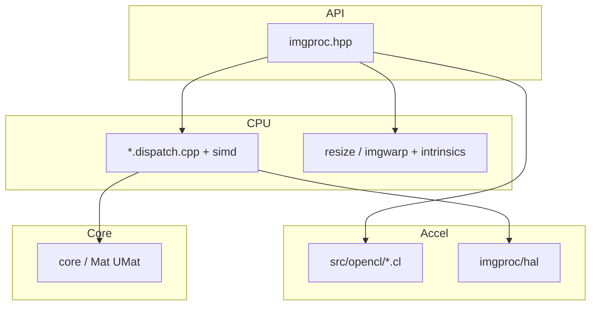

# OpenCV 4.13.0 — `modules/imgproc` 代码结构分析

本文档梳理 `opencv-4.13.0/modules/imgproc` 的职责、**SIMD 分发**策略、**HAL/OpenCL** 位置，以及 **`src/`** 主要文件与常见图像处理功能的对应关系，便于从 **`cv::GaussianBlur` 等 API** 追到 `*.dispatch.cpp` / `*.simd.hpp` 或 OpenCL 内核。

---

## 1. 模块定位与构建

- **职责**（`CMakeLists.txt`）：**Image Processing** — 滤波、几何变换、颜色处理、边缘/轮廓、特征与分割、绘图等在 **`cv::Mat`/`UMat` 上**的经典 2D 算子集合。
- **依赖**：仅 **`opencv_core`**（下游 **imgcodecs、highgui、features2d、video** 等均直接或间接依赖本模块）。
- **语言绑定**：Java、Objective-C、Python、JavaScript。
- **可选 C API 剔除**：`OPENCV_CORE_EXCLUDE_C_API` 时定义 **`OPENCV_EXCLUDE_C_API=1`**（与 core 选项一致）。
- **Intel IPP**：若启用 **`HAVE_IPP`**，可通过 **`OPENCV_IPP_GAUSSIAN_BLUR`** 为 **`smooth.dispatch.cpp`** 打开 **`ENABLE_IPP_GAUSSIAN_BLUR`**（增大二进制体积）。

---

## 2. SIMD 运行时分发（`ocv_add_dispatched_file`）

下列基名对应 **`*.dispatch.cpp`** + **`*.simd.hpp`**（或同类），在运行时按 CPU 特性选择实现：

| 基名 | 典型指令集 / 注释 |
|------|-------------------|
| `accum` | SSE4_1, AVX, AVX2 |
| `bilateral_filter` | SSE2, AVX2 |
| `box_filter` | SSE2, SSE4_1, AVX2, AVX512_SKX |
| `filter` | SSE2, SSE4_1, AVX2（含线性可分离卷积等广义滤波骨架） |
| `color_hsv` / `color_rgb` / `color_yuv` | SSE2, SSE4_1, AVX2 |
| `median_blur` | SSE2, SSE4_1, AVX2, AVX512_SKX |
| `morph` | SSE2, SSE4_1, AVX2 |
| `smooth` | SSE2, SSE4_1, AVX2, **AVX512_ICL**（含高斯模糊等） |
| `sumpixels` | SSE2, AVX2, AVX512_SKX |

阅读热点算子时：在 `src/` 搜索 **`<basename>.dispatch.cpp`** 与同名 **`simd`** 头文件。

---

## 3. 非 dispatch、但含平台特化的文件（示例）

部分算子在独立 **`*.avx.cpp` / `*.avx2.cpp` / `*.sse4_1.cpp` / `*.lasx.cpp`** 中实现，例如：

- **`resize*.cpp`**、**`imgwarp*.cpp`**：与插值、仿射/透视变换相关的向量化路径。
- **`corner.avx.cpp`**、`corner.cpp`：角点响应等。

以仓库内实际存在的 **`resize.cpp` + `resize.*.cpp`**、**`imgwarp.cpp` + `imgwarp.*.cpp`** 为准。

---

## 4. 内部预编译头：`src/precomp.hpp`

- 包含 **`opencv2/imgproc.hpp`**、**`imgproc_c.h`**、**`core/private`**、**`ocl.hpp`**、**`core/hal/hal.hpp`**、**`opencv2/imgproc/hal/hal.hpp`**、**`hal_replacement.hpp`**（自定义 HAL）、**`filterengine.hpp`**、**`_geom.h`**。
- 声明 **`icvSaturate8u_cv`**、**`icv8x32fTab_cv`** 等查找表（在 **`tables.cpp`** 中定义），供饱和运算与颜色路径快速查表。
- **IPP**：在定义 **`HAVE_IPP`** 时内联 **`ippiGetInterpolation`**，把 OpenCV `INTER_*` 映射到 IPP 插值枚举。

---

## 5. `src/` 功能分组与代表文件

下列按**主题**归类（**非穷举**；约 **75** 个顶层 `*.cpp`）。

### 5.1 滤波与卷积

| 文件（节选） | 典型 API / 含义 |
|--------------|-----------------|
| `filter.dispatch.cpp` | `filter2D`、`sepFilter2D`、Sobel/Scharr/Laplacian 等广义引擎 |
| `smooth.dispatch.cpp` | `GaussianBlur`、box blur 等平滑 |
| `box_filter.dispatch.cpp` | 盒式滤波 |
| `bilateral_filter.dispatch.cpp` | `bilateralFilter` |
| `median_blur.dispatch.cpp` | `medianBlur` |
| `morph.dispatch.cpp` | `erode`/`dilate`/`morphologyEx` |
| `stackblur.cpp` | Stack Blur 近似 |
| `deriv.cpp` | 求导辅助 |
| `spatialgradient.cpp` | `spatialGradient` |

### 5.2 颜色与类型

| 文件 | 含义 |
|------|------|
| `color.cpp` | `cvtColor` 总调度与各路径注册 |
| `color_hsv.dispatch.cpp`、`color_rgb.dispatch.cpp`、`color_yuv.dispatch.cpp` | 分色彩空间 SIMD 路径 |
| `color_lab.cpp` | Lab 等 |
| `demosaicing.cpp` | Bayer 等去马赛克 |
| `colormap.cpp` | `applyColorMap` |

### 5.3 几何变换与金字塔

| 文件 | 含义 |
|------|------|
| `resize.cpp` + 各体系向量化文件 | `resize` |
| `imgwarp.cpp` + 各体系向量化文件 | `warpAffine`/`warpPerspective`/`remap` 等 |
| `pyramids.cpp` | `pyrDown`/`pyrUp` |
| `samplers.cpp` | 采样辅助 |

### 5.4 特征、模板与变换域

| 文件 | 含义 |
|------|------|
| `corner.cpp`、`corner.avx.cpp` | `cornerMinEigenVal` 等 |
| `cornersubpix.cpp` | `cornerSubPix` |
| `hough.cpp` | 霍夫线/圆 |
| `templmatch.cpp` | `matchTemplate` |
| `phasecorr.cpp`、`phasecorr_iterative.cpp` | 相位相关 |
| `lsd.cpp` | 线段检测 LSD |
| `gabor.cpp` | Gabor 滤波器 |
| `generalized_hough.cpp` | 广义霍夫 |
| `canny.cpp` | `Canny` |

### 5.5 直方图与阈值

| 文件 | 含义 |
|------|------|
| `histogram.cpp` | 直方图、`calcHist` 等 |
| `clahe.cpp` | CLAHE |
| `thresh.cpp` | `threshold`/`adaptiveThreshold` |

### 5.6 轮廓、区域与形状

| 文件 | 含义 |
|------|------|
| `contours.cpp`、`contours_new.cpp`、`contours_link.cpp`、`contours_approx.cpp`、`contours_common.cpp` | `findContours` 体系 |
| `shapedescr.cpp` | 形状描述符 |
| `moments.cpp` | 矩 |
| `matchcontours.cpp` | 轮廓匹配 |
| `connectedcomponents.cpp` | 连通域标记 |
| `min_enclosing_convex_polygon.cpp`、`min_enclosing_triangle.cpp` | 最小外接凸多边形/三角形 |
| `convhull.cpp` | 凸包 |
| `rotcalipers.cpp` | 旋转卡壳 |

### 5.7 分割、填充与交互辅助

| 文件 | 含义 |
|------|------|
| `segmentation.cpp` | **`watershed`** 等分割相关 |

### 5.8 绘图与字体

| 文件 | 含义 |
|------|------|
| `drawing.cpp` | `line`/`rectangle`/`circle`/`putText` 等 |
| `hershey_fonts.cpp` | 矢量字体数据 |

### 5.9 其它常用

| 文件 | 含义 |
|------|------|
| `approx.cpp` | 多边形逼近 `approxPolyDP` |
| `geometry.cpp`、`intersection.cpp` | 几何计算 |
| `linefit.cpp` | 直线拟合 |
| `distransform.cpp` | 距离变换 |
| `emd.cpp`、`emd_new.cpp` | Earth Mover’s Distance |
| `blend.cpp` | `addWeighted` 等 |
| `accum.cpp` / `accum.dispatch.cpp` | 累计类运算 |
| `sumpixels.dispatch.cpp` | 像素和对（积分图等相关） |
| `featureselect.cpp` | `goodFeaturesToTrack` 辅助 |
| `intelligent_scissors.cpp` | 智能剪刀 |
| `subdivision2d.cpp` | Delaunay/三角剖分数据结构 |

### 5.10 基础设施

| 文件 | 含义 |
|------|------|
| `tables.cpp` | 查找表 |
| `utils.cpp` | 内部工具 |
| `main.cpp` | 初始化（如 IPP） |

---

## 6. OpenCL（`src/opencl/*.cl`）

大量 **`.cl`** 内核覆盖 **resize、warp、filter2D、morph、median、color、CLAHE、Canny、Hough、pryramid** 等；对应 C++ 侧通过 **`UMat`/`ocl::`** 在带 OpenCL 的构建中走 GPU 路径。函数名与 `opencv2/core/ocl` 调度可在各 **`*.cpp`** 中搜索 **`ocl::`**。

---

## 7. HAL（`include/opencv2/imgproc/hal/hal.hpp`）

与 **`hal_replacement.hpp`** 配合，允许以 **自定义 imgproc HAL** 替换部分底层实现（滤波核、几何等），与 **core HAL** 机制一致。

---

## 8. 公开 API 文档分组

**`include/opencv2/imgproc.hpp`** 中文档分组（Doxygen）覆盖：**滤波、几何变换、颜色转换、直方图、结构分析与形状描述、运动分析与对象跟踪（部分）** 等；具体子组见头文件 **`@defgroup`** 块（体量很大，适合按关键字检索）。

---

## 9. 依赖关系简图

---

## 10. 推荐阅读顺序

1. **`include/opencv2/imgproc.hpp`**：所需函数所在 `@defgroup`。  
2. **对应 `.cpp`**：多数情况下入口在同名或 `filter.cpp`/`color.cpp` 调度文件。  
3. **热点算子**：打开 **`*.dispatch.cpp`**，跟踪到 **`GET_OPTIMIZED`** 或 **`simd`** 实现。  
4. **UMat 加速**：在同一 `.cpp` 中搜索 **`ocl`**。  

---

## 11. 版本与路径说明

- 分析对象：`opencv-4.13.0/modules/imgproc`。  
- 文件列表与 dispatch 标签会随平台与版本扩展（如 LASX、AVX512 变体），以当前树 **`CMakeLists.txt`** 与 **`src/`** 为准。

---

*文档用于本地源码导航，与官方 imgproc 教程及函数参考互补。*
