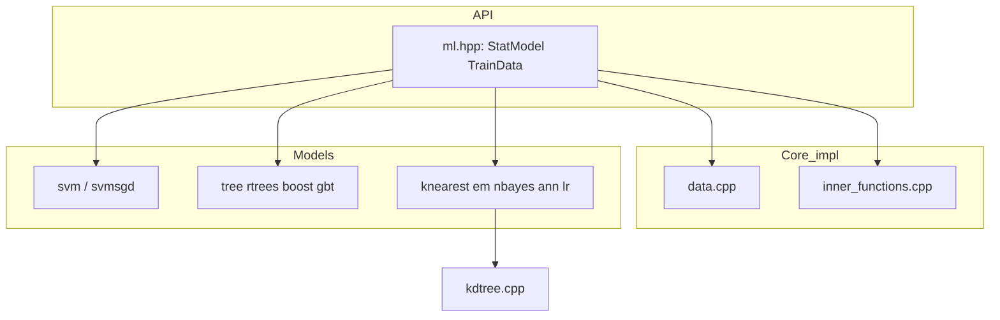

# OpenCV 4.13.0 — `modules/ml` 代码结构分析

本文档说明 `opencv-4.13.0/modules/ml` 的职责、**`cv::ml::StatModel` 体系**与各算法实现文件对应关系。该模块体量适中、**几乎全部为 C++ 源码**（无 SIMD `dispatch` 大表），依赖面窄，适合作为传统机器学习在 OpenCV 中的入口。

---

## 1. 模块定位与构建

- **职责**（`CMakeLists.txt`）：**Machine Learning** — 分类、回归、聚类及训练数据封装。
- **依赖**：仅 **`opencv_core`**。
- **语言绑定**：Java、Objective-C、Python。
- **特点**：无第三方 ML 框架依赖；算法为 OpenCV 自有实现；无 OpenCL/CUDA 分包。

---

## 2. 公开头文件

| 路径 | 说明 |
|------|------|
| **`include/opencv2/ml.hpp`** | **主入口**：`cv::ml` 命名空间、`TrainData`、`StatModel`、`ParamGrid` 及各算法类声明；大量内联/包装在 **`ml.inl.hpp`**。 |
| **`include/opencv2/ml/ml.hpp`** | 兼容头：在 **`__OPENCV_BUILD`** 下禁止直接包含，应使用 **`opencv2/ml.hpp`**。 |

Doxygen 总览见 **`ml.hpp`** 中 **`@defgroup ml`** 与 **`ml_intro`** 引用。

---

## 3. 抽象层与公共实现

| 文件 | 说明 |
|------|------|
| **`inner_functions.cpp`** | **`StatModel`** 基类默认行为、**`ParamGrid`**、交叉验证/误差计算 **`ParallelCalcError`** 等与训练流程相关的共用逻辑（`predict`/`calcError` 等路径）。 |
| **`data.cpp`** | **`TrainData`** 的默认实现：自 **`Mat`** 构建、缺失值、类别变量、训练/测试划分、**`loadFromCSV`** 等；体量较大，是数据管道的核心。 |
| **`testset.cpp`** | 与测试子集、评估辅助相关的实现。 |
| **`precomp.hpp`** | 包含 **`opencv2/ml.hpp`**、**`core/private.hpp`** 及模块内共用结构体/宏（正文后半为内部定义，读具体算法前可先浏览头部）。 |

所有具体模型类均继承（直接或简介）**`cv::ml::StatModel`**，并通过 **`Ptr<TrainData>`** 或 **`InputArray samples`** 接口训练。

---

## 4. 算法实现文件一览

| 源文件 | 算法类 / 内容 |
|--------|----------------|
| **`svm.cpp`** | **`SVM`** 支持向量机（含 `trainAuto` 等与 **`ParamGrid`** 配合）。 |
| **`svmsgd.cpp`** | **`SVMSGD`** 随机梯度下降型线性 SVM。 |
| **`knearest.cpp`** | **`KNearest`**；内部配合 **`kdtree.cpp` / `kdtree.hpp`** 做最近邻搜索。 |
| **`nbayes.cpp`** | **`NormalBayesClassifier`**。 |
| **`em.cpp`** | **`EM`**（高斯混合期望最大化）。 |
| **`lr.cpp`** | **`LogisticRegression`**。 |
| **`ann_mlp.cpp`** | **`ANN_MLP`** 多层感知机。 |
| **`tree.cpp`** | **`DTrees`** 决策树（CART 风格等，以文档为准）。 |
| **`rtrees.cpp`** | **`RTrees`** 随机森林。 |
| **`boost.cpp`** | **`Boost`**（离散 AdaBoost 等 boosting 树模型）。 |
| **`gbt.cpp`** | **`GBTrees`** 梯度提升树。 |

阅读某一算法时，一般顺序：**`ml.hpp` 中类声明** → **同名 `.cpp`** → **是否调用 `tree.cpp` 公共树代码**（随机森林/提升树常复用树结构）。

---

## 5. 依赖关系简图

---

## 6. 测试与 Python

- **`test/`**：按算法划分的回归测试；**`test_kmeans.cpp`** 针对 **`cv::kmeans`**（实现在 **core** 模块），此处作集成/行为验证。
- **`misc/python/pyopencv_ml.hpp`**：Python 绑定辅助。

---

## 7. 推荐阅读顺序

1. **`include/opencv2/ml.hpp`**：`StatModel`、`TrainData`、各 `::create()`。  
2. **`data.cpp`**：如何把 `Mat` 变成可训练数据、类别/缺失值语义。  
3. **`inner_functions.cpp`**：`train`/`predict`/`calcError` 的默认与钩子。  
4. 任选 **`svm.cpp`** 或 **`rtrees.cpp`** 看完整训练循环。  
5. **`knearest.cpp` + `kdtree.*`**：理解 KNN 与 KD 树在本模块中的角色。  

---

## 8. 版本与路径说明

- 分析对象：`opencv-4.13.0/modules/ml`。  
- 超参数默认值与 API 细节以当前树 **`ml.hpp`** 与各 **`*.cpp`** 为准。

---

*文档用于本地源码导航；与官方 `ml_intro` 教程及_statistical models_ 说明互补。*
