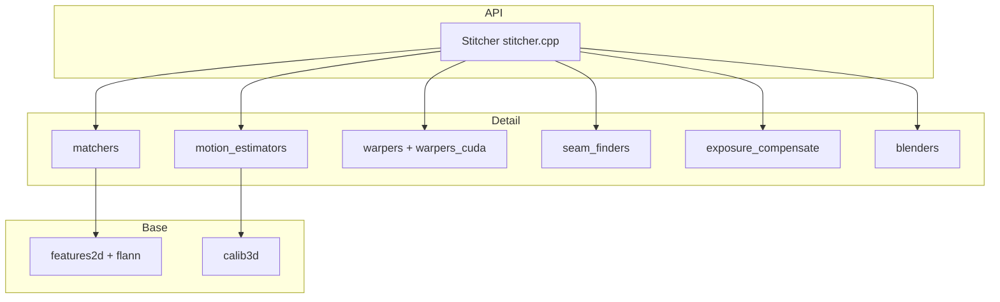

# OpenCV 4.13.0 — `modules/stitching` 代码结构分析

本文档说明 `opencv-4.13.0/modules/stitching`：**多幅图像拼接为全景/大图** 的高层管线。对外以 **`cv::Stitcher`** 为主，**`cv::detail`** 命名空间内提供可替换的匹配、估计、接缝与融合等积木；理论基础与文献见 **`stitching.hpp`** 中的 **Brown & Lowe @cite BL07** 等引用。

---

## 1. 模块定位与构建

- **职责**（`CMakeLists.txt`）：**Images stitching**。
- **必选依赖**：**`opencv_imgproc`**、**`opencv_features2d`**、**`opencv_calib3d`**、**`opencv_flann`**。
- **可选依赖**：
  - **CUDA 系列**（需相应模块与 **ENABLE_CUDA_FIRST_CLASS_LANGUAGE** 时链 **`CUDA::cudart`**）：**`opencv_cudaarithm`**、**`cudawarping`**、**`cudafeatures2d`**、**`cudalegacy`**、**`cudaimgproc`**。
  - **Contrib**：**`opencv_xfeatures2d`**（如 SIFT 等扩展特征）；若 **`BUILD_opencv_world AND OPENCV_WORLD_EXCLUDE_EXTRA_MODULES`** 等条件下，CMake 可将 **`STITCHING_CONTRIB_DEPS` 置空**，此时不强制链接 **xfeatures2d**。
- **语言绑定**：Python。
- **CUDA 编译**：若开启 CUDA，CMake 对部分警告 **禁用**（`-Wundef` 等）。

---

## 2. 管线与两种相机模型（概念）

官方在 **`stitching.hpp`** 中说明管线与 **StitchingPipeline.jpg** 示意图，并与 **BL07** 类方法对应。

- **单应（透视）模型**：旋转全景、手持/脚架绕光学中心拍摄等；对应 **`HomographyBasedEstimator`**、**`BundleAdjusterRay`/`BundleAdjusterReproj`**、**`BestOf2NearestMatcher`** 等。
- **仿射模型**：扫描件、俯视拼接等；对应 **`AffineBasedEstimator`**、**`BundleAdjusterAffine*`**、**`AffineBestOf2NearestMatcher`**、**`AffineWarper`** 等。

**`Stitcher::create(Mode)`** 在 **`stitcher.cpp`** 中为 **`PANORAMA` / `SCANS`** 等模式装配默认对象（特征检测器、 Matcher、Estimator、BundleAdjuster、Warper、SeamFinder、Blender 等）；**不要混用**针对两种模型设计的类。

---

## 3. 公开头文件分层

| 路径 | 作用 |
|------|------|
| **`include/opencv2/stitching.hpp`** | **`Stitcher`** 类声明、**`Stitcher::Mode`**、`create`；聚合 **`warpers.hpp`** 与 **`detail/*`** 中与默认管线相关的声明；大量 Doxygen 分组（匹配、旋转估计、自标定、变形、接缝、曝光、融合）。 |
| **`include/opencv2/stitching/warpers.hpp`** | 投影面 Warper 工厂与常用 **`WarperCreator`**（球面、柱面、平面、仿射等）声明。 |
| **`include/opencv2/stitching/detail/*.hpp`** | 各子步骤接口：**`matchers`**、**`motion_estimators`**、**`autocalib`**、**`camera`**、**`exposure_compensate`**、**`seam_finders`**、**`blenders`**、**`timelapsers`**、**`warpers`** + **`util`** / **`util_inl`** / **`warpers_inl`**。 |

---

## 4. `src/*.cpp` 与 `detail` 头文件对应

| 源文件 | 内容概要 |
|--------|-----------|
| **`stitcher.cpp`** | **`Stitcher::create`** 默认参数、**`stitch`/`compose`** 等主流程，把多分辨率工作尺度、注册、接缝估计、曝光补偿、混合串起来。 |
| **`matchers.cpp`** | 特征匹配、**`BestOf2NearestMatcher`** / **`AffineBestOf2NearestMatcher`** 等实现侧。 |
| **`motion_estimators.cpp`** | 单应/仿射 **Estimator**、**BundleAdjuster**、置信度传播、**wave correction** 等。 |
| **`autocalib.cpp`** | 焦距/视场等自标定相关。 |
| **`camera.cpp`** | **`detail::Camera`** 参数化与辅助。 |
| **`warpers.cpp`** | CPU 路径 **RotationWarper** 族与映射。 |
| **`warpers_cuda.cpp`** | 与 **CUDA warping** 相关的加速路径（受 **`HAVE_OPENCV_CUDAWARPING`** 等保护）。 |
| **`exposure_compensate.cpp`** | 块/通道曝光补偿（**`ExposureCompensator`** 层次）。 |
| **`seam_finders.cpp`** | 接缝线搜索（如 **GraphCut**、**Voronoi** 等实现）。 |
| **`blenders.cpp`** | 多频带等 **Blender** 实现。 |
| **`timelapsers.cpp`** | 时序/曝光渐变 **Timelapser**（HDR/序列合成场景）。 |
| **`util.cpp`** | 通用工具函数；**`util_log.hpp`** 为内部日志辅助。 |

实现文件数量不多，**逻辑集中在少数大文件**；具体类名以各 **`detail/*.hpp`** 为准。

---

## 5. `src/precomp.hpp`

- 包含 **`opencv2/stitching.hpp`** 与 **全部 `detail` 头**、**`imgproc`/`features2d`/`calib3d`**、**`core/ocl.hpp`**（支持 **UMat** 与 OpenCL 路径）。
- 按 **`HAVE_OPENCV_CUDA*`** 条件包含 **cudaarithm / cudawarping / cudafeatures2d / cudalegacy / cudaimgproc** 头文件，供 **`warpers_cuda.cpp`** 等使用。

---

## 6. 测试与性能

- **`test/`**：拼接器整体（**`test_stitcher.cpp`**）、混合器（含 **CUDA** 变体）、曝光补偿、匹配器、重投影、**`wave_correction`** 等。
- **`perf/`**：估计器、匹配器、拼接、warper；**`perf/opencl`** 下有 OpenCL 相关用例。

---

## 7. 依赖关系简图

---

## 8. 推荐阅读顺序

1. **`include/opencv2/stitching.hpp`**：模式与默认组合说明、**X11 `Status` 宏** 冲突提示。  
2. **`src/stitcher.cpp`**：`create` 中的默认 **`ORB`**、**`GraphCutSeamFinder`**、**`MultiBandBlender`** 等。  
3. 深入替换某一步：**`detail/matchers.hpp` + `matchers.cpp`**，或 **motion_estimators / seam_finders / blenders**。  
4. **CUDA**：**`warpers_cuda.cpp`** 与 **`precomp.hpp`** 中 CUDA 宏。  

---

## 9. 版本与路径说明

- 分析对象：`opencv-4.13.0/modules/stitching`。  
- 默认特征与融合器可能随小版本微调，以 **`Stitcher::create`** 实现为准。

---

*文档用于本地源码导航；与 `samples/cpp/stitching.cpp`、`stitching_detailed.cpp` 及官方 Stitching 教程互补。*
