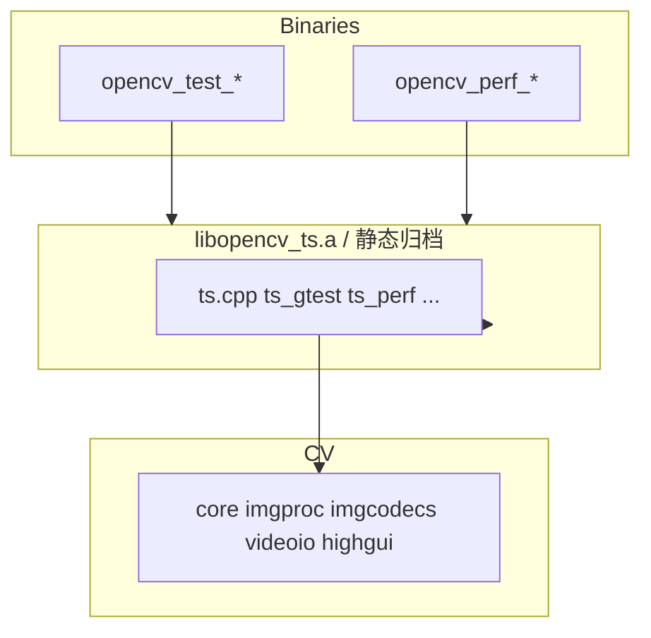

# OpenCV 4.13.0 — `modules/ts` 代码结构分析

本文档说明 **`modules/ts`（Test Support）**：OpenCV **单元测试与性能测试** 的专用支撑库，**不对最终用户应用暴露产品 API**。只有在开启 **`opencv_ts`** 或 **`BUILD_TESTS` / `BUILD_PERF_TESTS`** 时才会参与构建；默认配置下若未测需要求，该模块会被 **禁用**。

---

## 1. 模块定位与构建特征

- **职责**（`CMakeLists.txt`）：**The ts module** — 为全树 **`opencv_test_*` / `opencv_perf_*`** 可执行文件提供 **Google Test 集成、CV 专用断言、性能测试基类、数据路径、OpenCL/CUDA 测试脚手架** 等。
- **模块属性**：
  - **`INTERNAL`**：标记为内部模块。
  - **`OPENCV_MODULE_TYPE STATIC`**：以**静态库**形式链接进各测试程序（不随 `opencv_world` 作为独立 `libopencv_ts` 面向应用分发，与 **`OPENCV_MODULE_IS_PART_OF_WORLD FALSE`** 一致）。
- **启用条件**：若 **`NOT BUILD_opencv_ts AND NOT BUILD_TESTS AND NOT BUILD_PERF_TESTS`**，则 **`ocv_module_disable(ts)`**，整个模块不生成。
- **依赖**：**`opencv_core`**、**`imgproc`**、**`imgcodecs`**、**`videoio`**、**`highgui`**（测试常需读图、写临时文件、弹窗调试等）。
- **无 WRAP**：不向 Java/Python 等绑定导出该模块。

### 其它 CMake 行为

- **WINRT**：用 **`add_env_definitions`** 注入 **`OPENCV_TEST_DATA_PATH`**、**`OPENCV_PERF_VALIDATION_DIR`**（无环境变量可用时）。
- **生成 `opencv_tests_config.hpp`**（构建目录）：写入 **`OPENCV_INSTALL_PREFIX`**、**`OPENCV_TEST_DATA_INSTALL_PATH`** 等，供测试定位数据。
- **`OPENCV_DISABLE_THREAD_SUPPORT`**：为兼容 **gtest** 线程模型，可向公共编译定义 **`GTEST_HAS_PTHREAD=0`**（参见 `ts_gtest.h` 说明）。
- **QNX**：可选链接 **regex**。

---

## 2. 公开头文件体系（供测试源码 `#include`）

| 路径 | 作用 |
|------|------|
| **`include/opencv2/ts.hpp`** | **总头**：定义 **`__OPENCV_TESTS`**、拉齐 **core/imgproc/imgcodecs/videoio/highgui**、**测试标签宏**（见下节）、**GTest 宏开关**（`GTEST_DONT_DEFINE_*`）、再包含 **`ts_gtest.h`** 等。体积大，是各模块 **`test_precomp.hpp`** 的常见顶层包含。 |
| **`include/opencv2/ts/ts_gtest.h`** | 随 **`ts_gtest.cpp`** 配套的 **Google Test** 公开 API 头（OpenCV 树内 vendored/同步版本；版权声明为 Google）。 |
| **`include/opencv2/ts/ts_ext.hpp`** | 扩展宏与 CV 侧测试工具声明（由 **`ts.hpp`** 或 perf 头间接使用）。 |
| **`include/opencv2/ts/ts_perf.hpp`** | **性能测试**：**`perf` 命名空间**、**`TestBase`**、典型分辨率常量（VGA、720p 等）、参数化模板与原语。 |
| **`include/opencv2/ts/ocl_test.hpp` / `ocl_perf.hpp`** | **OpenCL** 正确性 / 性能测试封装。 |
| **`include/opencv2/ts/cuda_test.hpp` / `cuda_perf.hpp`** | **CUDA** 测试封装。 |

应用开发**不应**依赖这些头；若链接到 `opencv_ts`，通常仅出现在 **构建目录中的测试目标**。

---

## 3. 测试标签宏（`ts.hpp` 节选）

用于 **`TEST`/`PARAM` 用例打标签**，便于按内存、时长、分辨率、**OpenCL** 等过滤（与 **`ts_tags`** 实现配合）：

- **内存**：`CV_TEST_TAG_MEMORY_512MB` … `mem_14gb`  
- **时长**：`long`、`verylong`、`debug_long` …  
- **分辨率**：`size_hd`、`size_fullhd`、`size_4k`  
- **其它**：`type_64f`、`filter_small`…`filter_huge`、`opencl`  

具体过滤策略以 **`ts_tags.cpp`** 与测试运行脚本/环境变量为准。

---

## 4. `src/` 源文件分工

| 文件 | 说明 |
|------|------|
| **`ts.cpp`** | 核心杂项：**测试数据路径**、环境、目录检查、与 **OpenCL** 信息/分配统计 **dump**（见内 `HAVE_OPENCL` 分支）、跨平台 **信号/异常** 等测试运行期支撑。 |
| **`ts_gtest.cpp`** | 与 **Google Test** 链接的胶水实现（**不得**定义 `GTEST_LINKED_AS_SHARED_LIBRARY` 为 ts，与 `precomp.hpp` 断言一致）。 |
| **`ts_perf.cpp`** | 性能测试运行时：**`perf`** 框架与 **`TestBase`** 相关实现。 |
| **`ts_func.cpp`** | 功能测试通用辅助（与 **CV_Assert**、矩阵对比等相关的封装，以代码为准）。 |
| **`ts_arrtest.cpp`** | 数组/矩阵类测试辅助例程。 |
| **`ts_tags.cpp` / `ts_tags.hpp`** | 测试 **tag** 注册与解析。 |
| **`ocl_test.cpp` / `ocl_perf.cpp`** | OpenCL 测试与 perf 后端。 |
| **`cuda_test.cpp` / `cuda_perf.cpp`** | CUDA 测试与 perf 后端。 |
| **`precomp.hpp`** | 包含 **`opencv2/ts.hpp`**、日志与配置头；禁止 **`GTEST_LINKED_AS_SHARED_LIBRARY`**。 |

---

## 5. 依赖关系简图

---

## 6. 推荐阅读顺序（针对贡献测试代码）

1. **`include/opencv2/ts.hpp`**：标签宏、与 GTest 的包含顺序。  
2. 参考某模块 **`test/test_precomp.hpp`**：看如何最小 include。  
3. **`ts_perf.hpp` + `ts_perf.cpp`**：写 **`PERF_TEST`** 系列用例。  
4. **`ocl_test.hpp` / `cuda_test.hpp`**：加速器测试模板。  

---

## 7. 版本与路径说明

- 分析对象：`opencv-4.13.0/modules/ts`。  
- GTest 头版本与宏可能与上游更新不同步，以当前树 **`ts_gtest.h`** 为准。

---

*文档用于理解 OpenCV 自测基础设施；终端用户只需安装二进制与 `opencv-python` 等，无需关心 `ts` 模块。*
