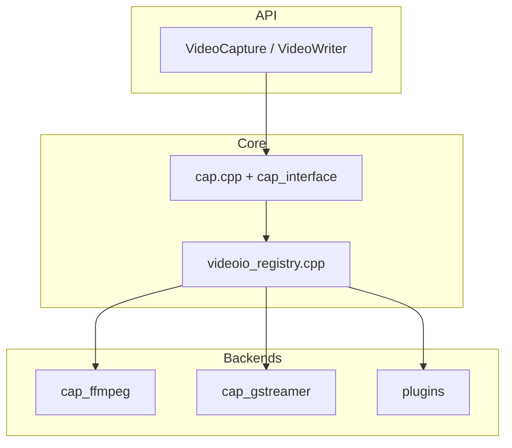

# OpenCV 4.13.0 — `modules/videoio` 代码结构分析

本文档说明 `opencv-4.13.0/modules/videoio`：**视频/图像序列的读取与写入**、**摄像头采集** 及**多后端**注册机制。与 **`modules/video`（视频分析算法）** 不同：本模块负责 **I/O**，将帧解码为 **`Mat`/`UMat`**。

---

## 1. 模块定位与构建

- **职责**（仓库内注释 / Doxygen）：**Video I/O** — `VideoCapture`、`VideoWriter`、后端枚举 **`CAP_*`**、硬件加速标志等。
- **依赖**：**`opencv_imgproc`**、**`opencv_imgcodecs`**（与转码、部分格式路径相关）。
- **语言绑定**：Java、Objective-C、Python。
- **插件总开关**：**`VIDEOIO_ENABLE_PLUGINS`**（默认在 EMSCRIPTEN、iOS、XROS、WINRT 下为 **OFF**；否则多为 **ON**）。
- **`VIDEOIO_PLUGIN_LIST`**：逗号分隔列表，可将 **ffmpeg、gstreamer、mfx、msmf、ueye** 或 **`all`** 编成**动态插件**（与主 **`libopencv_videoio`** 分离）；若关闭 **`VIDEOIO_ENABLE_PLUGINS`**，列表会被忽略并告警。

启用插件时 CMake 会创建 **`opencv_videoio_plugins`** 聚合目标（见 `CMakeLists.txt`）。

---

## 2. 始终参与的核心源文件

与平台后端无关，几乎每个配置都会编译：

| 文件 | 说明 |
|------|------|
| **`cap.cpp`** | **`VideoCapture`/`VideoWriter`** 的高层封装，与 **`cap_interface.hpp`** 定义的捕获器接口协作。 |
| **`videoio_registry.cpp`** | **后端注册表**：静态/动态后端工厂、`CAP_*` 与名称映射、`getBackendName`、`getBuildInformation` 相关数据来源之一（见文件内 **`builtin_backends[]`** 及排序注释）。 |
| **`videoio_c.cpp`** | **C API**（`CvCapture`/`CvVideoWriter` 等）。 |
| **`backend_static.cpp` / `backend_plugin.cpp`** | **静态链接后端**与**插件加载**（**`ENABLE_PLUGINS`**）。含 **`plugin_api.hpp`**、**`capture_api`/`writer_api`** 等。 |
| **`cap_images.cpp`** | 将**图像序列**（如 `img_%02d.jpg`）当作“视频”读入。 |
| **`cap_mjpeg_decoder.cpp` / `cap_mjpeg_encoder.cpp`** | **MJPEG** 类裸流或专用路径。 |
| **`container_avi.cpp`** | **AVI** 容器相关辅助。 |

阅读 I/O 总入口时：**`cap.cpp` + `videoio_registry.cpp` + `cap_interface.hpp`**。

---

## 3. 典型后端与源文件（按 CMake 条件加入）

下列文件仅在探测到对应 **`ocv.3rdparty.*`** 目标时加入（名称与 4.13.0 树一致）：

| 后端 / 用途 | 源文件（节选） |
|-------------|----------------|
| **FFmpeg** | **`cap_ffmpeg.cpp`**、**`cap_ffmpeg_impl.hpp`**、**`ffmpeg_codecs.hpp`**；可选 **`HAVE_FFMPEG_WRAPPER`**（Windows 上常用预编译 DLL，**非插件**时安装阶段复制 **`opencv_videoio_ffmpeg*.dll`**）。 |
| **GStreamer** | **`cap_gstreamer.cpp`** |
| **Intel Media SDK / MFX** | **`cap_mfx_*.cpp`**、**`cap_mfx_plugin.cpp`**（可改插件） |
| **Windows** | **DirectShow** `cap_dshow.*`、**MSMF** `cap_msmf.*`、**WinRT** `cap_winrt_*.cpp` 等 |
| **Linux** | **V4L/V4L2** `cap_v4l.cpp`、**Xine** `cap_xine.cpp` |
| **macOS / iOS** | **AVFoundation** `cap_avfoundation*.mm` |
| **Android** | **`cap_android_camera.cpp`**、**`cap_android_mediandk.cpp`** |
| **工业/科研相机** | **IEEE1394** `cap_dc1394_v2.cpp`、**XIMEA** `cap_ximea.cpp`、**Aravis** `cap_aravis.cpp`、**PvAPI** `cap_pvapi.cpp`、**uEye** `cap_ueye.cpp` |
| **深度 / RGB-D** | **OpenNI2** `cap_openni2.cpp`、**RealSense** `cap_librealsense.*`、**Orbbec/OBSENSOR** `cap_obsensor_*.cpp` 与子目录 |
| **其它** | **gPhoto2** `cap_gphoto2.cpp` |

具体是否编译以本机构建日志与 **`getBuildInformation()`** 为准。

---

## 4. `videoio_registry.cpp` 中的后端排序意图

文件内注释给出 **builtin 后端优先级** 设计思路（节选）：

- 跨平台通用库：**FFmpeg**、**GStreamer**、**Media SDK**  
- 平台通用 SDK：**WINRT**、**AVFoundation**、**MSMF/DSHOW**、**V4L**  
- RGB-D：**OpenNI**、**RealSense**、**OBSENSOR**  
- OpenCV 特殊：**images**、**mjpeg**  
- 专用工业相机与其它：**IEEE1394**、**XIMEA/ARAVIS**、**gPhoto2** 等  

实际数组由 **`#ifdef HAVE_*`** 与插件/静态宏共同决定。

---

## 5. 公开头文件

| 路径 | 说明 |
|------|------|
| **`include/opencv2/videoio.hpp`** | **`VideoCapture`** / **`VideoWriter`**、`CAP_PROP_*`、`cv::VideoAccelerationType` 等；含 Doxygen **`videoio_registry`** 分组。 |
| **`include/opencv2/videoio/registry.hpp`** | 运行时查询后端能力、列举后端等（与 `videoio_registry.cpp` 配合）。 |
| **`include/opencv2/videoio/*.h`** | 平台胶合（如 **iOS**、**WinRT** 头可按条件加回列表）。 |

---

## 6. 内部预编译头与其它

- **`src/precomp.hpp`**：统一引入 **`opencv2/videoio.hpp`**、**`core/private`** 等（具体以文件为准）。
- **`src/backend.hpp`**、**`cap_interface.hpp`**：后端抽象与 **`VideoCapture`/`VideoWriter` 内核**接口。
- **`misc/python/pyopencv_videoio*.hpp`**：Python 绑定（若存在）。

---

## 7. 插件与 FFmpeg 说明（Windows 常见）

- **`HAVE_FFMPEG_WRAPPER`**：使用随构建打包的 FFmpeg DLL，**CMake 在 Windows 下可复制**到输出目录并随 **install** 安装（见 **`CMakeLists.txt` 末尾** **`copy_if_different`** 逻辑）。
- 插件模式：**`ocv_create_builtin_videoio_plugin`** 生成独立 **`opencv_videoio_<name>`** 共享库，主 **`videoio`** 通过 **`backend_plugin.cpp`** 动态加载。

---

## 8. 依赖关系简图

---

## 9. 推荐阅读顺序

1. **`include/opencv2/videoio.hpp`**：`CAP_*` 与属性 ID。  
2. **`src/cap.cpp`**：打开设备/文件的统一路径。  
3. **`src/videoio_registry.cpp`**：`builtin_backends` 与 **`HAVE_*`** 分支。  
4. 按目标平台读 **`cap_ffmpeg.cpp`** 或 **`cap_v4l.cpp`** / **`cap_msmf.cpp`** 等。  
5. **`backend_plugin.cpp`**：需要自定义或调试插件加载时。  

---

## 10. 版本与路径说明

- 分析对象：`opencv-4.13.0/modules/videoio`。  
- 后端可用性强烈依赖 CMake 探测与系统库；请以 **`cv::getBuildInformation()`** 与 **`cv::videoio_registry::getBackends()`**（若使用）为准。

---

*文档用于本地源码导航；使用层面请参阅官方 **videoio_overview** 与各后端安装说明。*
