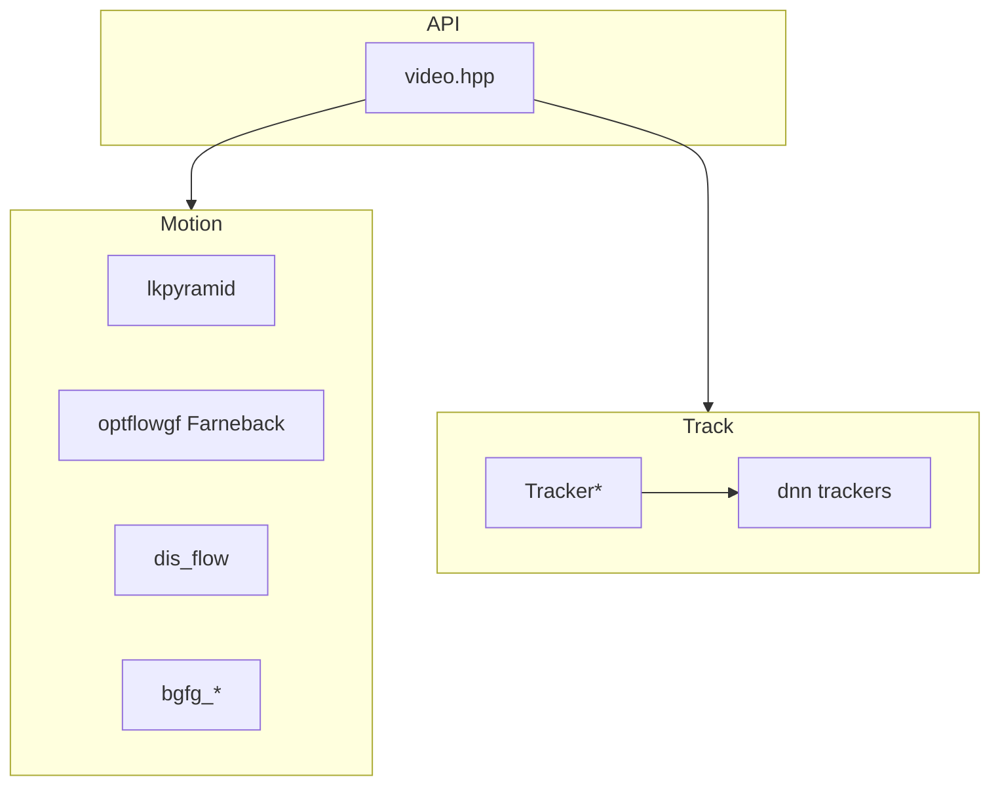

# OpenCV 4.13.0 — `modules/video` 代码结构分析

本文档说明 `opencv-4.13.0/modules/video` 的职责：**视频序列上的运动分析**（光流、背景建模、均值漂移族、稠密流变分细化等）与 **目标跟踪**（经典 MIL 与基于 **DNN** 的跟踪器）。公开 API 主要分居 **`tracking.hpp`** 与 **`background_segm.hpp`**（由 **`video.hpp`** 聚合包含）。

---

## 1. 模块定位与构建

- **职责**（`CMakeLists.txt`）：**Video Analysis**。
- **依赖**：**`opencv_imgproc`**（必选）。
- **可选模块**：**`opencv_calib3d`**、**`opencv_dnn`**（启用时可通过 **`#ifdef HAVE_OPENCV_DNN`** 在头文件中引入 DNN 跟踪声明，如 **`tracking.hpp`** 包含 **`opencv2/dnn.hpp`**）。
- **语言绑定**：Java、Objective-C、Python、JavaScript。
- **OpenMP**：若 CMake 探测到 **`OpenMP_CXX_LIBRARIES`**，则 **PRIVATE** 链接，便于部分并行循环。
- **与 `videoio` 的关系**：**`modules/video`** 不负责读/写视频文件或摄像头采集；那是在 **`videoio`** 中。本模块对 **`Mat`/`UMat` 序列** 做算法（光流、背景减、跟踪等）。

本模块 **CMake 未声明** SIMD `dispatch` 大表；热点在 **`*.cpp`** 与 **OpenCL** 内核。

---

## 2. 公开头文件

| 路径 | 说明 |
|------|------|
| **`include/opencv2/video.hpp`** | 总入口：仅包含 **`tracking.hpp`**、**`background_segm.hpp`**；Doxygen 分组 **video_motion**、**video_track**。 |
| **`include/opencv2/video/tracking.hpp`** | 光流（LK、Farneback、DIS、Variational）、**`camshift`** / **`meanShift`**、**`KalmanFilter`**、**`ECC`**、**`Tracker*`** 多跟踪器接口等（体量很大）。 |
| **`include/opencv2/video/background_segm.hpp`** | **`BackgroundSubtractorMOG2`**、**`BackgroundSubtractorKNN`** 等背景分割。 |

---

## 3. 内部预编译头：`src/precomp.hpp`

包含 **`opencv2/video.hpp`**、**`core/utility`**、**`core/private.hpp`**、**`core/ocl.hpp`**，便于各实现使用 **`UMat`** 与 OpenCL 路径。

---

## 4. 运动分析与稠密光流（`src/` 根文件）

| 文件 | 说明 |
|------|------|
| **`lkpyramid.cpp` / `lkpyramid.hpp`** | **Lucas–Kanade 金字塔**稀疏光流 **`calcOpticalFlowPyrLK`** 及 **`SparsePyrLKOpticalFlow`** 实现骨架。 |
| **`optflowgf.cpp`** | **Farneback** 稠密光流：多项式展开、**`FarnebackOpticalFlow`**、**`calcOpticalFlowFarneback`**（含 `OPTFLOW_FARNEBACK_GAUSSIAN` 等）。 |
| **`dis_flow.cpp`** | **DIS 稠密光流**（Dense Inverse Search）。 |
| **`variational_refinement.cpp`** | **变分法**对已有流场做细化（与 **`DenseOpticalFlow`** 管线配合）。 |
| **`ecc.cpp`** | **ECC** 图像对齐 / 运动模型估计（与 **`findTransformECC`** 等 API 对应）。 |
| **`optical_flow_io.cpp`** | 光流 **读写到文件**（如中间件格式，具体以后缀与实现为准）。 |
| **`camshift.cpp`** | **MeanShift / CAMShift** 跟踪窗口更新。 |
| **`kalman.cpp`** | **`KalmanFilter`** 状态估计。 |

---

## 5. 背景建模

| 文件 | 说明 |
|------|------|
| **`bgfg_gaussmix2.cpp`** | **MOG2** 高斯混合背景减除（**`BackgroundSubtractorMOG2`**）。 |
| **`bgfg_KNN.cpp`** | **KNN 背景模型**（**`BackgroundSubtractorKNN`**）。 |

---

## 6. 目标跟踪（`src/tracking/`）

### 6.1 统一接口

- **`tracking/tracker.cpp`**：**`Tracker`** 基类及公共注册/工厂逻辑（与头文件声明一致）。

### 6.2 各跟踪器实现（文件名为代表）

| 文件 | 说明 |
|------|------|
| **`tracker_mil.cpp`** | **MIL**（多实例学习）跟踪；与 **`detail/`** 下 MIL 状态、特征、在线 MIL 强相关。 |
| **`tracker_goturn.cpp`** | **GOTURN**（需 **DNN** 与权重）。 |
| **`tracker_dasiamrpn.cpp`** | **DaSiamRPN**（DNN）。 |
| **`tracker_nano.cpp`** | **Nano** 类轻量跟踪（DNN）。 |
| **`tracker_vit.cpp`** | **ViT** 类 Transformer 跟踪（DNN）。 |

### 6.3 `detail/` 子目录（节选）

- **`tracker_mil_model.*`、`tracker_mil_state.*`**：MIL 模型与状态。
- **`tracking_online_mil.*`、`tracker_feature*.cpp`**：在线 MIL、Haar 等特征与特征集。
- **`tracker_sampler*.cpp`**：采样与样本更新策略。
- **`tracker_model.cpp`、`tracker_state_estimator.cpp`**：通用模型与状态估计框架。

深度跟踪器源码中通常会 **`#ifdef HAVE_OPENCV_DNN`**，未编译 **dnn** 模块时部分符号不可用。

---

## 7. OpenCL（`src/opencl/*.cl`）

| 内核文件（节选） | 含义 |
|------------------|------|
| **`pyrlk.cl`** | 金字塔 LK 光流 |
| **`optical_flow_farneback.cl`** | Farneback |
| **`dis_flow.cl`** | DIS |
| **`bgfg_mog2.cl` / `bgfg_knn.cl`** | 背景减除 |

CPU 与 OCL 双路径时，在具体 **`*.cpp`** 内通过 **`ocl::`** / **`UMat`** 分支调用上述内核。

---

## 8. 其它

- **`hal_replacement.hpp`**：与 **video 专用 HAL** 或 core HAL 扩展的替换入口（与 **imgproc** 类似模式）。
- **`test/`**、**`perf/`**：含 **OpenCL** 子目录（如 Farneback、DIS 等性能对比）。

---

## 9. 依赖关系简图

---

## 10. 推荐阅读顺序

1. **`include/opencv2/video.hpp` → `tracking.hpp`**：按 **@defgroup video_motion / video_track** 找函数与类。  
2. **稀疏光流**：`lkpyramid.cpp`。  
3. **稠密光流**：`optflowgf.cpp`（Farneback）、`dis_flow.cpp`。  
4. **背景**：`bgfg_gaussmix2.cpp`、`bgfg_KNN.cpp`。  
5. **跟踪**：`tracking/tracker.cpp`，再进入具体 **`tracker_*.cpp`**；若走深度学习，确认构建含 **opencv_dnn** 与模型路径。  

---

## 11. 版本与路径说明

- 分析对象：`opencv-4.13.0/modules/video`。  
- 跟踪器列表与 DNN 依赖随版本迭代，以当前树 **`tracking.hpp`** 为准。

---

*文档用于本地源码导航；与官方视频分析教程及样本（如 optical flow、tracking）互补。*
