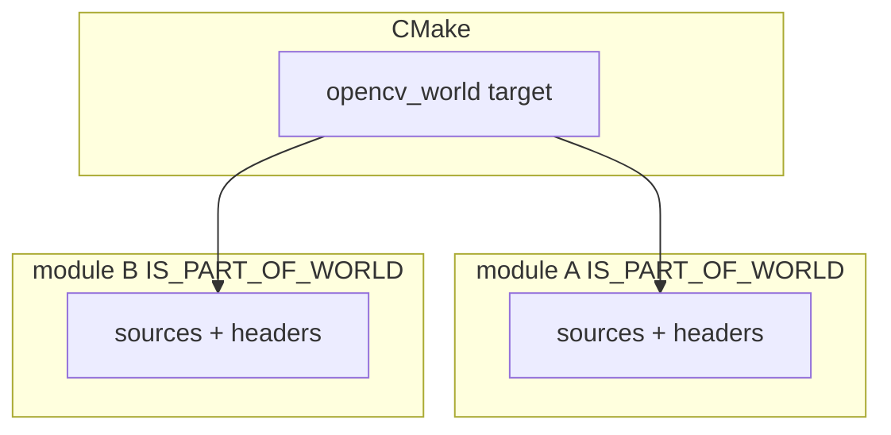

# OpenCV 4.13.0 — `modules/world` 代码结构分析

本文档说明 `opencv-4.13.0/modules/world`：**`opencv_world`** 聚合库 的 CMake 机制与极少量自有源码。该模块**不包含**各算法子模块的业务实现，而是把 **`OPENCV_MODULE_*_IS_PART_OF_WORLD`** 为真的模块的 **头文件与源文件列表** 合并进**单一目标** `opencv_world`（或静态归档）。

---

## 1. 模块定位

- **职责**（`CMakeLists.txt`）：**All OpenCV modules**（语义上：用户可选的“一站式”链接目标）。
- **自身标记**：**`OPENCV_MODULE_IS_PART_OF_WORLD FALSE`** — **`world` 自己不算在 world 内部**，避免递归。
- **默认关闭**：**`BUILD_opencv_world_INIT OFF`**；需在 CMake 中打开 **`BUILD_opencv_world=ON`** 才会生成 **`opencv_world`**。

---

## 2. 两级 CMake  passes

根工程通常先做一次 **`OPENCV_INITIAL_PASS`** 收集模块；**`world`** 的“展开子模块”逻辑在 **`NOT OPENCV_INITIAL_PASS`** 时执行：

1. 关闭 PCH：**`ENABLE_PRECOMPILED_HEADERS OFF`**（强制）。
2. **`project(opencv_world)`**。
3. **MSVC 2015（vc14）**：为避免 **LNK1210（ILK 过大）**，对 Debug/RelWithDebInfo 链接器标志把 **`/INCREMENTAL` 改为 `NO`**（与 OpenCV issue **#25543** 时代背景一致）。
4. 遍历 **`OPENCV_MODULES_BUILD`**：若 **`OPENCV_MODULE_${m}_IS_PART_OF_WORLD`**，则 **`include()` 该模块目录下的 `CMakeLists.txt`**（通过 **`include_one_module`**），并传播 **`CMAKE_CXX_FLAGS`/`CMAKE_C_FLAGS`**。

随后 **`ocv_add_module(world opencv_core)`** 声明 world 目标（显式依赖至少 **core**），再把 **所有 `IS_PART_OF_WORLD` 模块** 的 **`HEADERS`/`SOURCES`** 收集到 **`opencv_world`**，并合并各模块的 **`LINK_DEPS`**，调用 **`ocv_create_module`**。

因此：**算法仍分布在各 `modules/<name>`**，只是**编译产物**合成为一个大库。

---

## 3. 编译宏与特殊回调

- **`OPENCV_MODULE_IS_PART_OF_WORLD=1`**：在 **`opencv_world`** 目标上 **PRIVATE** 定义，供源码区分“随 world 构建”时的行为（若模块内使用）。
- **VTK**：若构建包含 **`opencv_viz`** 且 **VTK ≥ 8.90**，对 **`opencv_world`** 调用 **`vtk_module_autoinit`**。
- **Qt**：**`WITH_QT`** 时 **`qt_disable_unicode_defines(opencv_world)`**（见注释 issue **#25543**）。
- **imgcodecs / highgui**：若对应模块纳入 world，则调用 **`ocv_imgcodecs_configure_target()`** / **`ocv_highgui_configure_target()`**，与分模块构建时保持一致。

---

## 4. 静态库与链接标志

- **`NOT BUILD_SHARED_LIBS`**：将 **`OPENCV_MODULE_TYPE`** 设为 **STATIC**，并用 **`STATIC_LIBRARY_FLAGS`** 作为承载 **链接器额外参数** 的属性名（与动态库的 **`LINK_FLAGS`** 区分）。

---

## 5. 自有源码与头文件（极少）

| 路径 | 说明 |
|------|------|
| **`include/opencv2/world.hpp`** | 声明 **`CV_EXPORTS_W bool cv::initAll()`**；仅包含 **`opencv2/core.hpp`**。 |
| **`src/world_init.cpp`** | **`initAll()`** 实现：当前为 **`return true`**（占位/扩展点）。 |
| **`src/precomp.hpp`** | World 专用预编译头：包含 **`opencv_modules.hpp`**、**`ocl`**；按 **`HAVE_OPENCV_*`** 条件包含 **`video.hpp`**、**`features2d.hpp`**；在定义 **`HAVE_OPENCV_XFEATURES2D`** 时包含 **`opencv2/xfeatures2d/nonfree.hpp`**（来自 **opencv_contrib** 的 **xfeatures2d**，主仓库单独拉取时可能无存档）；最后包含 **`world.hpp`**。 |

除上述外，**无**大量算法代码；主体来自合并进来的各模块源文件。

---

## 6. 与 `OPENCV_WORLD_EXCLUDE_EXTRA_MODULES` 等选项的关系

根 **CMake** 中常有 **`OPENCV_WORLD_EXCLUDE_EXTRA_MODULES`**（若存在）：为减小 **world** 体积或避免 contrib 进 world，部分模块可 **`IS_PART_OF_WORLD`** 为假。具体以 **`OpenCVModules.cmake` / 缓存变量** 与官方文档为准（如 **stitching** 对 **xfeatures2d** 的可选依赖在 world 排除 extra 时会变）。

---

## 7. 使用与链接提示

- 链接 **`opencv_world`** 时，多数场景**只需**链接该库 + 系统/三方依赖，而**不必**逐个链接 **`opencv_core`**、**`opencv_imgproc`** 等（以平台与 **CMake imported target** 为准）。
- **Python/Java** 绑定若基于 **world** 构建，轮子/包内动态库可能为**单一大 **`.so`/`.dll`**，部署更简单，但**体积更大**、**增量链接**在部分 MSVC 版本上需上述 **`/INCREMENTAL:NO`** 处理。

---

## 8. 依赖关系简图

---

## 9. 推荐阅读顺序

1. **`modules/world/CMakeLists.txt`**：`include_one_module` 循环与 **`sources_list` 聚合**。  
2. 根 **`CMakeLists.txt`** / **`OpenCVModules.cmake`**：哪些模块默认 **`IS_PART_OF_WORLD`**。  
3. **`include/opencv2/world.hpp`** 与 **`world_init.cpp`**：公共入口 **`initAll`**。  

---

## 10. 版本与路径说明

- 分析对象：`opencv-4.13.0/modules/world`。  
- 开启 **world** 后具体包含哪些模块，以生成树中的 **`CMAKE` 日志**（`Processing WORLD modules...`）为准。

---

*文档用于理解“单库”构建；日常开发单一子模块时通常关闭 **BUILD_opencv_world**，仍按各 `modules/<name>` 独立分析即可。*
