# OpenCV 4.13.0 面试题 100 道（详细参考答案）

基于 `opencv-4.13.0` 源码结构与常用 API（core / imgproc / features2d / calib3d / video / dnn 等）整理。  
每题包含：**要点、详细说明、API/代码、易错点**。建议结合 `sample/` 中 01–26 demo 动手验证。

面试常先问「OpenCV 怎么分层、模块怎么依赖、一张图怎么走完流水线」——先看下面框图，再做题。更细的模块依赖见 [`OpenCV_4.13.0_模块依赖关系.md`](./OpenCV_4.13.0_模块依赖关系.md)。

---

## 架构框图（面试可画）

### A. 分层总览

从上到下：语言绑定 → 功能模块 → 核心数据 → 加速/HAL → 操作系统与硬件。

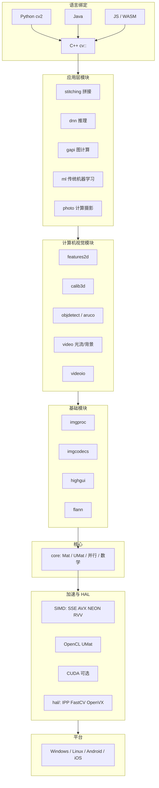

### B. 主库模块依赖（裁剪编译时要能画）

`core` 无依赖；几乎所有模块依赖 `core`；视觉算法多依赖 `imgproc`；拼接再叠 `features2d` + `calib3d`。

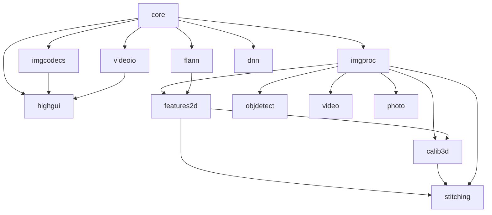

**裁剪口诀：** 只处理内存中的 `Mat` → 开 `core`+`imgproc`；要读写文件 → 加 `imgcodecs`；要窗口 → 加 `highgui`；要相机/视频 → 加 `videoio`；要深度学习 → 加 `dnn`（可不再编 `ml`）。

### C. 一张图在库内的数据流

典型桌面程序：解码进 `Mat` → `imgproc` 处理 → 显示或再编码。视频则 `videoio` 循环取帧。

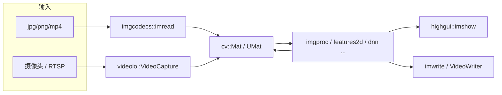

### D. `Mat` 内存模型（浅拷贝 vs 深拷贝）

头很小，像素在堆上；赋值和 ROI 只改指针，`clone` 才新分配。

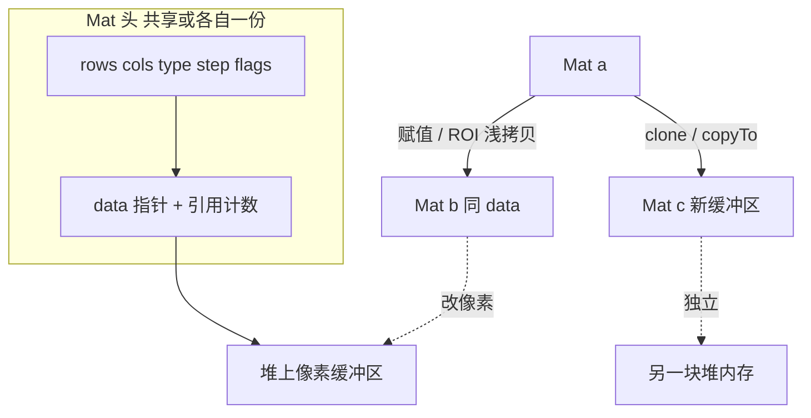

### E. 源码目录与运行时对应

面试问「实现写在哪」时按这张图指路径。

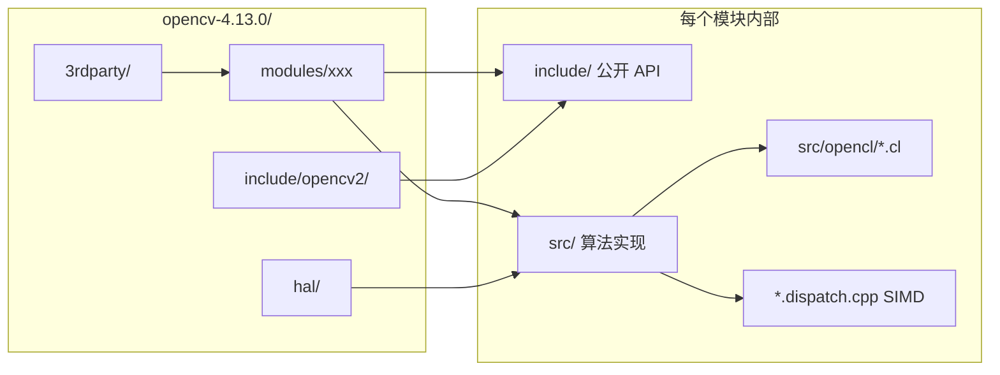

### F. 传统视觉「检测画框」流水线（对应第 100 题）


---

## 一、基础与 Mat（1–15）

### 1. OpenCV 中默认颜色通道顺序是什么？和 RGB 有何区别？

**要点：** 默认 **BGR**，不是 RGB。

**详细说明：**  
历史原因（早期 Windows GDI / 部分相机驱动按 BGR 排布），OpenCV 的 `imread`、`imshow`、`imwrite`、绘图函数都按 **B、G、R** 顺序存取三通道图。  
RGB 是人眼/网页/PIL/matplotlib 更常见的顺序。同一块内存若被一方当 BGR、另一方当 RGB 解释，红蓝会互换，画面偏色。

**API/代码：**
```cpp
cv::Mat bgr = cv::imread("a.jpg");                 // BGR
cv::Mat rgb;
cv::cvtColor(bgr, rgb, cv::COLOR_BGR2RGB);         // 交给 matplotlib / PIL 前转换
cv::cvtColor(bgr, bgr, cv::COLOR_BGR2RGB);         // 原地也可，但后续 OpenCV 绘图会错
```
Python：`cv2.imread` 仍是 BGR；`Image.open` / `plt.imshow` 期望 RGB。

**易错点：**  
- `Scalar(0,0,255)` 在 OpenCV 里是**红色**，不是蓝色。  
- 与深度学习框架（多为 RGB）对接时必须明确一次转换，否则训练/推理颜色分布不一致。

---

### 2. `cv::Mat` 是什么？浅拷贝和深拷贝如何区分？

**要点：** `Mat` 是带引用计数的二维数组；赋值/ROI 默认共享数据，`clone`/`copyTo` 才独立。内存关系见文首框图 D。

**详细说明：**  
`Mat` 头信息（rows、cols、type、step、data 指针）很小，像素缓冲区在堆上。多个 `Mat` 可指向同一块 data，用引用计数管理释放。  
- **浅拷贝：** `Mat b = a;`、`a.copyTo` 以外的头拷贝、`a(Rect)` ROI。改 `b` 的像素会改 `a`。  
- **深拷贝：** `a.clone()`、`a.copyTo(b)`（当 `b` 尺寸/类型不匹配时会重新分配）。得到独立缓冲区。

**API/代码：**
```cpp
cv::Mat a(480, 640, CV_8UC3, cv::Scalar(0,0,0));
cv::Mat b = a;              // 浅拷贝，引用计数 +1
cv::Mat c = a.clone();      // 深拷贝
cv::Mat roi = a(cv::Rect(0,0,100,100));  // 浅拷贝子区域
roi.setTo(cv::Scalar(0,0,255));          // 原图左上角变红
```

**易错点：**  
函数参数 `Mat` 按值传递只拷贝头，仍共享像素。若函数内要改图且不影响调用方，应 `clone` 或传 `OutputArray`。  
`copyTo` 在 mask 模式下只拷贝 mask 非零处，未覆盖区域保持原值。

---

### 3. `Mat::at` 与 `Mat::ptr` 有何区别？性能如何？

**要点：** `at` 安全、带断言；`ptr` 取行指针后遍历，实时路径更快。

**详细说明：**  
- `at<T>(row, col)`：每次访问做类型/越界 Debug 断言，语法清晰，适合偶发读写、调试。  
- `ptr<T>(row)`：返回第 `row` 行首地址，行内用指针或下标连续访问，减少函数调用与检查。  
Debug 下 `at` 越界会断言；Release 下越界是未定义行为。

**API/代码：**
```cpp
// at：慢但清晰
img.at<cv::Vec3b>(y, x)[0] = 255;  // B

// ptr：按行扫描
for (int y = 0; y < img.rows; ++y) {
    cv::Vec3b* row = img.ptr<cv::Vec3b>(y);
    for (int x = 0; x < img.cols; ++x)
        row[x][0] = 255;
}
```
连续图还可 `img.ptr<uchar>(0)` 一次扫完全图（需 `isContinuous()`）。

**易错点：**  
模板类型必须与 `type()` 一致：`CV_8UC3` 用 `Vec3b`，`CV_32FC1` 用 `float`，写错会静默读错内存。  
`at(y,x)` 是 **(row, col)**，不是 (x, y)。

---

### 4. `CV_8UC3` 表示什么？

**要点：** 8 位无符号、3 通道；常见 BGR 图。

**详细说明：**  
类型宏由 **深度 + 通道数** 组成：  
- 深度：`CV_8U`（0–255）、`CV_8S`、`CV_16U`、`CV_16S`、`CV_32S`、`CV_32F`、`CV_64F`。  
- 通道：`C1`–`C4`（更多通道用 `CV_MAKETYPE`）。  
`CV_8UC3` = `CV_8U` + 3 通道。单通道灰度是 `CV_8UC1`；浮点单通道 `CV_32FC1` 常用于梯度、光流、深度。

**API/代码：**
```cpp
int depth = img.depth();       // CV_8U == 0
int ch    = img.channels();    // 3
int type  = img.type();        // CV_8UC3
img.convertTo(f, CV_32F, 1.0/255);  // 归一化到 [0,1]
```

**易错点：**  
`depth()` 不含通道；比较类型要用 `type()`。  
16 位图（如某些 TIFF/深度图）误当 8U 显示会全黑或全白，需 `normalize` 或 `convertTo`。

---

### 5. `imread` 读不到图返回什么？如何判断失败？

**要点：** 返回空 `Mat`，用 `empty()` 判断，不要只看路径字符串。

**详细说明：**  
失败原因包括：路径错误、文件损坏、编解码器未编译（如没有 JPEG/PNG）、中文路径在部分 Windows 环境下、权限不足。OpenCV **不会抛异常**（默认），只返回空图。后续 `cvtColor` 空图会抛异常或断言。

**API/代码：**
```cpp
cv::Mat img = cv::imread(path, cv::IMREAD_COLOR);
if (img.empty()) {
    std::cerr << "Failed to load: " << path << std::endl;
    return -1;
}
```
Python：`img is None` 或 `img.size == 0`。

**易错点：**  
相对路径相对的是**进程当前工作目录**，不是源文件目录。  
`IMREAD_UNCHANGED` 对 16 位/带 alpha 图行为不同，失败时同样 empty。

---

### 6. `Scalar` 在三通道图里参数顺序是什么？

**要点：** `(B, G, R [, A])`。

**详细说明：**  
`Scalar` 最多 4 个 double。三通道图只用前三个，顺序与通道一致。单通道图只用第一个分量（灰度值）。画图、`setTo`、`copyMakeBorder` 的填充色都走 `Scalar`。

**API/代码：**
```cpp
cv::rectangle(img, r, cv::Scalar(0, 0, 255), 2);   // 红框
cv::rectangle(img, r, cv::Scalar(255, 0, 0), 2);   // 蓝框
img.setTo(cv::Scalar(128));                         // 单通道灰
```

**易错点：**  
从网页取的 `#FF0000` 是 RGB 红，写成 `Scalar(255,0,0)` 在 OpenCV 里是蓝。

---

### 7. ROI 是什么？修改 ROI 会影响原图吗？

**要点：** 感兴趣区域；默认共享内存，改 ROI 即改原图。

**详细说明：**  
ROI 用 `Rect(x, y, width, height)` 从大图切子矩阵，不拷贝像素，只改 data 指针和 rows/cols/step。适合局部处理、画框区域、裁剪后继续滤波。若后续要把结果独立保存或并行写不同区域，必须 `clone()`。

**API/代码：**
```cpp
cv::Rect box(40, 40, 100, 80);
cv::Mat roi = canvas(box);           // 共享
roi.setTo(cv::Scalar(0, 0, 255));    // 原图该区域变红
cv::Mat independent = canvas(box).clone();
```
对应 demo：`sample/02_mat_roi`。

**易错点：**  
ROI 必须完全落在图像内，否则 `Rect` 与图像求交或直接越界崩溃。  
`img(Range, Range)` 同样是浅拷贝。

---

### 8. `Mat` 的 `cols/rows` 与 `size()` 关系？

**要点：** `cols`=宽，`rows`=高；`size()` 是 `Size(width, height)` = `Size(cols, rows)`。

**详细说明：**  
图像习惯说「宽×高」，矩阵习惯说「行×列」。OpenCV 里：  
- `rows` = 行数 = height = y 方向大小  
- `cols` = 列数 = width = x 方向大小  
- `img.size()` 返回 `Size(cols, rows)`  
- `img.size[0]` 在 n 维 Mat 里是第一维，二维时容易和 `size().width` 搞混，二维图优先用 `rows/cols`。

**API/代码：**
```cpp
int w = img.cols, h = img.rows;
cv::Size s = img.size();  // s.width == w, s.height == h
cv::resize(img, out, cv::Size(640, 480));  // (宽, 高)
```

**易错点：**  
`at(i,j)` 是 `(row, col)` = `(y, x)`；`Point(x,y)` 是 `(col, row)`。这是最高频的坐标搞反。

---

### 9. 连续内存（continuous）为何重要？

**要点：** 连续则可把整图当一维数组扫；ROI/部分操作后可能不连续。

**详细说明：**  
`step`（每行字节数）可能因对齐大于 `cols * elemSize()`。整图从 `create` 出来通常连续；取 ROI 后子图 `step` 仍等于**原图**的 step，行与行之间有间隔，**不连续**。  
连续时可用单个指针 + `total()` 遍历；不连续必须按行 `ptr(y)`。

**API/代码：**
```cpp
if (img.isContinuous()) {
    uchar* p = img.ptr<uchar>(0);
    size_t n = img.total() * img.elemSize();
    // 一次处理 n 字节
} else {
    for (int y = 0; y < img.rows; ++y) { /* 按行 */ }
}
```

**易错点：**  
对 ROI 假设连续会读到邻接行的「原图其他像素」。  
`reshape`、部分 `transpose` 结果也可能不连续。

---

### 10. `convertTo` 与 `cvtColor` 区别？

**要点：** `convertTo` 改深度/缩放；`cvtColor` 改颜色空间，通道数可变。

**详细说明：**  
- `convertTo(dst, rtype, alpha=1, beta=0)`：`dst = saturate(alpha * src + beta)`，通道数不变。8U→32F、归一化、亮度平移。  
- `cvtColor`：BGR↔Gray、BGR↔HSV、BGR↔Lab 等，通道数从 3 变 1 或 3 变 4。内部有固定转换矩阵/非线性公式。

**API/代码：**
```cpp
src.convertTo(f32, CV_32F, 1.0/255.0);     // 深度
cv::cvtColor(src, hsv, cv::COLOR_BGR2HSV); // 颜色空间
```

**易错点：**  
不能用 `convertTo` 把 BGR 变成灰度。  
`cvtColor` 要求输入通道数匹配（BGR 不能当 Gray 送进去）。

---

### 11. OpenCV 坐标系原点在哪？x/y 方向？

**要点：** 原点左上；x 向右，y 向下。

**详细说明：**  
与屏幕/图像坐标系一致，与数学笛卡尔（y 向上）相反。`Point(x,y)`、`Rect(x,y,w,h)`、`circle` 中心都用这套。  
部分几何（相机、标定）在三维里用右手系，图像平面仍是这套像素坐标。

**易错点：**  
`Mat` 访问是 `(row, col)` = `(y, x)`，和 `Point(x,y)` 顺序相反。

---

### 12. `Point`、`Size`、`Rect` 分别表示什么？

**要点：** 点、尺寸、矩形；`Rect` 由左上角 + 宽高构成。

**详细说明：**  
- `Point` / `Point2f` / `Point2d`：坐标。  
- `Size` / `Size2f`：宽高，无位置。  
- `Rect`：`x, y, width, height`；`tl()` 左上，`br()` 右下（右下是开区间，即 `x+width, y+height`）。  
`rect.contains(pt)`、`rect & other` 求交、`rect | other` 并集包围盒。

**API/代码：**
```cpp
cv::Rect r(10, 20, 100, 80);
cv::Point c = (r.tl() + r.br()) / 2;  // 注意 br 开区间，中心要小心
r &= cv::Rect(0, 0, img.cols, img.rows);  // 裁到图像内
```

**易错点：**  
`br()` 不在矩形内部像素里（开区间）。画框时右下角常用 `x+w-1, y+h-1`。

---

### 13. 如何创建指定大小和类型的黑色图像？

**要点：** 构造时指定尺寸、类型、初始 `Scalar`。

**API/代码：**
```cpp
cv::Mat img(480, 640, CV_8UC3, cv::Scalar(0, 0, 0));  // 黑
cv::Mat zeros = cv::Mat::zeros(h, w, CV_8UC3);
cv::Mat ones  = cv::Mat::ones(h, w, CV_8UC1);         // 全 1，不是 255
cv::Mat gray(h, w, CV_8UC1); gray.setTo(128);
```

**易错点：**  
`Mat::ones` 对 8U 是 1 不是 255。白图用 `Scalar(255,255,255)` 或 `setTo(255)`。  
先 `Mat img;` 再忘了 `create`，后续写入会空图异常。

---

### 14. `split` / `merge` 的用途？

**要点：** 拆/合通道；只处理某一通道时用。

**详细说明：**  
彩色均衡化若直接对 BGR 三通道分别 `equalizeHist`，色相会漂。正确做法：转到 YUV/YCrCb/HSV，只均衡 **Y 或 V**，再 merge 回去。  
也用于把多张单通道拼成多通道、或提取 mask。

**API/代码：**
```cpp
std::vector<cv::Mat> ch;
cv::split(bgr, ch);                 // B, G, R
cv::equalizeHist(ch[0], ch[0]);
cv::merge(ch, out);
```
对应 demo：`sample/03_color_space`、`sample/11_histogram`。

**易错点：**  
`split` 的输出 vector 会重新分配；通道数必须一致才能 `merge`。

---

### 15. OpenCV 4.x 与 3.x 在模块组织上有何变化（简述）？

**要点：** 主库更精简；部分算法在 contrib；C API 进一步淘汰；DNN 成为一等模块。

**详细说明：**  
- 头文件统一 `opencv2/<module>.hpp`，少用 `cv.h`。  
- SIFT/SURF 等曾因专利在 contrib 的 `xfeatures2d`；SIFT 后来进主库（4.4+），仍以版本为准。  
- ArUco 在 4.x 主库 `aruco` 模块（本仓库 4.13 可用）。  
- `cv::String` 与 `std::string` 互通更好。  
- 构建用 CMake，模块可裁剪（core、imgproc、imgcodecs、highgui、dnn…）。

**架构位置：** 见文首框图 A/B。4.x 把 DNN 抬到主库一等模块；contrib 与主库同版本另编；C API（`IplImage`）不再作为新代码入口。

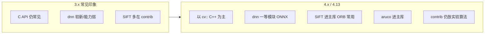

**易错点：**  
面试别说「4 和 3 完全不兼容」——常用 `Mat`/`imshow` 仍在；要说清 contrib、DNN、废弃 C API。画模块图时不要把 `dnn` 画成依赖 `ml`。

---

## 二、图像读写与显示（16–22）

### 16. `imread` 常用 flag 有哪些？

**要点：** COLOR / GRAYSCALE / UNCHANGED 最常用。

**详细说明：**  
| Flag | 行为 |
|------|------|
| `IMREAD_COLOR` (1) | 强制 3 通道 BGR，丢 alpha，默认 |
| `IMREAD_GRAYSCALE` (0) | 单通道灰度 |
| `IMREAD_UNCHANGED` (-1) | 保留通道与深度（16 位、4 通道） |
| `IMREAD_ANYDEPTH` | 允许 16/32 位 |
| `IMREAD_REDUCED_GRAYSCALE_2` 等 | 读入时降采样，省内存 |

**易错点：**  
PNG 带透明通道时用 COLOR 会把 alpha 合成到白/黑底上（实现相关），要透明必须 UNCHANGED。

---

### 17. `imwrite` 保存失败常见原因？

**要点：** 空图、目录不存在、扩展名、编码器、权限。

**详细说明：**  
`imwrite` 返回 bool。JPEG 可用 `IMWRITE_JPEG_QUALITY`（0–100）；PNG 用压缩级别。部分环境未编进 JPEG/PNG 支持。中文路径、只读目录、磁盘满都会失败。  
写 JPEG 时 4 通道图通常不支持，需先转 BGR。

**API/代码：**
```cpp
std::vector<int> params = {cv::IMWRITE_JPEG_QUALITY, 95};
if (!cv::imwrite("out.jpg", img, params)) { /* fail */ }
```

---

### 18. `waitKey(0)` 与 `waitKey(1)` 区别？

**要点：** 0=阻塞等键；正数=最多等这么多毫秒。返回按键码。

**详细说明：**  
`highgui` 窗口事件循环依赖 `waitKey`/`pollKey`。没有它，`imshow` 可能不刷新。视频循环用 `waitKey(1)` 或 `waitKey(delay)` 控制帧间隔。返回值：ASCII 或特殊键；无键常为 -1。  
`waitKey(0)` 适合单张图查看。

**易错点：**  
无窗口时 `waitKey` 行为依赖后端，服务器无 GTK/Qt 可能直接返回 -1。  
比较按键应用 `& 0xFF`（部分后端高位有标志）。

---

### 19. 无 GUI 环境如何调试图像？

**要点：** `imwrite` 落盘；不要依赖 `imshow`。

**详细说明：**  
Docker/SSH/CI 通常无显示器。本仓库 sample 默认 `--outdir` 写 PNG，`--show` 才 `imshow`。也可把图编码成 base64、或用 Jupyter。远程可 X11 转发，但重且慢。

**易错点：**  
链接了 highgui 但运行时缺 libgtk，程序可能启动即报错，编译时 `WITH_GTK=OFF` 或运行不调用 imshow。

---

### 20. VideoCapture 如何打开摄像头与视频文件？

**要点：** 索引开相机，路径开文件；先 `isOpened()` 再 `read`。

**API/代码：**
```cpp
cv::VideoCapture cap(0);                 // 默认相机
// cap.open("rtsp://...");               // 流
cv::VideoCapture file("a.mp4");
if (!file.isOpened()) return -1;
cv::Mat frame;
while (file.read(frame)) {
    // 处理 frame
}
```
属性：`CAP_PROP_FPS`、`FRAME_WIDTH/HEIGHT`、`POS_FRAMES`。后端可能是 FFmpeg、GStreamer、V4L2。

**易错点：**  
Linux 相机权限、被占用；Windows 索引不一定是 0。  
`read` 失败表示结束或掉线，循环要 break。

---

### 21. 视频写出去用什么类？四字符码作用？

**要点：** `VideoWriter`；FourCC 指定编码器。

**详细说明：**  
FourCC 四字符如 `mp4v`、`XVID`、`H264`、`MJPG`。容器扩展名（.mp4/.avi）要与编码匹配，否则打不开。必须指定 FPS、帧尺寸，且与写入帧一致。

**API/代码：**
```cpp
int fourcc = cv::VideoWriter::fourcc('m','p','4','v');
cv::VideoWriter writer("out.mp4", fourcc, 30.0, cv::Size(w,h));
writer.write(frame);
```

**易错点：**  
尺寸/通道不一致会静默失败。无对应编码器时 `isOpened()` 为 false。

---

### 22. 大图/4K 读入内存要注意什么？

**要点：** 内存、缓存、是否必须全分辨率处理。

**详细说明：**  
3840×2160×3 ≈ 24MB/帧，视频 30fps 原始带宽很大。算法复杂度随像素线性或更差。策略：  
1. 显示/检测用降采样（`resize` 或 `IMREAD_REDUCED_*`）；  
2. 只对 ROI 全分辨率；  
3. 滑动窗口/分块；  
4. 避免每帧 `clone` 全图。  
YOLO 类检测还会 letterbox 到 640，原图只用于画框。

---

## 三、颜色空间（23–28）

### 23. HSV 三个分量含义？OpenCV 中 H 的范围？

**要点：** H 色相、S 饱和度、V 明度；8U 下 **H∈[0,180]**，S/V∈[0,255]。

**详细说明：**  
标准 HSV 的 H 是 0–360°。为塞进 8 位，OpenCV 把 H 除以 2。32F 图 H 才是 0–360。  
色相：红约 0，绿约 60，蓝约 120（在 0–180 尺度下）。S=0 时是灰，H 无意义。

**API：** `cvtColor(..., COLOR_BGR2HSV)`。demo：`03_color_space`。

**易错点：**  
网上教程按 0–360 设阈值会全错。32F 与 8U 范围不同。

---

### 24. 为何颜色分割常用 HSV 而不是 BGR？

**要点：** HSV 把「什么颜色」和「多亮」分开，阈值更稳。

**详细说明：**  
BGR 中同一红色在亮处是 (50,50,255)、暗处是 (10,10,80)，三个通道同时变，很难用立方体框住。HSV 中两者 H 接近，只需放宽 V。工业色块、车道线、球类跟踪常用 HSV + `inRange`。  
光照极端时仍可能失败，可辅以自适应或转到 Lab 的 a/b 通道。

---

### 25. `inRange` 做什么？

**要点：** 逐通道落在 [lower, upper] 的像素为 255，否则 0。

**API/代码：**
```cpp
cv::Mat mask;
cv::inRange(hsv, cv::Scalar(35, 80, 50), cv::Scalar(85, 255, 255), mask); // 绿
src.copyTo(dst, mask);
```
多段颜色（红）用两个 mask 再 `|`。

**易错点：**  
`lower` 必须逐分量 ≤ `upper`。输入需与 Scalar 通道数匹配。

---

### 26. 灰度化常用公式/API？

**要点：** `COLOR_BGR2GRAY`，加权而非平均。

**详细说明：**  
人眼对绿更敏感，OpenCV 近似：  
\[
Y = 0.299 R + 0.587 G + 0.114 B
\]  
（实现可能用整数近似）。简单平均 `(R+G+B)/3` 发灰偏色。

**易错点：**  
已是单通道再 `BGR2GRAY` 会报错。

---

### 27. LAB 颜色空间适合什么场景？

**要点：** 感知更均匀；L 亮度，a/b 色度，光照变化时颜色聚类更稳。

**详细说明：**  
Lab（OpenCV 为 `COLOR_BGR2Lab`）在色差 ΔE 上更接近人眼。适合：颜色量化、k-means 分割、去光照影响的比较、印刷/质检色差。L 通道可单独做均衡。  
8U 的 Lab 有缩放，不是 CIE 标准数值，比相对关系即可。

---

### 28. 红色在 HSV 阈值为何常拆成两段？

**要点：** 红色在色环上跨 0°，对应 OpenCV H 的 0 附近和 180 附近。

**API/代码：**
```cpp
cv::Mat m1, m2, mask;
cv::inRange(hsv, cv::Scalar(0, 80, 60), cv::Scalar(10, 255, 255), m1);
cv::inRange(hsv, cv::Scalar(170, 80, 60), cv::Scalar(180, 255, 255), m2);
mask = m1 | m2;
```
demo：`03_color_space`。

---

## 四、滤波与增强（29–38）

滤波 = 用邻域信息改当前像素。线性滤波是卷积；中值/双边是非线性。增强则改对比度或细节，不一定去噪。

### 29. 均值滤波、高斯滤波、中值滤波差异？

**要点：** 均值是盒式平均；高斯按距离加权，更自然；中值取排序中位数，抗椒盐、相对保边。

**详细说明：**  
对每个像素取 \(k\times k\) 邻域：

| | 均值 `blur` / `boxFilter` | 高斯 `GaussianBlur` | 中值 `medianBlur` |
|--|--|--|--|
| 类型 | 线性卷积 | 线性卷积（可分离） | **非线性**（不能写成一张固定核） |
| 怎么算 | 邻域算术平均，权重全相等 | 权重 \(\propto e^{-(x^2+y^2)/(2\sigma^2)}\)，越近越大 | 邻域像素排序，取中位数写回 |
| 高斯噪声 | 能降，但边缘糊成一块 | **更合适**：远处像素权小，糊得比较自然 | 对高斯噪声不如高斯滤波 |
| 椒盐噪声 | 黑白点会「涂开」成斑 | 同样涂开 | **最好**：孤立 0/255 很难成为中位数 |
| 边缘 | 明显变糊 | 糊，但过渡较顺 | **相对保边**（边缘两侧值差大时中位数仍偏本侧） |
| 速度 | 最快（积分图 / 盒式） | 快（先横后竖两次 1D） | 相对慢（每个窗口要排序） |

面试一句话：去椒盐用中值；做平滑/Canny 前处理用高斯；只要「快速糊一下」用均值。

**API/代码：**
```cpp
cv::blur(src, dst, cv::Size(5, 5));
cv::GaussianBlur(src, dst, cv::Size(5, 5), 1.5);  // ksize 与 sigma 见第 34 题
cv::medianBlur(src, dst, 5);                      // ksize 必须是奇数
```
demo：`05_filter`。

**易错点：**  
- 中值 `ksize` 必须奇数，且不能用 `Size`，是一个 int。  
- 高斯 `sigmaX=0` 时由核大小自动推 \(\sigma\)，不是「不模糊」。  
- 核越大越糊、越慢；彩色图三通道分别滤，色边可能轻微色散。

---

### 30. 双边滤波的特点？

**要点：** 空间上近 **并且** 灰度/颜色也接近，才参与平均 → **保边去噪**；比高斯慢一个数量级以上。

**详细说明：**  
普通高斯只看几何距离：边缘两侧像素也会被平均，所以边糊。双边再乘一个「值域高斯」：

\[
w(i,j) = G_{\sigma_s}(\|p_i-p_j\|)\cdot G_{\sigma_r}(|I_i-I_j|)
\]

边缘两侧 \(|I_i-I_j|\) 很大，值域权重≈0，不会混色，边缘保住。平坦区两边灰度接近，行为接近高斯，噪声被抹掉。

典型用途：美颜磨皮、去噪但要留文字/轮廓、Canny 前想保边时（更常用高斯，因为双边太慢）。

**API/代码：**
```cpp
// d: 邻域直径，<=0 则由 sigmaSpace 推；sigmaColor 灰度差容忍；sigmaSpace 空间半径
cv::bilateralFilter(src, dst, /*d=*/9, /*sigmaColor=*/75, /*sigmaSpace=*/75);
```
demo：`05_filter`。

**易错点：**  
- `d` 过大（>9～15）实时基本扛不住，可先缩小再滤再放大。  
- `sigmaColor` 太大 ≈ 普通高斯（边也糊）；太小 ≈ 几乎不去噪。  
- 不能用 `filter2D` 实现（权重依赖图像内容，不是固定核）。

---

### 31. 卷积核尺寸为何常用奇数？

**要点：** 奇数核有唯一中心像素，锚点对称，滤波后图像不会整体平移半个像素。

**详细说明：**  
3×3、5×5、7×7 的中心格正好对准当前像素 \((x,y)\)。卷积输出写在锚点（默认核中心）。若用 2×2、4×4，中心落在四个像素缝上，等价于图像平移 0.5 像素，后面做边缘、配准会对不齐。

`medianBlur` 直接规定 ksize 为奇数。`GaussianBlur` 的 ksize 也必须奇数（或为 0 表示由 sigma 自动选奇数核）。`filter2D` 允许偶数核，但必须自己设 `anchor`，否则默认仍偏左上。

**易错点：**  
别回答「偶数核算不了」——能算，只是几何上不对称。面试要说到 **中心 / 锚点 / 半像素偏移**。

---

### 32. 直方图均衡化解决什么问题？副作用？

**要点：** 把灰度直方图「拉开铺满」0–255，提高**全局**对比度。副作用是噪声放大、不自然、彩色图会偏色。

**详细说明：**  
过暗或过亮的图，像素挤在直方图一端，层次看不清。`equalizeHist` 用累积分布函数（CDF）做映射：出现频率高的灰度区间被拉得更宽。结果对比度上去，细节「打开」。

副作用：  
1. 暗区噪声被一起拉亮，出现颗粒。  
2. 直方图被强制拉平，天空、墙面等平坦区可能出现色带（posterize）。  
3. 对 BGR 三通道分别均衡，各通道映射不同 → **色相漂移**。正确做法：转到 YUV/YCrCb/HSV，只均衡 Y 或 V，再合回去。  
4. 全局一把尺子，左边很暗、右边很亮的图（逆光）会顾此失彼 → 改用 CLAHE。

**API/代码：**
```cpp
cv::equalizeHist(gray, eq);
// 彩色：转 YCrCb，只均衡 Y
cv::cvtColor(bgr, ycrcb, cv::COLOR_BGR2YCrCb);
std::vector<cv::Mat> ch; cv::split(ycrcb, ch);
cv::equalizeHist(ch[0], ch[0]);
cv::merge(ch, ycrcb);
cv::cvtColor(ycrcb, out, cv::COLOR_YCrCb2BGR);
```
demo：`11_histogram`。

**易错点：**  
输入必须是 `CV_8UC1`。已经对比度很好的图再均衡会更假。

---

### 33. CLAHE 相对 equalizeHist 的优势？

**要点：** 分块做均衡，并 **限制对比度**，局部自适应，光照不均时更自然、噪声更可控。

**详细说明：**  
CLAHE = Contrast Limited Adaptive Histogram Equalization。

1. **Adaptive：** 图像切成 `tileGridSize` 小块（如 8×8），每块各自均衡。左边暗、右边亮时，两边都能拉开，不会被全局直方图绑死。  
2. **Contrast Limited：** 每块直方图里过高的 bin 被裁掉（`clipLimit`），多出来的均匀摊回。避免小块里噪声被拉成「雪花」。  
3. 块与块之间双线性插值，避免接缝。

适合：医学影像、雾天、文档阴影、监控逆光。`clipLimit` 常用 2.0～4.0；越大越接近普通局部均衡（更猛、更噪）。

**API/代码：**
```cpp
cv::Ptr<cv::CLAHE> clahe = cv::createCLAHE(/*clipLimit=*/2.0, cv::Size(8, 8));
clahe->apply(gray, out);   // 同样只作用于单通道
```

**易错点：**  
tile 太小（如 2×2）块效应明显；太大又退化成全局。彩色图同样只处理亮度通道。

---

### 34. `blur` 与 `GaussianBlur` 参数含义？

**要点：** 两者都要核大小；高斯还要 \(\sigma\)，\(\sigma\) 才是「糊多少」的本质参数。

**详细说明：**

`blur(src, dst, ksize, anchor, borderType)`  
- `ksize`：`Size(w,h)`，盒式窗口。常用 `(3,3)` `(5,5)`。  
- `anchor`：核锚点，默认 `(-1,-1)` = 中心。  
- `borderType`：图像边缘外怎么补像素。

`GaussianBlur(src, dst, ksize, sigmaX, sigmaY=0, borderType)`  
- `ksize`：奇数，或 `(0,0)` 表示由 sigma 自动选核。  
- `sigmaX`：X 方向标准差。越大，远处像素权越大，越糊。  
- `sigmaY=0`：与 `sigmaX` 相同。  
- `sigmaX=0` 且 ksize 给定：由 ksize 反推 \(\sigma\approx 0.3((k-1)/2-1)+0.8\)。

边界：`BORDER_DEFAULT`（反射 101）、`REPLICATE`（边缘像素外延）、`CONSTANT`（常值，常出现黑框）、`REFLECT`。处理后再裁回原尺寸时，边界模式决定四周是否发黑/发亮。

**API/代码：**
```cpp
cv::blur(src, a, cv::Size(5, 5));
cv::GaussianBlur(src, b, cv::Size(0, 0), 1.5);  // 核由 sigma 决定
cv::GaussianBlur(src, c, cv::Size(5, 5), 0);    // sigma 由核决定
```

**易错点：**  
`Size(5,5)` 和 `sigma=5` 不是一回事。只改 ksize、sigma 仍为 0，糊的程度按公式走，不一定符合直觉。

---

### 35. 锐化如何用 OpenCV 实现（思路）？

**要点：** 锐化 = 把「细节」（原图 − 模糊图）加回原图；或用中心为正、四周为负的拉普拉斯核卷积。

**详细说明：**  
模糊去掉高频。`detail = src - blur` 就是边缘和纹理。  
`sharp = src + amount * detail` 即 unsharp mask（反锐化掩模，名字来自暗房，实际是锐化）。  
`addWeighted(src, 1+k, blur, -k, 0)` 与上面等价。

另一路：拉普拉斯核探测二阶变化，中心取正、邻域取负，卷积后加到原图。比 unsharp 更「硬」，噪声也更明显。

**API/代码：**
```cpp
cv::Mat blur, sharp;
cv::GaussianBlur(src, blur, cv::Size(0, 0), 3);
cv::addWeighted(src, 1.5, blur, -0.5, 0, sharp);  // k=0.5

cv::Mat kernel = (cv::Mat_<float>(3, 3) <<
     0, -1,  0,
    -1,  5, -1,
     0, -1,  0);
cv::filter2D(src, sharp, -1, kernel);
```

**易错点：**  
先去噪再锐化，否则噪声一起被放大。`amount` 过大出现白边光晕（halos）。输出可能溢出，`addWeighted` 会饱和截断。

---

### 36. 图像噪声常见类型与对应滤波？

**要点：** 先看噪声长什么样，再选滤波器；选错会边糊或噪点仍在。

**详细说明：**

| 噪声 | 怎么来 / 画面 | 首选 | 为什么 |
|------|----------------|------|--------|
| 椒盐 / 脉冲 | 传感器坏点、传输误码；随机纯黑/纯白点 | **中值** | 孤立极值当不成中位数 |
| 高斯 | 电子热噪声；整图细颗粒 | **高斯**；要保边用**双边** | 线性平均对零均值高斯最优 |
| 泊松 / 散粒 | 光子计数，暗处更明显 | 双边；或降曝光噪声模型 | 方差随亮度变，简单高斯不够 |
| 量化条带 | 位深不够、JPEG 过压 | 更高位深、抖动、别再均衡过头 | 滤波去不掉阶梯，只会更糊 |
| 周期性条纹 | 电源干扰、摩尔纹 | 频域陷波（DFT） | 空域滤波难对准频率 |

工程上：先 `medianBlur(3)` 去坏点，再轻度高斯，再后续算法。

**易错点：**  
对椒盐用高斯会把白点涂成一片灰斑。不要「所有噪声都高斯糊一下」就结束。

---

### 37. `filter2D` 用途？

**要点：** 自己提供任意 **线性** 卷积核：平滑、锐化、浮雕、自定义边缘。中值/双边做不了。

**详细说明：**  
`filter2D(src, dst, ddepth, kernel, anchor, delta, borderType)`  
- `ddepth=-1`：输出类型与输入相同（8U 卷积后可能截断，梯度类核应输出 `CV_16S`/`CV_32F`）。  
- `kernel`：`float` 矩阵，不必方、不必奇数，但奇数+中心锚点最省事。  
- `delta`：卷积后再加的偏置。

Sobel/高斯等专用 API 有 SIMD/OpenCL，热路径优先用专用函数；`filter2D` 适合实验核、作业、一次性效果。

**API/代码：**
```cpp
cv::Mat k = (cv::Mat_<float>(3, 3) << -1,-1,-1, -1,8,-1, -1,-1,-1);  // 拉普拉斯
cv::filter2D(src, dst, CV_16S, k);
cv::convertScaleAbs(dst, vis);
```

**易错点：**  
核系数之和为 1 则平均亮度大致不变；之和为 0 则提取变化（边缘），均值区变黑。8U 上直接卷积边缘核会大量截断成 0。

---

### 38. 降采样前为何常先模糊？

**要点：** 抗混叠（anti-aliasing）。先去掉降采样后表示不了的高频，再抽点，避免锯齿和摩尔纹。

**详细说明：**  
采样定理：像素间距变大后，能保留的最高频率下降。若原图有细条纹、文字、栅栏，直接每隔 N 个像素取一个，高频会折回到低频，变成错误的粗条纹（aliasing / 摩尔纹）。

先低通（高斯/盒式）再抽点，等于丢掉那些「反正保不住」的频率。OpenCV 里：  
- `resize(..., INTER_AREA)` 缩小时本身接近区域平均，自带抗混叠，**缩小优先用它**。  
- `INTER_LINEAR`/`NEAREST` 缩小更容易锯齿。  
- 高斯金字塔 `pyrDown` = 高斯模糊 + 隔点抽样。

**易错点：**  
放大一般不需要先模糊（模糊会更糊）。标签图/mask 降采样不要高斯，用 `INTER_NEAREST`，否则类别被插成中间值。

---


## 五、边缘、阈值与形态学（39–50）

边缘看灰度变化；阈值把灰度量成 0/255；形态学在二值（或灰度）上用结构元素「长/削」形状。三者经常串成：模糊 → 边缘或阈值 → 形态学去噪 → 轮廓。

### 39. Sobel 与 Laplacian 区别？

**要点：** Sobel 是**一阶梯度**，能给出方向；Laplacian 是**二阶导数**，无方向、对噪声更敏感。

**详细说明：**  
边缘 = 灰度跳变。一阶导在跳变处出现峰值；二阶导在跳变处过零。

- **Sobel：** 用 3×3（或更大）核分别近似 \(\partial I/\partial x\)、\(\partial I/\partial y\)。幅值 \(G=\sqrt{G_x^2+G_y^2}\) 表示「有多像边」，角度 \(\theta=\mathrm{atan2}(G_y,G_x)\) 表示边的法向。Canny 内部就用这一步。`Scharr` 是 3×3 时更准确的一阶核。  
- **Laplacian：** 近似 \(\nabla^2 I = I_{xx}+I_{yy}\)，一个核同时响应各个方向（各向同性）。过零点才是边，因此通常先高斯再 Laplacian（LoG），否则噪声的二阶导比信号还大。

输出不要直接当 8U 用：导数有正有负，常用 `CV_16S`/`CV_32F`，再 `convertScaleAbs` 才方便 `imshow`。

**API/代码：**
```cpp
cv::Mat gx, gy, mag;
cv::Sobel(gray, gx, CV_32F, 1, 0, 3);
cv::Sobel(gray, gy, CV_32F, 0, 1, 3);
cv::magnitude(gx, gy, mag);

cv::Mat lap;
cv::Laplacian(gray, lap, CV_16S, 3);
cv::convertScaleAbs(lap, vis);
```
demo：`06_edge`。

**易错点：**  
`Sobel(src, dst, ddepth, dx, dy)` 的 `dx,dy` 是求导阶数，`(1,0)` 是竖边（水平梯度），不是核宽高。在 8U 上直接 Sobel 负值全变成 0，只剩一半边缘。

---

### 40. Canny 主要步骤？

**要点：** 高斯 → 梯度 → **非极大值抑制** 细化 → **双阈值 + 滞后连接**。输出是单像素宽的二值边缘。

**详细说明：**  
1. **高斯平滑：** 降噪，避免噪声被当成边（Canny 函数内部会做，外面再糊一层要小心边被抹掉）。  
2. **Sobel 梯度：** 得到幅值和方向（量化到 0°/45°/90°/135° 四向）。  
3. **非极大值抑制（NMS）：** 只在梯度方向上比较左右邻居，不是局部最大的点清零。宽边缘变成 1 像素脊线。  
4. **双阈值：** 幅值 ≥ 高阈值 → 强边，一定保留；介于高低之间 → 弱边；低于低阈值 → 丢弃。  
5. **滞后连接：** 弱边只有与强边连通才留下，用来把断掉的真边缘续上，同时挡住孤立噪声。

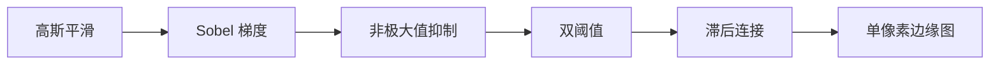

**API/代码：**
```cpp
cv::Canny(gray, edges, /*low=*/50, /*high=*/150, /*apertureSize=*/3);
// apertureSize 是 Sobel 核，3 或 5；L2gradient=true 时用真正的欧氏幅值
```
demo：`06_edge`。

**易错点：**  
高低阈值顺序不能反。输入应是单通道。Canny 已经含高斯，外面再大核模糊会丢细边。

---

### 41. Canny 高低阈值如何理解？

**要点：** 高阈值 = 「我确定这是边」；低阈值 = 「也许是边，但必须连到强边才算」。常用比例约 1:2 或 1:3。

**详细说明：**  
把梯度幅值想成「边缘置信度」：  
- 只设一个阈值会两难：高了边缘断裂，低了满图噪声。  
- 高阈值卡住质量：只有很强的跳变成为「种子」。  
- 低阈值负责召回：沿种子生长，把同一条物体轮廓上较弱的点连回来（滞后）。  
- 弱边若不连到任何强边，视为噪声丢掉。

调参经验：先固定比例 1:2 或 1:3（如 50/150、80/160），再整体平移。图对比强、分辨率高，可整体提高。也有人用梯度中位数自动估（OpenCV 无现成 API，面试提到即可）。

**易错点：**  
没有万能阈值。光照一变就要重调，所以工业上常先均衡/归一化再 Canny，或改用自适应阈值 + 形态学。

---

### 42. 阈值分割 `THRESH_BINARY` 与 `OTSU`？

**要点：** `THRESH_BINARY` 用你给定的 T 一切两半；OTSU **自动**找让前景/背景类间方差最大的 T，适合直方图双峰。

**详细说明：**

`threshold(src, dst, thresh, maxval, type)` 常见 type：  
- `THRESH_BINARY`：\(dst = src > T\ ?\ maxval : 0\)  
- `THRESH_BINARY_INV`：反过来（白底黑字常用）  
- `THRESH_TRUNC`：大于 T 的截成 T  
- `THRESH_TOZERO` / `TOZERO_INV`：一侧清零  

OTSU：假设像素来自两类（目标/背景），遍历 T，使类间方差 \(\sigma_B^2\) 最大（等价于类内方差最小）。调用写成：

```cpp
double t = cv::threshold(gray, bin, 0, 255, cv::THRESH_BINARY | cv::THRESH_OTSU);
// 传入的 0 会被忽略，返回值 t 才是算出来的阈值
```

**适用：** 目标与背景灰度差开、直方图两个峰。单峰、多峰、光照不均时 OTSU 会切错 → 自适应阈值或先 ROI。

**易错点：**  
OTSU 仍是**全局一个 T**，解决不了半边亮半边暗。返回值要接住，不要以为参数里的 `thresh` 还有效。

---

### 43. 自适应阈值适用场景？

**要点：** 每个像素用**局部邻域**算自己的 T，专门对付光照不均（阴影、文档扫描、棋盘格）。

**详细说明：**  
全局阈值用同一把尺子，阴影里的字会和背景一起变黑。自适应：

\[
T(x,y) = \mathrm{mean}_{block}(x,y) - C
\]

或用高斯加权均值。`blockSize` 必须奇数（邻域宽高）；`C` 是从均值里再减的常数，用来让阈值略低于局部平均，文字比纸稍暗就能分出来。

**API/代码：**
```cpp
cv::adaptiveThreshold(gray, bin, 255,
    cv::ADAPTIVE_THRESH_GAUSSIAN_C, cv::THRESH_BINARY, /*blockSize=*/11, /*C=*/2);
```
文档扫描、阴影下 OCR、标定板预处理常用。

**易错点：**  
`blockSize` 太小（3）噪声斑点多；太大（51+）又接近全局，阴影处仍切不出来。`C` 符号/极性要和「字比背景暗还是亮」一致，反了用 `THRESH_BINARY_INV`。

---

### 44. 腐蚀与膨胀直观效果？

**要点：** 先约定 **白=前景、黑=背景**。腐蚀让白区变瘦、去小白点；膨胀让白区变胖、填小黑洞。

**详细说明：**  
结构元素（小核）在图上滑动：  
- **腐蚀 erode：** 核完全落在前景里，中心才保持前景 → 边界向内收。细线、小亮噪会消失，粘连物体可能被断开。  
- **膨胀 dilate：** 核只要碰到前景，中心就变前景 → 边界向外扩。孔洞、断裂缝被填上，邻近物体可能被粘连。  

灰度图：腐蚀 = 邻域**最小**值；膨胀 = 邻域**最大**值。  
若前景是黑（0）、背景是白，效果对调，面试必须先问极性。

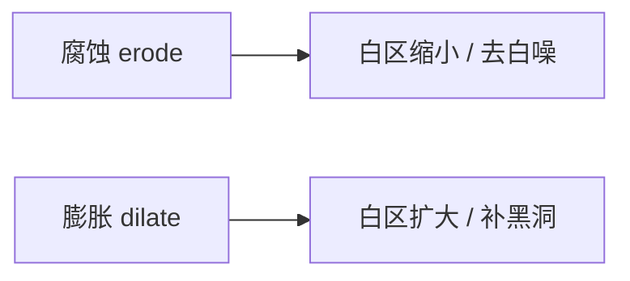

demo：`07_morphology`。

**易错点：**  
连续腐蚀会把目标腐蚀没。核形状影响方向：横条核主要削/扩水平方向。

---

### 45. 开运算与闭运算？

**要点：** 开 = 先腐后膨，去小亮噪、拆粘连；闭 = 先膨后腐，填小洞、连断缝。物体整体位置/大小大致不变。

**详细说明：**  
单独腐蚀会让目标变小，再膨胀一次「补回去」，但已经消失的小亮点补不回来 → **开运算**去前景噪点。  
单独膨胀会让目标变大，再腐蚀一次缩回，但已经填上的小洞缩不回去 → **闭运算**补洞、连笔画。

核越大，能去掉/填上的尺度越大，也越容易误伤（不该连的连上、不该拆的拆掉）。流水线里常「开再闭」或反过来，看噪声是点还是洞。

**API/代码：**
```cpp
cv::Mat k = cv::getStructuringElement(cv::MORPH_ELLIPSE, cv::Size(5, 5));
cv::morphologyEx(bin, opened, cv::MORPH_OPEN, k);
cv::morphologyEx(bin, closed, cv::MORPH_CLOSE, k);
```

**易错点：**  
开闭顺序记反是高频口误：Open=erode→dilate，Close=dilate→erode。对灰度图同样成立，只是「噪/洞」变成亮细节/暗细节。

---

### 46. 结构元素 `getStructuringElement` 形状？

**要点：** 矩形、十字、椭圆三种最常用；形状决定形态学的方向性，尺寸决定尺度。

**详细说明：**  
- `MORPH_RECT`：实心矩形，各向都强，角点变方，去噪彻底。  
- `MORPH_CROSS`：只有十字臂，对水平/垂直细线较友好，斜向弱。  
- `MORPH_ELLIPSE`：近似圆盘，轮廓更圆滑，一般首选「看起来自然」的开闭。  

细长 `Size(15,1)` 矩形可专门连/断水平裂缝（车牌、表格线）。锚点默认中心。

**API/代码：**
```cpp
cv::Mat k = cv::getStructuringElement(cv::MORPH_ELLIPSE, cv::Size(5, 5));
cv::Mat hline = cv::getStructuringElement(cv::MORPH_RECT, cv::Size(15, 1));
```

**易错点：**  
核必须与图像类型匹配地用在 `erode/dilate/morphologyEx` 上。Size 写反（宽高）会导致只在一个方向生效。

---

### 47. 形态学梯度是什么？

**要点：** 膨胀结果减腐蚀结果，得到一圈「边界带」，带宽约等于核半径。

**详细说明：**  
膨胀把物体向外扩一圈，腐蚀向内收一圈，相减剩下轮廓壳。比 Canny 粗，不依赖梯度阈值，对二值和灰度都可用。适合粗定位物体外形。

同族：  
- **顶帽 TOPHAT = 原图 − 开：** 提取比周围亮的小结构（亮斑、细文字）。  
- **黑帽 BLACKHAT = 闭 − 原图：** 提取比周围暗的小结构（暗裂纹）。

**API/代码：**
```cpp
cv::morphologyEx(src, grad, cv::MORPH_GRADIENT, k);
cv::morphologyEx(src, hat, cv::MORPH_TOPHAT, k);
```

**易错点：**  
输入若是 8U，相减可能下溢，OpenCV 会饱和；要精确差值可用更高深度。核越大壳越厚，不是单像素边。

---

### 48. 距离变换常用于什么？

**要点：** 每个**前景**像素的值 = 到最近**背景**像素的距离。中心亮、靠近边界暗。

**详细说明：**  
二值图上，边界上的前景距离≈0，物体最「内部」的点距离最大。用途：  
1. **分水岭标记：** 对距离图再阈值，得到 sure-foreground（见第 89 题）。  
2. **最大内接圆 / 宽度：** 距离最大值即半径。  
3. **骨架：** 沿距离脊线提取。  
4. 形状描述（厚度是否均匀）。

**API/代码：**
```cpp
cv::Mat dist;
cv::distanceTransform(bin, dist, cv::DIST_L2, 5);  // 5 或 3 是掩模精度
cv::normalize(dist, vis, 0, 255, cv::NORM_MINMAX, CV_8U);
```
demo：`18_watershed`。

**易错点：**  
输入必须是 8U，**非零=前景**。若白底黑字没反相，算的是「到黑字的距离」，语义反了。输出是 `CV_32F`，直接 `imshow` 几乎全黑，要归一化。

---

### 49. 边缘检测前为何要高斯模糊？

**要点：** 梯度/拉普拉斯会放大噪声；先低通，假边缘才会少。

**详细说明：**  
噪声是高频小跳变，Sobel 一看全是边。高斯把这些小跳变抹掉，真正物体边界（尺度更大）还在。Canny 第一步就是高斯；自己调 `Canny` 时若图已经很干净，不必再大核。模糊过度则真边缘变缓、定位变差（边往外扩）。

**易错点：**  
不是「所有图都 9×9 高斯」。噪声大才加大 \(\sigma\)；医学细血管、文字边缘要用小核。

---

### 50. 二值图中前景是 0 还是 255 有约定吗？

**要点：** **没有强制约定**，但 OpenCV 多数函数把 **非零当前景**，所以工程上习惯 255=目标、0=背景。

**详细说明：**  
`findContours`、`connectedComponents`、`distanceTransform`、形态学默认都认非零像素。白底黑字的扫描件 OTSU 后字可能是 0，这时轮廓找到的是纸洞而不是字，必须 `THRESH_BINARY_INV` 或 `bitwise_not`。

一条流水线从头到尾极性必须一致：阈值 → 形态学 → 轮廓。画图显示时 255 才看得见。

**易错点：**  
`imshow` 二值图若类型是 `CV_32F` 的 0/1，会几乎全黑（1 被当成 1/255）。显示前转 `CV_8U` 并乘 255。

---


## 六、轮廓与连通域（51–58）

轮廓是物体**边界点序列**；连通域是**每个像素一个标签**的填充区域。找目标框时两者都能用，形状分析更常用轮廓。

### 51. `findContours` 输入有何要求？

**要点：** 一般是 `CV_8UC1` 二值图；非零=前景。重要原图先 `clone`，因为旧版会改输入。

**详细说明：**  
函数沿前景/背景交界走一圈，得到 `vector<vector<Point>>`。可选输出 `hierarchy` 描述谁套着谁。

- 输入不要用彩色图、不要用 `CV_32F` 的 0/1。  
- `RETR_*` 控制找哪些轮廓（见第 52 题）。  
- `CHAIN_APPROX_NONE` 保留全部边界点；`CHAIN_APPROX_SIMPLE` 压缩水平/垂直/对角直线为端点，省内存，后续 `approxPolyDP` 仍够用。  
- OpenCV 3.2 之前会把输入图改掉；4.x 多数实现不再破坏，面试仍建议说「先 clone 更稳」。

**API/代码：**
```cpp
std::vector<std::vector<cv::Point>> cs;
std::vector<cv::Vec4i> hier;
cv::findContours(bin.clone(), cs, hier, cv::RETR_EXTERNAL, cv::CHAIN_APPROX_SIMPLE);
```
demo：`08_contour`。

**易错点：**  
空轮廓、图全黑时 vector 为空，后续 `cs[0]` 会崩。阈值极性反了会找到「整张纸」一个超级轮廓。

---

### 52. `RETR_EXTERNAL` 与 `RETR_TREE`？

**要点：** EXTERNAL 只要最外圈，适合数物体；TREE 保留完整嵌套，适合孔洞、环、父子关系。

**详细说明：**

| 模式 | 行为 | 何时用 |
|------|------|--------|
| `RETR_EXTERNAL` | 只最外层，内部孔、孔里的岛都忽略 | 计数、画外接框 |
| `RETR_LIST` | 所有轮廓，扁平，无父子 | 只要形状列表 |
| `RETR_CCOMP` | 两层：外轮廓 + 孔 | 简单环 |
| `RETR_TREE` | 完整树 | 分析「环套环」、OCR 字中的孔 |

`hierarchy[i] = {next, prev, child, parent}`，值为轮廓下标，-1 表示没有。TREE 下才能靠 parent/child 判断孔。

**易错点：**  
用 EXTERNAL 却想检测环形物体的内圆，永远找不到。hierarchy 没要却按树去索引会越界。

---

### 53. 如何过滤噪声轮廓？

**要点：** 先形态学去噪，再按面积、周长、宽高比、矩形度、凸度、边数设阈值，丢掉太小/太碎/形状不对的。

**详细说明：**  
Canny 后会有大量毛刺轮廓。常用几何量：

- `contourArea`：小于 N 像素当噪点（N 随分辨率变，如 100）。  
- `arcLength(..., true)`：周长；细长噪声周长面积比很大。  
- 外接框宽高比 `w/h`：滤掉明显不是目标的条。  
- `extent = area / (w*h)`：填充外接框的程度。  
- `solidity = area / contourArea(hull)`：相对凸包的实心程度，可去星形噪点。  
- `approxPolyDP` 后的顶点数：只要四边形就看 `==4`。

**API/代码：**
```cpp
for (const auto& c : cs) {
    if (cv::contourArea(c) < 100) continue;
    cv::Rect r = cv::boundingRect(c);
    double ar = (double)r.width / r.height;
    if (ar < 0.3 || ar > 3.0) continue;
    // 保留
}
```

**易错点：**  
面积阈值写死在 1080p 上，换 4K 会把真目标滤掉，应按图像面积比例或标定物理尺寸。

---

### 54. `boundingRect` 与 `minAreaRect`？

**要点：** 前者是轴对齐的正矩形，快、好画框；后者是可旋转的最小面积矩形，测倾斜物体更紧。

**详细说明：**  
- `boundingRect(contour)` → `Rect(x,y,w,h)`，边平行于图像坐标轴。倾斜 45° 的尺子会得到很大的虚空框。  
- `minAreaRect` → `RotatedRect`：中心、`size`（宽高）、`angle`。`boxPoints` 取出四个角再画。适合测宽、纠偏、旋转物体抓取。  
- 还有 `minEnclosingCircle`（最小外接圆）、`fitEllipse`（椭圆拟合，点数要够）。

**API/代码：**
```cpp
cv::Rect r = cv::boundingRect(c);
cv::RotatedRect rr = cv::minAreaRect(c);
cv::Point2f pts[4]; rr.points(pts);
```

**易错点：**  
`RotatedRect::angle` 的范围和宽高谁是长边，随 OpenCV 版本/约定容易搞混，画框请用 `points()` 四个角，不要自己用 angle 硬转。点数太少 `minAreaRect` 不稳定。

---

### 55. 图像矩能得到什么？

**要点：** 零阶矩≈面积，一阶矩给出质心；Hu 矩可做简单的平移/尺度/旋转不敏感形状特征。

**详细说明：**  
`Moments m = moments(contour)` 或对整幅二值图算：  
- \(m_{00}\)：面积（二值时）。  
- 质心 \(c_x=m_{10}/m_{00},\ c_y=m_{01}/m_{00}\)，跟踪、对准常用。  
- 中心矩、归一化中心矩去掉平移和尺度。  
- `HuMoments` 七个量，对旋转也较稳，可当极简形状指纹（区分圆/方/三角够用，复杂物体不够）。

**易错点：**  
`m00==0` 不能除。Hu 矩数值很小，比较时常用对数。彩色图矩没有直观「面积」意义，一般对单通道/二值算。

---

### 56. `approxPolyDP` 作用？

**要点：** 用更少的顶点逼近轮廓（Douglas-Peucker）。epsilon 越大越粗。常用来判断三角形/四边形、找文档角点。

**详细说明：**  
算法反复用弦代替弧，直到最大偏差 ≤ `epsilon`。`epsilon` 常用周长的比例，如 `0.02 * arcLength`：太小仍是很多点，太大正方形会变成三角形。`closed=true` 表示闭合多边形。

文档扫描：最大轮廓 → `approxPolyDP` → `size()==4` 且凸 → 四个角送透视变换。

**API/代码：**
```cpp
double peri = cv::arcLength(c, true);
std::vector<cv::Point> approx;
cv::approxPolyDP(c, approx, 0.02 * peri, true);
if (approx.size() == 4 && cv::isContourConvex(approx)) { /* 四边形 */ }
```
demo：`23_document_scan`。

**易错点：**  
epsilon 固定像素值，图一缩放就失效，要用相对周长。四点顺序不一定是 tl-tr-br-bl，透视前要自己排序。

---

### 57. 连通域与轮廓的差异？

**要点：** 连通域给每个像素贴标签并直接出面积/外接框/质心；轮廓只存边界点，擅长形状和多边形。

**详细说明：**

| | 轮廓 `findContours` | 连通域 `connectedComponentsWithStats` |
|--|--|--|
| 表示 | 边界折线 | 整块区域的 label 图 |
| 统计 | 自己 `contourArea` 等 | stats 列：面积、外接框、质心 |
| 孔洞 | `hierarchy` | 孔一般不算独立域（被外域填充） |
| 用途 | 多边形、矩、拟合 | 数颗粒、筛面积、快速 ROI |

4 连通 / 8 连通：斜向是否算连在一起，颗粒分析要统一。

**API/代码：**
```cpp
cv::Mat labels, stats, centroids;
int n = cv::connectedComponentsWithStats(bin, labels, stats, centroids);
for (int i = 1; i < n; ++i) {  // 0 是背景
    int area = stats.at<int>(i, cv::CC_STAT_AREA);
}
```
demo：`15_connected_components`。

**易错点：**  
label 0 永远是背景。`stats` 类型是 `CV_32S`，用错 `at<float>` 会读垃圾。

---

### 58. `drawContours` 的 thickness=-1 含义？

**要点：** `-1` 表示**填充**轮廓围成的区域；正数是线宽（像素）。

**详细说明：**  
`drawContours(image, contours, contourIdx, color, thickness)`  
- `contourIdx=-1`：画全部轮廓。  
- `thickness=-1` 或 `FILLED`：填内部，常用来从轮廓生成 mask。  
- 颜色通道数必须与 image 一致（灰度图画 `Scalar(255)`，BGR 画 `Scalar(0,0,255)`）。

**易错点：**  
自交轮廓填充结果未定义。hierarchy 下填外轮廓会连孔一起填，需要再把子轮廓填成 0 才能留孔。

---

## 七、几何变换与相机模型（59–70）

几何变换改像素坐标；相机模型把三维点投到像素。文档拉正用单应，测距用标定+（双目）视差。

### 59. 仿射变换与透视变换自由度？

**要点：** 仿射 6 自由度（2×3），平行线仍平行；透视 8 自由度（3×3 单应），平行线可以汇聚。

**详细说明：**  
平面上的点 \((x,y)\)：

- **仿射：** \(\begin{bmatrix}x'\\y'\end{bmatrix}=A_{2\times3}\begin{bmatrix}x\\y\\1\end{bmatrix}\)。含平移、旋转、各向尺度、剪切。矩形→平行四边形，不会变成梯形。3 对点可解。`getAffineTransform` / `warpAffine`。  
- **透视（单应）：** \(\tilde{p}'\sim H_{3\times3}\tilde{p}\)，H 差一个尺度所以 8 DoF。矩形可以变成任意凸四边形（梯形、纸张倾斜）。4 对点可解。`getPerspectiveTransform` / `warpPerspective`。

文档扫描、鸟瞰图、AR 贴平面必须透视；轻微旋转缩放用仿射更稳、更快。

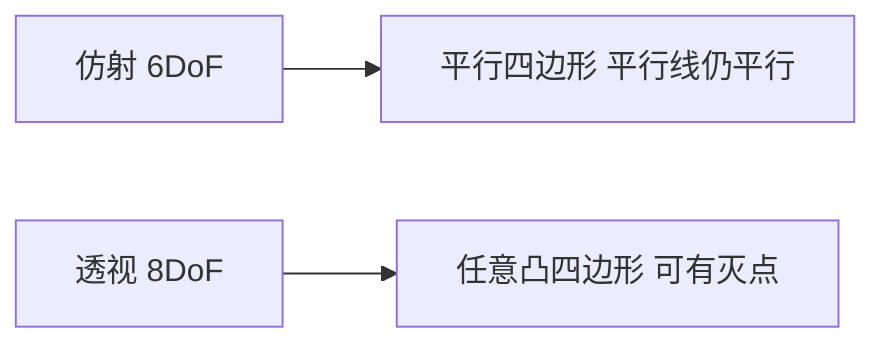

**易错点：**  
3×3 里若最后一行固定 `[0,0,1]` 就退化成仿射。点对应搞错顺序，H 会乱飞。

---

### 60. `resize` 的插值怎么选？

**要点：** 放大用线性/立方；**缩小用 `INTER_AREA`**；mask/标签用最近邻。

**详细说明：**  
插值决定「新像素由哪些旧像素混合」。

| 场景 | 推荐 | 原因 |
|------|------|------|
| 放大显示 | `INTER_LINEAR`（默认） | 够用、快 |
| 放大要质量 | `CUBIC` / `LANCZOS4` | 更锐，可能振铃 |
| **缩小** | **`INTER_AREA`** | 区域平均，抗混叠（见第 38 题） |
| 二值 mask、分割标签 | `INTER_NEAREST` | 避免出现 127 这种假类别 |
| 实时预览 | LINEAR | 折中 |

**API/代码：**
```cpp
cv::resize(src, dst, cv::Size(640, 480), 0, 0, cv::INTER_AREA);  // 缩小
cv::resize(src, dst, cv::Size(), 2.0, 2.0, cv::INTER_LINEAR);    // 按比例放大
```

**易错点：**  
`Size(w,h)` 是宽高不是行列。`fx,fy` 与 `dsize` 不要同时乱设：`dsize` 非空时优先。

---

### 61. `warpAffine` 与 `warpPerspective`？

**要点：** 分别用 2×3、3×3 矩阵把整图「搬到」新坐标系；必须指定输出画布大小，否则内容被裁。

**详细说明：**  
默认是**反向映射**：对输出每个像素，用逆变换到原图取样（配合插值）。`flags` 里的插值同 `resize`。`borderMode`/`borderValue` 填原图范围外的像素（旋转后四角）。

变换点集（不是整图）用 `transform`（仿射）或 `perspectiveTransform`（单应，点要 `CV_32FC2`）。

**API/代码：**
```cpp
cv::warpAffine(src, dst, M23, cv::Size(w, h));
cv::warpPerspective(src, dst, H, cv::Size(w, h));
```
demo：`09_geometry`。

**易错点：**  
输出 Size 仍用原图大小时，旋转 45° 四角会被切掉。H 的类型要是 `CV_64F` 或 `CV_32F`，不能拿 8U 当矩阵。

---

### 62. `getRotationMatrix2D` 参数？

**要点：** 中心点、角度（**度**、逆时针正）、尺度 → 得到 2×3 仿射矩阵，再交给 `warpAffine`。

**详细说明：**  
`getRotationMatrix2D(center, angle, scale)` 绕 `center` 转，不是绕原点。`center` 常用图像中心 `Point2f(cols/2.f, rows/2.f)`。`scale=1` 只转不缩放。

绕中心转之后，原图四角可能出画布，需要根据旋转后角点算新宽高，并修正矩阵平移项；否则接受黑边或裁切。

**易错点：**  
角度单位是度不是弧度。正负号：OpenCV 图像 y 向下，和数学上「逆时针」在屏幕上看可能反直觉，以文档为准：正角度逆时针。

---

### 63. 单应矩阵 H 的物理含义？

**要点：** 把一个平面上的点，从一张图的像素坐标映射到另一张图（或理想正视图）。\(p_2 \sim H p_1\)。

**详细说明：**  
当世界点共面（桌面、墙、纸）时，两张图之间存在 3×3 单应。H 里混合了：两相机相对位姿、平面法向、内参。应用：  
- 文档拉正：纸面四角 → A4 矩形四角。  
- 图像拼接/对齐。  
- AR：把虚拟图贴到标定平面。  

有深度差（近物远物）时单应只是近似，RANSAC 内点再多，接缝处也会裂（parallax）。

demo：`14_homography`。

**易错点：**  
H 作用在齐次坐标，最后要除以第三维。不要对非平面场景硬套单应还当「精确模型」。

---

### 64. `findHomography` 为何常用 RANSAC？

**要点：** 特征匹配里有误匹配；最小二乘会被外点带偏；RANSAC 反复随机抽 4 对点，选内点最多的 H。

**详细说明：**  
4 对点就能定一个 H。RANSAC：随机抽 4 对 → 算 H → 看其余点重投影误差是否小于阈值（像素）→ 内点多的模型胜出 → 再用全部内点精炼。输出 `mask` 标记哪些匹配是内点。

阈值一般 1～5 像素，图大/噪声大可略放宽。内点比例过低说明重叠不够或匹配太烂，H 不能用。

**API/代码：**
```cpp
cv::Mat H = cv::findHomography(srcPts, dstPts, cv::RANSAC, 3.0, inlierMask);
if (H.empty()) { /* 失败 */ }
```

**易错点：**  
点对少于 4、或几乎共线，失败返回空 Mat。不要用 `LMEDS` 却按 RANSAC 阈值去理解。`src`/`dst` 顺序反了，H 是逆变换。

---

### 65. 针孔相机模型中 K 是什么？

**要点：** **内参矩阵**，描述焦距和主点，把相机坐标系下的方向变成像素。

**详细说明：**
\[
K=\begin{bmatrix}f_x & s & c_x\\ 0 & f_y & c_y\\ 0 & 0 & 1\end{bmatrix}
\quad \tilde{p}\sim K[R|t]P
\]
- \(f_x,f_y\)：以**像素**计的焦距（\(f/\mathrm{pixel\_size}\)），两者不同表示像素不是正方形。  
- \(c_x,c_y\)：主点，光轴与像面交点，理想在图像中心，实际会偏。  
- \(s\)：skew，传感器轴不正交，现代相机≈0，OpenCV 常当 0。  

K 只跟相机/分辨率/对焦有关，跟相机在世界里怎么放无关（那是外参 R、t）。

**易错点：**  
换分辨率或裁切后 K 要按比例改 \(f,c\)，不能沿用旧标定。\(f_x\) 不是毫米焦距。

---

### 66. 相机标定至少需要什么？

**要点：** 已知格子尺寸的标定板 + **多张**不同位姿的清晰图 + 亚像素角点 + `calibrateCamera`。

**详细说明：**  
1. 棋盘格内角点行列数、每格边长（毫米）必须准确。  
2. 一般 ≥10 张，覆盖视场四角、远近、倾斜，避免张张平行于相机。  
3. `findChessboardCorners` 找到后再 `cornerSubPix` 亚像素。  
4. `calibrateCamera` 输出 K、畸变系数、每张图的 rvec/tvec、RMS 重投影误差。  

单张平面图无法可靠同时解内参和所有外参（尺度/约束不够）。圆点板、ChArUco 是同类思路，遮挡时 ChArUco 更稳。

demo：`25_camera_calib`。

**易错点：**  
「内角点」不是格子数：8×6 格只有 7×5 个内角。打印标定板不要缩放，边长量错则所有以米计的 t 都错。

---

### 67. 畸变类型与去畸变 API？

**要点：** 径向（桶形/枕形）+ 切向（透镜装歪）；单张 `undistort`，视频先建 map 再每帧 `remap`。

**详细说明：**  
- **径向 \(k_1,k_2,k_3\)：** 沿主点向外，直线变弯。广角常见桶形（\(k_1<0\) 一类）。  
- **切向 \(p_1,p_2\)：** 透镜与传感器不平行。  
- **鱼眼：** 另一套模型，走 `fisheye::calibrate` / `fisheye::undistortImage`，不要用普通 `undistort` 硬套。

去畸变是按模型把像素搬回「理想针孔」位置，边缘会有无效区，可 `getOptimalNewCameraMatrix` 裁掉或留黑边。

**API/代码：**
```cpp
cv::undistort(src, dst, K, dist);
// 视频：
cv::initUndistortRectifyMap(K, dist, cv::noArray(), K, size, CV_16SC2, map1, map2);
cv::remap(frame, undist, map1, map2, cv::INTER_LINEAR);
```

**易错点：**  
每帧 `undistort` 会重复算 map，慢。K 和 dist 必须来自**同一分辨率**。

---

### 68. 重投影误差是什么？

**要点：** 三维点按标定结果投回图像，与检测角点的像素距离；RMS 越小标定越好，常看 <0.5～1 像素。

**详细说明：**  
对每个棋盘角点：世界坐标（已知格子）→ 用 rvec/tvec 变到相机系 → K 和畸变投到像素 → 与 `cornerSubPix` 检测位置比欧氏距离。`calibrateCamera` 返回值就是这些距离的均方根。

过大（好几像素）：角点不准、板不平整、运动模糊、图太少、打印有透视变形、行列数填错。过小也要警惕过拟合（图很少却模型很复杂）。

**易错点：**  
RMS 低不等于「测距准」：还要看标定板是否覆盖工作距离、是否用对畸变模型。

---

### 69. StereoBM 输出的视差与深度关系？

**要点：** 校正后 \(Z = f\cdot B / d\)。视差 \(d\) 大 → 近。BM 输出常是 16 位定点，真实视差要 `/16`。

**详细说明：**  
双目先 `stereoRectify` 把两图行对齐，同一世界点在左右图同一行、列差就是视差 \(d\)。基线 \(B\) 越大、越近，\(d\) 越大。StereoBM 是局部块匹配，快、弱纹理处容易花；SGBM 半全局，更准更慢。

无效处（遮挡、无纹理）视差为 0 或被 mask。可视化要把 16S 的值缩放成 8U。

**API/代码：**
```cpp
cv::Ptr<cv::StereoBM> bm = cv::StereoBM::create(16*5, 21);
bm->compute(left, right, disp);           // CV_16S
cv::Mat disp32; disp.convertTo(disp32, CV_32F, 1.0/16.0);
// Z = f * B / disp32  （disp32==0 要避开）
```
demo：`24_stereo_bm`。

**易错点：**  
左右图没校正就 BM，视差无几何意义。除零。单位：\(f\) 用像素，\(B\) 用米，则 \(Z\) 为米。

---

### 70. 文档扫描流水线典型步骤？

**要点：** 找到纸的四个角 → 透视拉到固定矩形 → 再增强对比度。失败多半在找角，不在 warp。

**详细说明：**  
1. 灰度 + 高斯降噪。  
2. Canny 或自适应阈值，让纸边成为连通轮廓。  
3. `findContours` 取面积最大且 `approxPolyDP` 为凸四边形的轮廓。  
4. 四角排序成 tl、tr、br、bl（按坐标和、差）。  
5. 目标四角设为 A4 比例画布，`getPerspectiveTransform` + `warpPerspective`。  
6. 可选 CLAHE、二值化、去阴影，便于 OCR。

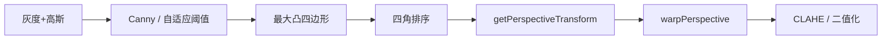

demo：`23_document_scan`。背景杂乱、纸缺角、反光、纸不是四边形时会失败，可改成用户点四角或深度学习检测。

**易错点：**  
角点顺序错会得到镜像/折叠图。目标宽高比不对，字会被拉扁。

---


## 八、特征、匹配与拼接（71–80）

特征点管「这里有个可重复的位置」；描述子管「这点长什么样」。匹配后再用单应/本质矩阵剔误匹配。拼接是这条链的工程封装。

### 71. 关键点与描述子区别？

**要点：** 关键点 = 在哪、多大、朝哪；描述子 = 邻域编成的向量，用来比较像不像。

**详细说明：**  
- **关键点 `KeyPoint`：** `pt` 坐标、`size` 尺度、`angle` 主方向、`response` 强度。只解决「检测」。FAST、Harris 可以只出点。  
- **描述子：** 把点周围一块 patch 变成向量。SIFT 是 128 维 float（梯度直方图）；ORB 是 256 bit 二进制（BRIEF 的旋转版）。匹配比的是描述子距离，不是像素坐标。  

完整流程：`detect` → `compute`，或 `detectAndCompute` 一次做完。没有描述子就无法在两图间认「同一点」。

demo：`10_feature_match`。

**易错点：**  
两图关键点数量不同很正常。描述子 `Mat` 的行数应等于关键点数，过滤点后两边要同步删。

---

### 72. ORB 相对 SIFT 的特点？

**要点：** ORB 更快、二进制、专利友好，适合实时；SIFT 尺度/光照更稳，更重。4.4+ SIFT 已进主库。

**详细说明：**

| | ORB | SIFT |
|--|-----|------|
| 检测 | FAST + 图像金字塔 | 高斯差分 DoG 极值 |
| 方向 | 灰度质心 | 梯度主方向 |
| 描述 | rBRIEF，二进制 | 128 维梯度直方图 |
| 匹配距离 | Hamming | L2 |
| 速度 | 快，嵌入式/SLAM 常用 | 慢一个数量级以上 |
| 稳健性 | 旋转还行，尺度靠金字塔，弱于 SIFT | 尺度、视角、光照更好 |
| 许可 | 无专利包袱 | 专利已过期，OpenCV 4.4+ 主库 `SIFT::create` |

实时 AR、ORB-SLAM 选 ORB。高精度配准、纹理一般的场景可上 SIFT/AKAZE。

**易错点：**  
ORB 默认点数有上限（`nfeatures`），图很大时要加大。SIFT 在 3.x 常需 contrib 的 `xfeatures2d`，面试要按 4.13 说主库已有。

---

### 73. BFMatcher 与 FlannBasedMatcher？

**要点：** BF 暴力精确，点少时用；FLANN 近似最近邻，点很多时更快但可能漏匹配。

**详细说明：**  
- **BFMatcher：** 每个查询描述子和库里所有向量比距离，取最近。`NORM_HAMMING` 配 ORB；`NORM_L2` 配 SIFT。`crossCheck=true` 要求 A→B 最近且 B→A 也最近，精度升、数量降。  
- **FlannBasedMatcher：** KD-Tree（float）或 LSH（二进制），近似 kNN。几万点时明显更快。参数不调可能匹配变差。

点只有几百～两三千，BF+crossCheck 或 BF+knn+Lowe 通常够。

**易错点：**  
ORB 丢给默认 FLANN（KD-Tree）会错，二进制要用 LSH 或直接 BF Hamming。

---

### 74. Hamming 距离用于何种描述子？

**要点：** 只用于**二进制**描述子（ORB/BRIEF/BRISK/FREAK）：有多少个 bit 不同。

**详细说明：**  
两串 bit 做 XOR，再数 1 的个数。CPU 有 popcount，极快。SIFT/SURF 是浮点向量，必须用 L2（或 L1），用 Hamming 没有意义。

**API/代码：**
```cpp
cv::BFMatcher matcher(cv::NORM_HAMMING);
matcher.match(des1, des2, matches);
```

**易错点：**  
`NORM_HAMMING2` 用于部分 2 bit 一组的描述子（如部分 BRISK 配置），ORB 一般 `NORM_HAMMING`。

---

### 75. Lowe 比值测试（knnMatch）作用？

**要点：** 看「最近邻比次近邻近多少」。比值不够小说明描述子没有判别力（重复纹理），丢掉，减少误匹配。

**详细说明：**  
只取最近邻时，即使是错配也会有一个「最近的」。若第二近的几乎一样近，说明很多点长得像，这个匹配不可信。Lowe 提出 \(d_1/d_2 < 0.7\sim 0.8\) 才保留。ORB 同样适用。阈值越小越严、匹配越少越干净。

**API/代码：**
```cpp
std::vector<std::vector<cv::DMatch>> knn;
matcher.knnMatch(des1, des2, knn, 2);
std::vector<cv::DMatch> good;
for (auto& v : knn) {
    if (v.size() < 2) continue;
    if (v[0].distance < 0.75f * v[1].distance) good.push_back(v[0]);
}
```

**易错点：**  
必须 `k=2`。有的点不够两个邻居（库太小）要跳过。比值测试之后通常还要 RANSAC 单应/本质矩阵再滤一轮。

---

### 76. 模板匹配的局限？

**要点：** 基本只抗**平移**；旋转、尺度、透视、遮挡、光照大变都会挂。固定相机、目标大小不变时仍然又快又准。

**详细说明：**  
`matchTemplate` 把模板当滑窗在图上算相似度，输出一张得分图。模板在图中必须几乎原样出现。改进：金字塔多尺度；多角度各扫一次（很慢）；或改用特征点/DNN。

工业检测（零件位置固定、光照可控）仍常用。自然场景搜 logo 一般不够。

demo：`13_template_match`。

**易错点：**  
模板比原图大直接报错。得分图尺寸是 `(W-w+1, H-h+1)`，峰值坐标不是模板中心，是模板左上角。

---

### 77. `matchTemplate` 常用方法？

**要点：** 优先 `TM_CCOEFF_NORMED`（归一化相关系数，越大越好，1 为完美）；`TM_SQDIFF` 是越小越好。

**详细说明：**

| 方法 | 好坏方向 | 特点 |
|------|----------|------|
| `TM_SQDIFF` / `_NORMED` | 越小越好 | 差的平方和 |
| `TM_CCORR` / `_NORMED` | 越大越好 | 相关，受亮度影响 |
| **`TM_CCOEFF_NORMED`** | 越大越好 | 减均值再归一化，抗线性光照 |

流程：`matchTemplate` → `minMaxLoc` 取峰 → 在原图 `Rect(maxLoc, templ.size())` 画框。多目标需设阈值并做 NMS，否则同一目标周围一堆峰。

**易错点：**  
用了 SQDIFF 却取 `maxLoc` 会拿到最差位置。NORMED 输出约 [-1,1] 或 [0,1]，不要和像素值比。

---

### 78. 图像拼接 Stitcher 大致流程？

**要点：** 特征匹配估相机 → 投影到同一面 → 曝光补偿 → 找接缝 → 融合。不是简单「两张图 findHomography 糊一起」。

**详细说明：**  
1. 每张图提特征、两两匹配。  
2. 估计焦距/旋转（或单应），束调整让多图一致。  
3. 投到平面/柱面/球面，避免多图连在一起时变形爆炸。  
4. 曝光补偿，减轻明暗差。  
5. 图割找接缝，躲开运动物体错位。  
6. 多频段融合，让接缝看不见。

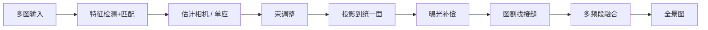

**API/代码：**
```cpp
cv::Ptr<cv::Stitcher> st = cv::Stitcher::create(cv::Stitcher::PANORAMA);
cv::Stitcher::Status s = st->stitch(images, pano);
```
demo：`20_stitching`。`SCANS` 模式更适合文档类平面扫描。

**易错点：**  
图太少、重叠不够会直接失败。内存随分辨率暴涨，可先缩小再拼。

---

### 79. 拼接失败常见原因？

**要点：** 重叠不足、纹理弱、视差大、运动物体、曝光差、顺序/数量不对。

**详细说明：**  
- 重叠一般要 20%～40%。  
- 白墙、天空：特征点不够。  
- 近处物体 + 旋转拍摄：不满足单应/共面，重影。  
- 行人车辆在接缝处被撕开。  
- 状态码：`ERR_NEED_MORE_IMGS`、`ERR_HOMOGRAPHY_EST_FAIL`、`ERR_CAMERA_PARAMS_ADJUST_FAIL`。  

对策：增加重叠、固定曝光、远离前景、或改用带深度的拼接（超出基础 OpenCV）。

**易错点：**  
失败时 `pano` 可能是空图，必须检查 `Status`，不要直接 `imwrite`。

---

### 80. ArUco 码能提供什么信息？

**要点：** 字典内的 **ID** + **四个角点**；再加码的物理边长和相机 K，可解 **6DoF 位姿**（rvec、tvec）。

**详细说明：**  
ArUco 是方形二进制标记，检测比二维码对模糊更稳，专为位姿设计。`detectMarkers` 给出每码 id 与角点。`estimatePoseSingleMarkers` 把码平面放到相机坐标系。用途：标定板（ChArUco）、机器人定位、AR 锚点、多相机外参。

demo：`21_aruco`。4.x：`aruco::ArucoDetector` / `DetectorParameters`，旧 `detectMarkers` 全局函数仍常见。

**易错点：**  
字典必须和打印的一致（`DICT_4X4_50` 等）。边长单位决定 tvec 单位。没标定 K 时只能得到像素四边形，不能当真三维位姿。

---

## 九、视频、运动与跟踪（81–88）

视频多了时间维：光流看像素怎么动，背景减除看什么是新来的，卡尔曼把检测框在时间上平滑。

### 81. 稀疏光流与稠密光流区别？

**要点：** 稀疏只跟踪一批点，快；稠密每个像素一个速度，慢，适合运动场可视化/分割。

**详细说明：**  
- **稀疏 PyrLK：** 先 `goodFeaturesToTrack`（或 FAST）拿角点，`calcOpticalFlowPyrLK` 在下一帧找这些点去哪。输出点坐标 + `status`。跟踪、SLAM 前端、稳像常用。  
- **稠密 Farneback 等：** `calcOpticalFlowFarneback` 得到与图像同尺寸的 `CV_32FC2` 流场。可做运动分割、光流可视化。DIS 光流是更快的稠密实现。

demo：`16_optical_flow`。

**易错点：**  
稠密光流不是「更准的 LK」。无纹理区域稠密场不可信。点跟踪丢了要补新点，否则越跟越少。

---

### 82. Lucas-Kanade 基本假设？

**要点：** 亮度不变、位移小、窗口内速度相同。大运动靠金字塔；假设破了就跟丢。

**详细说明：**  
1. **亮度恒定：** \(I(x,y,t)=I(x+dx,y+dy,t+dt)\)，推导出光流约束 \(I_x u+I_y v+I_t=0\)。  
2. **小运动：** 泰勒展开只留一阶，位移只能是亚像素到数像素。金字塔从粗到细，把大位移变成小位移。  
3. **空间平滑：** 窗口内 \((u,v)\) 相同，多个像素组成超定方程，最小二乘求解（这就是 LK 相对「一点一个方程欠定」的补丁）。

失败场景：曝光闪、运动模糊、大位移没开够层、弱纹理、遮挡。看 `status` 和 `err`。

**易错点：**  
面试漏掉「窗口内同速度」就不完整。只说「找角点」没有说到方程约束。

---

### 83. 背景减除 MOG2 原理直觉？

**要点：** 每个像素用**多个高斯**描述历史颜色；权重大、方差小的当背景；对不上的当前景。

**详细说明：**  
单高斯背景：像素值长期在均值附近就当背景，但摇树叶、水面会有两种颜色，单峰不够。MOG2 为每个像素维护若干高斯，新像素：  
- 落入某个高斯 → 更新该高斯的均值/方差/权重；  
- 都不像 → 标前景，并可能插入新高斯、挤掉最弱的。  

慢变光照会被慢慢学进背景。`detectShadows=true` 时阴影常标成 127（不是 255）。

**API/代码：**
```cpp
cv::Ptr<cv::BackgroundSubtractor> mog2 =
    cv::createBackgroundSubtractorMOG2(/*history=*/500, /*varThreshold=*/16, true);
mog2->apply(frame, fgmask);  // 0 背景, 255 前景, 127 阴影
```
demo：`17_bg_subtract`。

**易错点：**  
前几十帧 mask 很脏，要等 history 填满。相机一动，整图变前景，MOG2 不是为手持视频设计的。

---

### 84. 背景建模常见难点？

**要点：** 阴影、开关灯、相机抖、目标静止融入背景、鬼影。要用形态学、面积过滤、与检测器融合，不能只信 mask。

**详细说明：**  
- 阴影灰度低于背景但形状像人，MOG2 可分 127，仍常要再滤。  
- 突然开灯：全局都「不像」旧高斯。可检测全局变化后重置。  
- 抖动：边缘一圈闪烁，可先稳像或形态学开运算。  
- 停车后的车会被学成背景；开走留下「鬼影」洞，要等 history 覆盖。  
- 对策：最小面积、ROI、与 YOLO 检测取交、周期性加大学习率。

**易错点：**  
`apply` 的学习率参数：负数用默认；设成 0 等于冻结背景，设太大则运动目标很快被吃进背景。

---

### 85. 卡尔曼滤波在跟踪中的角色？

**要点：** 用运动模型**预测**下一位置，再用检测**更新**；平滑噪声，短时遮挡时还能往前推几帧。

**详细说明：**  
状态常取 \([x,y,v_x,v_y]\)（或加框宽高）。预测：匀速外推。更新：把检测框当观测，按卡尔曼增益融合（观测噪声大则更信预测）。SORT 跟踪器 = 卡尔曼 + 匈牙利匹配。非线性观测用 EKF/UKF；多峰分布用粒子滤波。

demo：`22_kalman_track`。

**易错点：**  
卡尔曼**不是检测器**，没有观测时只是开环积分，时间一长必漂。过程噪声/观测噪声调反会要么抖要么跟不上。

---

### 86. 预测、观测、估计三者区别？

**要点：** 预测是模型往前推；观测是检测器测量；估计是两者融合后的结果，作为输出和下一轮输入。

**详细说明：**

| 名称 | 何时 | 含义 |
|------|------|------|
| 预测 predict | 新帧开始、检测前 | \(x_{k|k-1}=F x_{k-1}\) |
| 观测 measurement | 检测器返回 | 带噪声的框/点，可能漏、可能虚警 |
| 估计/后验 correct | 融合后 | \(x_{k|k}\)，画在图上的轨迹点 |

面试可画：黄点预测、红点观测、绿点估计。漏检时只有黄点；虚警时红点离群，增益应让绿点别被拉开。

**易错点：**  
不要把「预测」说成最终结果。输出给下游的应是估计（有观测时）或预测（短暂无观测时）。

---

### 87. 光流可视化常用什么？

**要点：** 稠密流用 HSV：色相=方向，亮度=速度大小；稀疏流画箭头。

**详细说明：**  
`cartToPolar(flow_x, flow_y, mag, ang, true)` 得到幅值和角度（度）。H = 角度映射到 0～180，S=255，V=幅值归一化到 0～255，再 `cvtColor HSV2BGR`。稀疏：`arrowedLine(prev, next)`，或画小圆点轨迹。

**易错点：**  
`flow` 是 `CV_32FC2`，`split` 成 fx,fy。角度是弧度还是度要看 `cartToPolar` 最后一个参数。

---

### 88. 视频实时处理如何保证帧率？

**要点：** 少算像素、少拷贝、流水线并行、算法降级；先 profile 再优化。

**详细说明：**  
1. 降分辨率、ROI、跳帧（检测 10Hz，跟踪 30Hz）。  
2. 换轻量算法：MOG2 代替稠密光流；ORB 代替 SIFT。  
3. `Mat` 预分配，避免每帧 `clone`。  
4. 采集 / 计算 / 显示三线程队列。  
5. `UMat`/OpenCL、CUDA、NPU（DNN 另内部署）。  
6. 超时则本帧跳过或降低质量。  

用 `getTickCount`/`getTickFrequency` 或 chrono 打点，先找最慢的那一步。

**易错点：**  
Python 里对每个像素 for 循环，再快的 C++ 后端也救不了。`imshow` 本身也可能是瓶颈。测性能必须 Release 编译。

---

## 十、分割、修复与进阶（89–94）

分割把像素归到物体；修复/融合改像素内容。分水岭和 GrabCut 是传统交互分割代表。

### 89. 分水岭算法核心思想？

**要点：** 把灰度/距离图当地形，水从**标记好的盆地**上涨，相遇处筑坝，坝就是边界。无标记会过分割。

**详细说明：**  
每个局部极小都是一个盆，直接灌水会碎成无数块（过分割）。实践用标记：

1. 二值化得到大概物体。  
2. `distanceTransform`，阈值得到 sure-fg。  
3. 膨胀得到 sure-bg。  
4. 剩下的是 unknown。  
5. `connectedComponents` 给 sure-fg 编号，unknown 标 0。  
6. `watershed` 在原图（或梯度）上生长，边界像素值为 **-1**。

demo：`18_watershed`。

**易错点：**  
标记必须是 `CV_32S`。没做 sure-fg/bg 直接 watershed 结果不可用。粘连圆点用距离变换最典型。

---

### 90. GrabCut 如何初始化？

**要点：** 给一个矩形（框外=确定背景，框内=可能前景），或给像素级 mask；然后迭代 GMM + 图割。

**详细说明：**  
GrabCut 用两个高斯混合模型分别建模前景/背景颜色，再在像素图上建图（相邻像素若颜色像则边权大），最小割得到分割。迭代几次让 GMM 和分割互相促进。

初始化：  
- `GC_INIT_WITH_RECT`：用户框住目标，最常见。  
- `GC_INIT_WITH_MASK`：`GC_BGD / GC_FGD / GC_PR_BGD / GC_PR_FGD` 四种标签，适合涂鸦修正。

**API/代码：**
```cpp
cv::Mat mask, bgd, fgd;
cv::grabCut(img, mask, rect, bgd, fgd, 5, cv::GC_INIT_WITH_RECT);
cv::Mat fg = (mask == cv::GC_FGD) | (mask == cv::GC_PR_FGD);
```
demo：`19_grabcut`。细头发、透明、与背景同色会失败，需要再涂 mask 迭代。

**易错点：**  
`bgdModel/fgdModel` 必须在多次迭代间复用，不要每次空 Mat 当第一次。输入要彩色图。矩形必须完全在图像内。

---

### 91. `inpaint` 解决什么问题？

**要点：** 用周围完好像素填补 mask 区域：去划痕、字幕、污点。大面积缺失效果有限。

**详细说明：**  
- `INPAINT_TELEA`：快速行进，按边界法向传播，速度快。  
- `INPAINT_NS`：Navier-Stokes，更偏光滑延拓。  

mask 非零处被填。mask 应略大于损伤，否则边缘残留。适合细划痕；人脸大块缺失要用生成模型。

demo：`26_inpaint_clone`。

**易错点：**  
mask 和图像尺寸必须一致。JPEG 块效应不是 inpaint 的菜。

---

### 92. `seamlessClone` 相对硬贴图优势？

**要点：** 泊松融合对齐的是**梯度**，接缝处亮度和颜色跟着目标图走，看起来像长在场景里。

**详细说明：**  
硬 `copyTo` 把源像素值贴过去，光源不一致就有一圈色差。泊松融合求解：内部梯度尽量等于源图梯度（保留纹理），边界像素等于目标图（无缝）。  

- `NORMAL_CLONE`：完整泊松。  
- `MIXED_CLONE`：源/目标梯度取强者，适合透明/纹理混合。  
- `MONOCHROME_TRANSFER`：只借纹理不借颜色。  

需要源上的 mask 和目标图上的中心点。

**易错点：**  
中心点太靠目标边缘，源 ROI 会出界。mask 要覆盖整块要贴的内容，不要只给矩形。

---

### 93. k-means 在图像中可做什么？

**要点：** 把像素当样本聚类，做颜色量化、海报化、粗分割。

**详细说明：**  
把 \(H\times W\) 的 BGR（或 Lab）reshape 成 \(N\times 3\) 的 `CV_32F`，`kmeans` 聚成 k 类，再用中心色替换。k=2 可当简陋前后景；k=8～16 做配色压缩。Lab 空间更接近人眼色差。可把 (x,y) 拼进特征，让空间上近的像素更易一类，但变 5 维、更慢。

**API/代码：**
```cpp
cv::Mat data = bgr.reshape(1, bgr.rows * bgr.cols);
data.convertTo(data, CV_32F);
cv::kmeans(data, 8, labels, term, 3, cv::KMEANS_PP_CENTERS, centers);
```

**易错点：**  
k 要预先指定。随机初始化结果不稳定，用 `KMEANS_PP_CENTERS` 并多试几次。reshape 后通道必须摊平对。

---

### 94. 超像素（如 SLIC）用途？

**要点：** 先把图切成几百～几千块「差不多颜色」的小区域，后续算法按块而不是按像素算，更快且贴边。

**详细说明：**  
SLIC 在五维 (Lab + xy) 做局部 k-means，块大小近似相等、边界贴边缘。用途：图割预处理、显著性、作为超图节点做语义分割。OpenCV 主库没有 SLIC，contrib 的 `ximgproc::createSuperpixelSLIC`。面试能说到「过分割成同质区域、降复杂度」即可。

**易错点：**  
超像素不是语义分割，一块里仍可能跨物体，只是概率更低。

---

## 十一、DNN、工程与源码（95–100）

部署和读源码时，要能画出模块边界、推理数据流和性能手段。

### 95. OpenCV DNN 模块能做什么？

**要点：** 在 C++ 里加载 ONNX/Caffe/TF/Darknet 等做**前向推理**（分类、检测、分割），不依赖 Python/PyTorch 运行时。

**详细说明：**  
适合嵌入式、只发一个 OpenCV 库的场合。训练仍在 PyTorch/TF 里做，导出 ONNX 再 `readNet`。不是训练框架，也没有自动求导。

流程：读网 → 图转 blob（缩放、减均值、RGB/BGR、NCHW）→ `setInput` → `forward` → 按模型解析输出（YOLO 要解码框、NMS）。

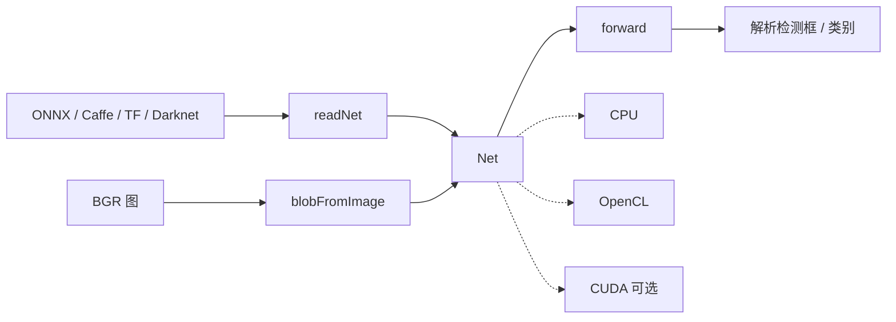

**API/代码：**
```cpp
cv::dnn::Net net = cv::dnn::readNet("model.onnx");
cv::Mat blob = cv::dnn::blobFromImage(bgr, 1/255.0, cv::Size(640, 640), cv::Scalar(), true, false);
net.setInput(blob);
cv::Mat out = net.forward();
```

**易错点：**  
`swapRB=true` 才会 BGR→RGB，必须和训练一致。输入尺寸、归一化均值也要一致，否则精度「神秘」下降。

---

### 96. DNN 后端常见有哪些？

**要点：** 默认 CPU；还可 OpenCL、CUDA（需编译）、部分推理引擎。RK3588 的 NPU **不会**被 DNN 模块自动用上。

**详细说明：**  
`setPreferableBackend` + `setPreferableTarget`：  
- `DNN_BACKEND_OPENCV` + `DNN_TARGET_CPU`：一定能跑。  
- `DNN_TARGET_OPENCL` / `OPENCL_FP16`：核显/独显，驱动差时可能更慢。  
- `DNN_BACKEND_CUDA`：编译时打开 CUDA 才有。  
- 另有 Vulkan、TimVX 等，视 4.13 编译选项。  

性能大致：CUDA > 好的 OpenCL > CPU。板端 NPU 要走厂商工具链（如 RKNN），先转 ONNX 再转专用格式，不是 `readNet` 换个 target 就行。

**易错点：**  
`setPreferable*` 失败会静默回退 CPU，要用日志或计时确认真的在加速。

---

### 97. OpenCV 主模块与 opencv_contrib 关系？

**要点：** 主库稳定常用；contrib 是额外/实验算法，必须与主库**同版本**一起编译，否则没有那些头文件。

**详细说明：**  
主仓库：core、imgproc、calib3d、features2d、dnn、video… 测试充分、API 稳。  
contrib：`xfeatures2d`（SURF 等）、`ximgproc`（SLIC）、部分 tracking、cuda 扩展、text… API 可能变。CMake 把 contrib 路径指给主库一起编。4.13.0 对 4.13.0，不要混 4.8 的 contrib。

**易错点：**  
「SIFT 在 contrib」对 4.13 已过时（主库有）。SURF 仍常在 contrib。没编 contrib 时 `#include <opencv2/xfeatures2d.hpp>` 直接找不到。

---

### 98. 如何定位某 API 在源码中的实现？

**要点：** 头文件看声明，`modules/<模块>/src/` 看实现，dispatch/opencl 看加速版。见文首框图 E。

**详细说明：**  
1. 公开 API：`include/opencv2/<module>.hpp` 或 `modules/<module>/include/`。  
2. 实现：`modules/imgproc/src/canny.cpp`、`smooth.cpp` 这类。  
3. SIMD：同目录 `*.dispatch.cpp` + `hal/`。  
4. GPU：`src/opencl/*.cl`。  
5. 用法：官方 `samples/cpp/`、本仓库 `openCV/sample/`。  

CMake 开关 `BUILD_opencv_xxx` 决定模块在不在。

**易错点：**  
Python 名 `cv2.Canny` 对应 C++ `cv::Canny`，实现仍在 C++ 模块，不是 Python 里再写一遍。

---

### 99. 性能优化常见手段？

**要点：** 少拷贝、少像素、并行、SIMD/OpenCL/CUDA、算法换轻量；先测量后动手。

**详细说明：**  
1. 避免 `clone`、预分配、连续内存 `ptr` 扫描（见第 2、9 题）。  
2. 降分辨率、ROI、跳帧（见第 22、88 题）。  
3. `parallel_for_` / TBB。  
4. 让 OpenCV 走自带 HAL/IPP/NEON，不要自己写朴素三重循环。  
5. `UMat` 走 OpenCL；CUDA 模块另链。  
6. Python：热点放进 OpenCV/NumPy 向量化。  
7. 算法：积分图、金字塔、模型 INT8。  

**易错点：**  
过早微优化。Debug 编译比 Release 慢数倍，测性能必须 Release。

---

### 100. 用 OpenCV 搭一个「从图像到框选目标」的最小流程？

**要点：** 读图 → 变成干净二值 → 找轮廓 → 过滤 → 画框。每步失败都有对应参数可调。见文首框图 F。

**详细说明：**  
传统视觉最小闭环：


对应 demo：`01` + `05` + `06/07` + `08`。

调参思路：框太多 → 提高阈值/面积、先开运算；框没有 → 极性是否反、阈值是否过严、模糊是否过重；框不准 → 用 `minAreaRect` 或透视。

进阶替换某段：颜色用 `inRange`（`03`）；平面目标用特征+单应（`10/14`）；运动用 MOG2（`17`）；复杂类别用 `dnn`/YOLO。面试要能画出这条链，并说明哪一步换成 DNN。

**易错点：**  
空图没判断、BGR 当灰度、轮廓未过滤就取 `cs[0]`、画框用了 ROI 坐标却画在原图上（或反过来）。

---

## 附：速记对照（模块 → 题号）

| 模块/主题 | 题号 |
|-----------|------|
| Mat/基础 | 1–15 |
| IO/显示/视频 IO | 16–22 |
| 颜色 | 23–28 |
| 滤波增强 | 29–38 |
| 边缘形态学 | 39–50 |
| 轮廓连通域 | 51–58 |
| 几何/标定/立体 | 59–70 |
| 特征匹配拼接 | 71–80 |
| 运动跟踪 | 81–88 |
| 分割修复 | 89–94 |
| DNN/工程 | 95–100 |

## 附：结合本仓库 sample 复习

| Demo | 相关题 |
|------|--------|
| 01–02 | 1–15 |
| 03 | 23–28 |
| 05–07 | 29–50 |
| 08、15 | 51–58 |
| 09、14、23–25 | 59–70 |
| 10、13、20、21 | 71–80 |
| 16–17、22 | 81–88 |
| 18–19、26 | 89–94 |

---

*文档版本：2.2（29–100 题按要点/说明/API/易错点展开） | 对应 OpenCV 4.13.0 | 路径：`openCV/doc/OpenCV_4.13.0_面试题100道.md`*
